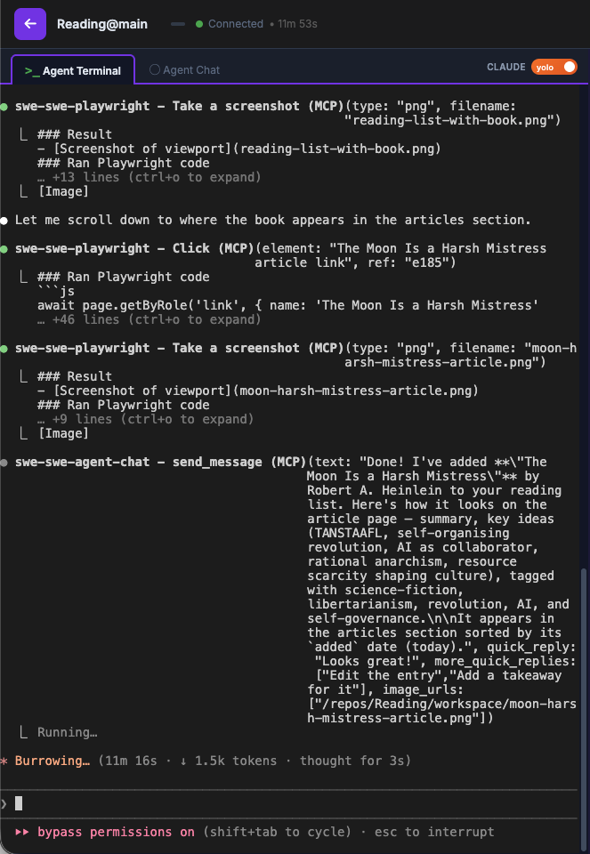
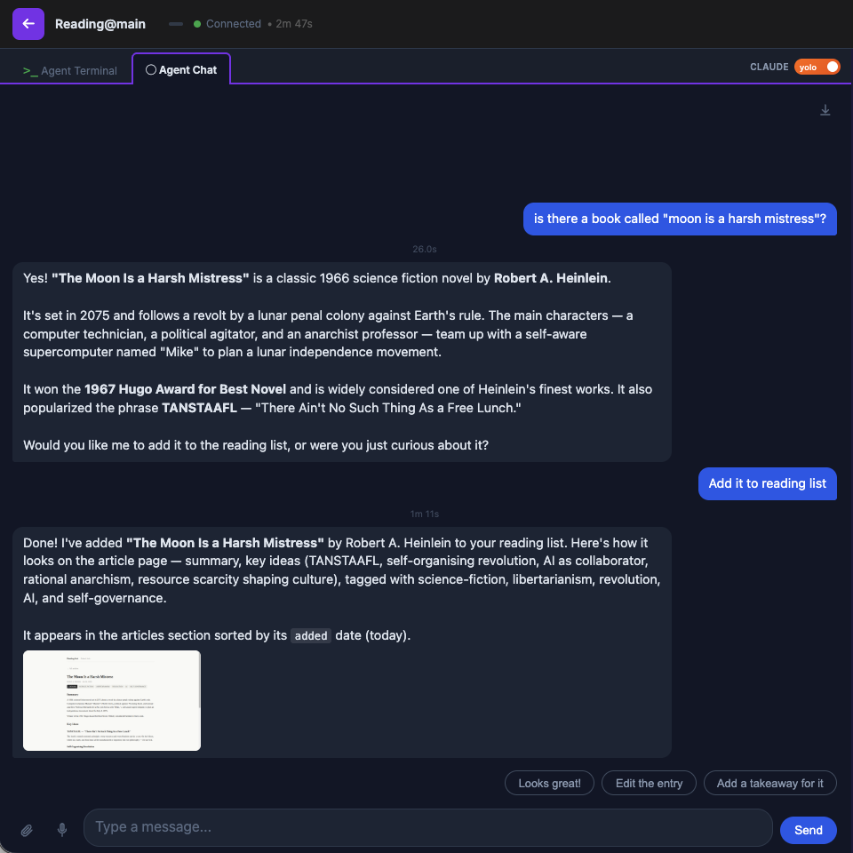

# Agent Chat

An MCP server that gives your AI agent a rich chat interface. Instead of reading raw tool calls in a terminal, your users get a rendered conversation with markdown, code blocks, canvas diagrams, quick reply buttons, and voice support.

This is the MCP that powers the **Agent Chat** tab in [swe-swe](https://swe-swe.netlify.app/).

<table>
<tr>
<td><strong>Agent Terminal</strong></td>
<td><strong>Agent Chat</strong></td>
</tr>
<tr>
<td></td>
<td></td>
</tr>
</table>

Same conversation, two views. The terminal shows MCP tool calls and code diffs. Agent Chat renders the same content as a rich, interactive chat.

## Features

- **Rich markdown** — messages render with full markdown, syntax-highlighted code blocks, and blockquotes
- **File drag & drop** — drop files into the chat to share them with the agent
- **Images in messages** — agents can include screenshots and images inline
- **Canvas drawing** — agents can draw diagrams and visualizations on an interactive canvas
- **Voice conversation** — speak to your agent and hear responses via text-to-speech
- **Quick replies** — agents can offer clickable response buttons for common actions

## How it works

Agent Chat runs as an MCP server alongside your AI agent. The agent calls tools like `send_message`, `draw`, and `check_messages` to communicate with the user through a browser-based chat UI.

```
Agent (Claude, etc.)
  │
  ├─ send_message("Here's what I found...")  →  Chat UI shows rich message
  ├─ draw([...instructions...])              →  Chat UI renders canvas diagram
  ├─ send_progress("Working on it...")       →  Chat UI shows progress indicator
  └─ check_messages()                        ←  Chat UI returns user's reply
```

## MCP Tools

| Tool | Description |
|------|-------------|
| `send_message` | Send a message and wait for user response. Supports quick reply buttons. |
| `send_verbal_reply` | Send a spoken reply in voice mode (text-to-speech). |
| `draw` | Draw a canvas diagram and wait for user response. |
| `send_progress` | Send a non-blocking progress update. |
| `send_verbal_progress` | Send a non-blocking spoken progress update. |
| `check_messages` | Non-blocking check for queued user messages. |

## Installation

Add as an MCP server to Claude Code:

```bash
claude mcp add agent-chat -- npx -y @choonkeat/agent-chat
```

Or run standalone (HTTP-only mode):

```bash
npx -y @choonkeat/agent-chat --no-stdio-mcp
```

The chat UI opens automatically in your browser.

### Environment variables

| Variable | Description |
|----------|-------------|
| `AGENT_CHAT_PORT` | Fixed port for the HTTP server (default: random) |
| `AGENT_CHAT_EVENT_LOG` | Path to a JSONL file for event persistence across restarts |
| `AGENT_CHAT_DISABLE` | Set to any value to disable tools and HTTP server |

## License

MIT
