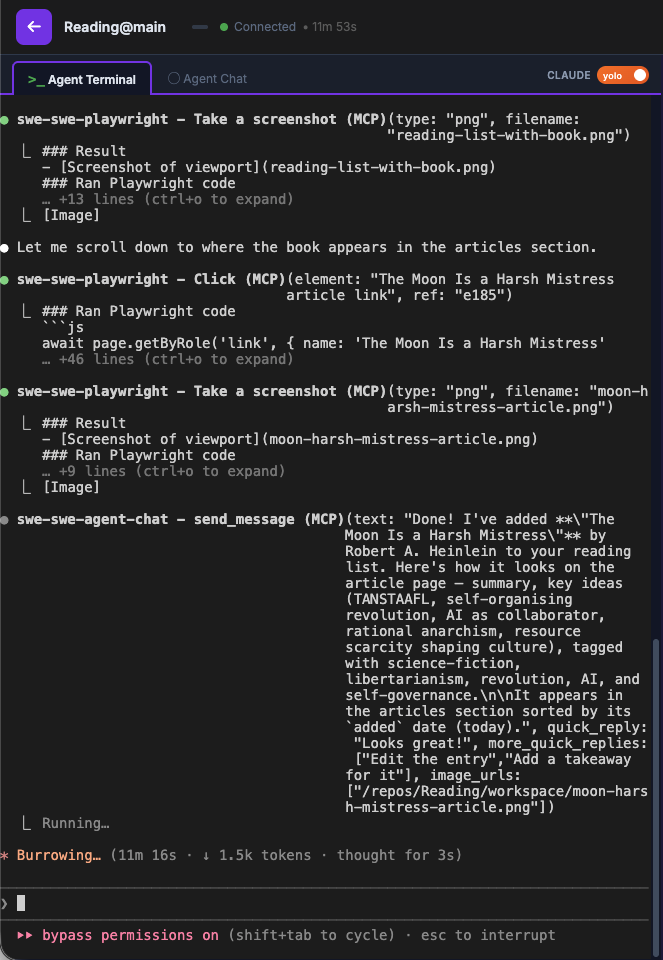
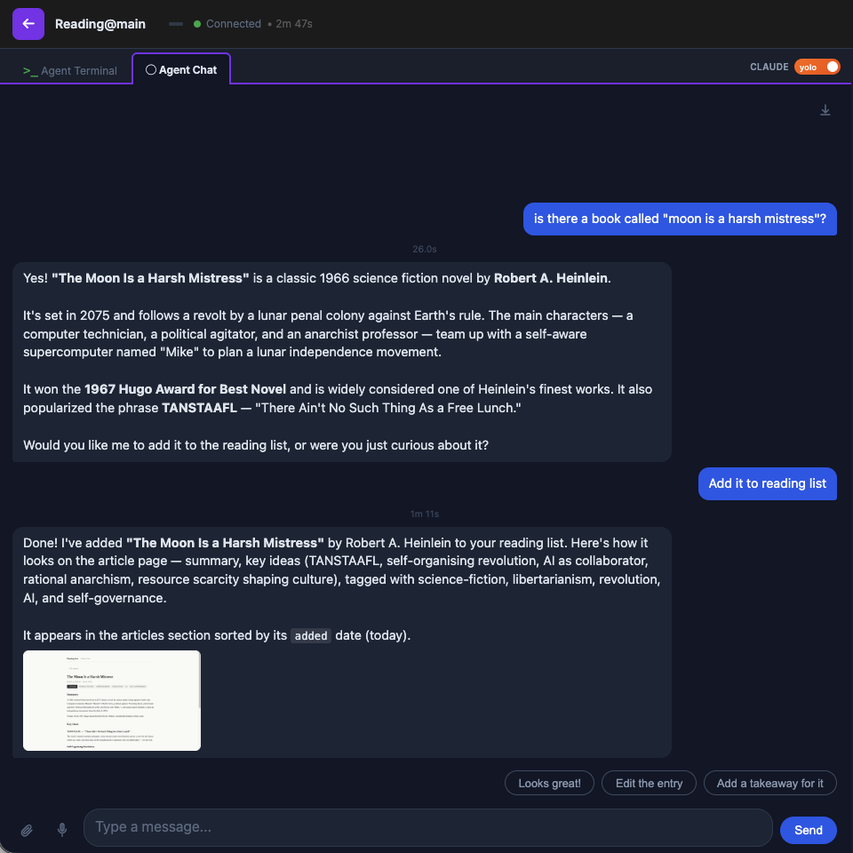

# Agent Chat

An MCP server that gives your AI agent a rich chat interface. Instead of reading raw tool calls in a terminal, your users get a rendered conversation with markdown, code blocks, canvas diagrams, quick reply buttons, and voice support.

This is the MCP that powers the **Agent Chat** tab in [swe-swe](https://swe-swe.netlify.app/).

<table>
<tr>
<td><strong>Agent Terminal</strong></td>
<td><strong>Agent Chat</strong></td>
</tr>
<tr>
<td></td>
<td></td>
</tr>
</table>

Same conversation, two views. The terminal shows MCP tool calls and code diffs. Agent Chat renders the same content as a rich, interactive chat.

## Features

- **Rich markdown** — messages render with full markdown, syntax-highlighted code blocks, and blockquotes
- **File drag & drop** — drop files into the chat to share them with the agent
- **Images in messages** — agents can include screenshots and images inline
- **Canvas drawing** — agents can draw diagrams and visualizations on an interactive canvas
- **Voice conversation** — speak to your agent and hear responses via text-to-speech
- **Quick replies** — agents can offer clickable response buttons for common actions
- **Permission prompts in chat** — when Claude Code is launched with `--dangerously-load-development-channels server:swe-swe-agent-chat`, tool-use permission prompts are intercepted from stdin and surfaced as Allow/Deny quick replies in the chat UI (and spoken aloud in voice mode), instead of blocking on a TUI prompt

## How it works

Agent Chat runs as an MCP server alongside your AI agent. The agent calls tools like `send_message`, `draw`, and `check_messages` to communicate with the user through a browser-based chat UI.

```
Agent (Claude, etc.)
  │
  ├─ send_message("Here's what I found...")  →  Chat UI shows rich message
  ├─ draw([...instructions...])              →  Chat UI renders canvas diagram
  ├─ send_progress("Working on it...")       →  Chat UI shows progress indicator
  └─ check_messages()                        ←  Chat UI returns user's reply
```

## MCP Tools

| Tool | Description |
|------|-------------|
| `send_message` | Send a message and wait for user response. Supports quick reply buttons. |
| `send_verbal_reply` | Send a spoken reply in voice mode (text-to-speech). |
| `draw` | Draw a canvas diagram and wait for user response. |
| `send_progress` | Send a non-blocking progress update. |
| `send_verbal_progress` | Send a non-blocking spoken progress update. |
| `check_messages` | Non-blocking check for queued user messages. |
| `set_chat_title` | Name the streaming chat-log export (see below): renames the auto-written `…-untitled.md` to `…-{slugified-title}.md` and rewrites its header. Call again anytime to rename; also re-enables the export after `chatlog_optout`. |
| `chatlog_close` | Close out the streaming chat-log export for a clean git commit: freezes this session's `.md` (kept, unlike `chatlog_optout`), regenerates `index.html`, and returns the exact paths to `git add`. Requires a `title` while the file is still untitled; never renames an already-titled file. `set_chat_title` re-opens with a full-history backfill. |
| `chatlog_optout` | Stop the streaming chat-log export for this session and delete its `.md` (assets are left — content-sha names may be shared; `index.html` regenerated). |
| `export_chat_md` | Manually export the current chat as a markdown file (script-style `**USER**` / `**AGENT**` markers that render as iMessage-style left/right bubbles via a sibling `index.html` and as a normal markdown doc on GitHub/GitLab). Writes `./agent-chats/YYYY-MM-DD-NN-{title}.md`, copies attachments to `./agent-chats/assets/`, refreshes `viewer.css` / `viewer.js`, and regenerates the chat-archive `index.html`. The manual escape hatch when the streaming export (below) is enabled. |

## Streaming chat-log export

Set `AGENT_CHAT_EXPORT_DIR` (e.g. `agent-chats`, resolved relative to the
working directory — it cannot escape it) and the markdown archive writes
itself, no `export_chat_md` call needed:

- **Every chat bubble is appended to `{date}-{NN}-untitled.md` the moment it
  happens** (`{date}-{NN}-untitled-{SESSION_UUID}.md` when a `SESSION_UUID`
  env var identifies the host session), and its attachments are copied into
  `assets/` at that same moment (content-sha filenames), while the upload
  files still exist.
- The agent names the file via `set_chat_title` (renames + header rewrite;
  callable again to rename). `chatlog_optout` stops the export for the session
  and deletes its `.md`.
- To commit the archive without it going dirty on the next reply, the agent
  calls `chatlog_close` (optionally titling in the same call), which freezes
  the `.md` and returns the exact paths to `git add`. Freezing loses nothing:
  the JSONL event log keeps recording, and `set_chat_title` re-opens the
  export with a full-history rewrite that backfills anything that arrived
  while frozen.
- `index.html` — the archive landing page — is **regenerated from the `.md`
  files on disk** after each quiet turn, never patched incrementally. That
  makes it merge-friendly: on a git conflict in `index.html`, accept either
  side (or delete the file); the next export regenerates it correctly.
  Duplicate daily `NN`s from parallel branches are fine — the regenerated
  index lists both, and content-sha asset names never clobber.
- The header comment carries a `session:` line, so a restarted process
  (same `AGENT_CHAT_EVENT_LOG`) resumes appending to its own file instead of
  minting a new one.
- Nothing is ever auto-committed — the export sits in the working tree.

## Installation

Add as an MCP server to Claude Code:

```bash
claude mcp add agent-chat -- npx -y @choonkeat/agent-chat
```

Or run standalone (HTTP-only mode):

```bash
npx -y @choonkeat/agent-chat --no-stdio-mcp
```

The chat UI opens automatically in your browser.

### Environment variables

| Variable | Description |
|----------|-------------|
| `AGENT_CHAT_PORT` | Fixed port for the HTTP server (default: random) |
| `AGENT_CHAT_EVENT_LOG` | Path to a JSONL file for event persistence across restarts |
| `AGENT_CHAT_EXPORT_DIR` | Directory (relative to cwd) for the streaming markdown chat-log export; unset = disabled |
| `AGENT_CHAT_DISABLE` | Set to any value to disable tools and HTTP server |

## License

MIT
