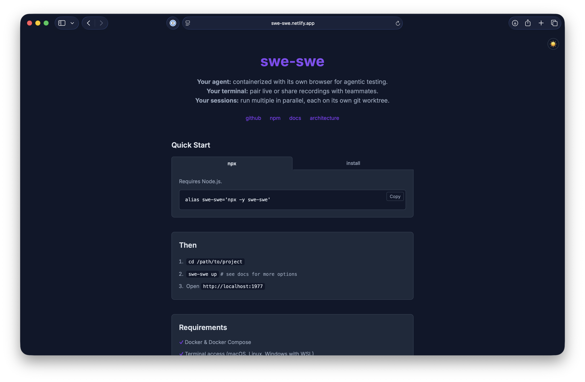
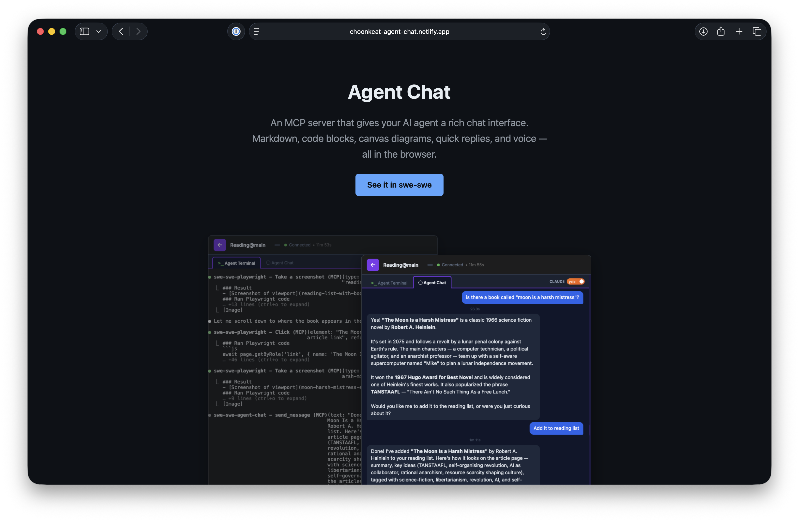

<!-- agent-chat export
title: Test Export Chat Feature
date: 2026-05-03
index: 01
slug: test-export-chat-feature
agent: claude
version: 0.5.0 (dff1d6d)
-->

# Test Export Chat Feature

_2026-05-03 · 01 · claude · agent-chat 0.5.0 (dff1d6d)_

**USER**

> I'm trying to test our new export chat feature
>
> 

> 
> 
> 

<small>took 17.1s</small> 
**AGENT**

> Got the two screenshots — swe-swe.netlify.app and choonkeat-agent-chat.netlify.app landing pages. How would you like to test the export chat feature with these? A few options:
>
> 1. Export this current conversation as markdown using `export_chat_md` and share the result
> 2. Walk me through a specific test scenario you have in mind
> 3. Verify the exported markdown renders correctly somewhere (GitHub, etc.)
>
> What's your testing goal?

[Quick replies]
- Export this conversation now
- Walk me through it
- Just verify rendering

**USER**

> Export this conversation now

