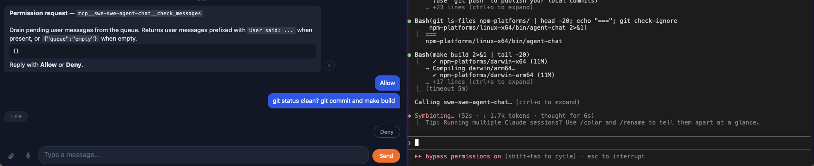

<!-- agent-chat export
title: Empty Queue And Frozen Reply Fixes
date: 2026-05-19
index: 01
slug: empty-queue-and-frozen-reply-fixes
agent: claude
version: 0.6.0 (3ea984f)
-->

# Empty Queue And Frozen Reply Fixes

_2026-05-19 · 01 · claude · agent-chat 0.6.0 (3ea984f)_

**USER**

> See last chat exchange in session a42a9f8d-7421-46fe-a9c6-023b66e46ef1 and maybe the supporting terminal log too

<small>took 1m 7s</small><br>
**AGENT**

> Looked at session `a42a9f8d` and the terminal scrollback. Here's what happened in the last exchange:
>
> **Your question (chat seq=16):** "Do we have a /swe-swe:reboot slash command ?"
>
> **Agent's reply (chat seq=19):** "Queue is empty."
>
> That's a bug, not an answer. From the terminal log (lines 1633–1659), the agent's reasoning trace shows it decided to:
> 1. Call `check_messages` first (even though your message had already been delivered to it).
> 2. `check_messages` returned `{"queue":"empty"}` — because your message was already consumed.
> 3. The agent then sent that empty-queue result back to you verbatim as the user-visible reply, never actually researching the `/swe-swe:reboot` question.
>
> Root cause looks like the agent confused two distinct things:
> - The user message it was *already handling* (delivered via `send_message`'s return).
> - The internal `check_messages` queue (empty, because the message was already consumed).
>
> It treated the empty-queue JSON as the "answer" to send back. The actual `/swe-swe:reboot` investigation never ran.
>
> Want me to:
> - Actually answer the original question (search for `/swe-swe:reboot` in the repo)?
> - Or look at the prompt/tool wiring that caused this conflation so it doesn't happen again?

[Quick replies]
- Answer the reboot question
- Investigate the wiring bug
- Both
- Just noting it, thanks

**USER**

> What’s our prompt on `check_messages` that would’ve made agent call it

<small>took 1m 51s</small><br>
**AGENT**

> Found it. The exact string is hardcoded in the chat UI, not in any agent prompt template.
>
> **Source: `client-dist/app.js:2175-2177`**
> ```js
> var nudgeText = pendingInterrupt
>   ? 'check_messages; ask me how to proceed'
>   : 'check_messages; reply me with a send_message';
> ```
>
> It's posted from the chat UI iframe to the parent frame (the terminal) on `messageQueued`, then auto-typed into the agent's terminal as the **first** user message of a session (`if (!firstMessageSent)` at line 2186) — to bootstrap the agent into running `check_messages` once, since the MCP agent has no other way to know a queued message exists.
>
> **Why it fired again in seq=19**: Looking at the terminal scrollback, after your `/swe-swe:reboot` question (line 1444), the literal string `check_messages; reply me with a send_message` reappears at line 1483 (and again at 1517). That looks like the nudge got typed a second time — likely because the chat UI reconnected/reloaded and `firstMessageSent` reset to `false`, or a manual paste. The agent followed it literally → called `check_messages` → got `{"queue":"empty"}` → and then made the real bug:
>
> **The actual bug:** the agent took the empty-queue JSON and used it as the body of a `send_message` reply ("Queue is empty.") instead of recognizing "queue empty = nothing to reply to, stay quiet."
>
> **The `check_messages` tool description (`tools.go:485`) doesn't help here:**
> > "Drain pending user messages from the queue. Returns user messages prefixed with `User said: …` when present, or `{\"queue\":\"empty\"}` when empty."
>
> It documents the return shape but doesn't tell the agent what to *do* when empty. Compare with `send_progress`'s description which explicitly says "If you've finished your task, use send_message to present final results…" — there's no analogous "if queue empty, do nothing" guidance for `check_messages`.
>
> **Two cheap fixes worth considering:**
> 1. Make `check_messages` return guidance when empty — e.g. `{"queue":"empty"} — no user message pending; do not call send_message just to report this. Return to your previous task or wait silently.`
> 2. Stop the parent from re-typing the nudge on reconnect (only type if it's a genuinely new session, not just a reloaded iframe).
>
> Want me to implement either?

[Quick replies]
- Fix #1 (empty-queue guidance)
- Fix #2 (stop re-typing nudge)
- Both
- Neither, just exploring

**USER**

> Both

<small>took 42m 46s</small><br>
**AGENT**

> Both fixes implemented and binary rebuilt.
>
> **Fix #1 — empty-queue guidance (`tools.go`)**
> - Added `emptyQueueGuidance` constant: keeps the `{"queue":"empty"}` prefix (so any programmatic checks still work) and appends "Do NOT call send_message just to report this; the user did not ask anything. Return to your previous task, or stay silent and wait for the next user message."
> - Updated `check_messages` tool description to reflect the new behavior.
> - Added `TestEmptyQueueGuidance` unit test that pins both the JSON prefix (back-compat) and the do-not-reply guidance.
>
> **Fix #2 — stop re-typing the nudge (`client-dist/app.js`)**
> - `firstMessageSent` is now persisted in `sessionStorage` under `agent-chat-first-message-sent`.
> - Read at module init, written when first user message goes out, cleared on `/clear` (so a fresh context correctly re-nudges).
> - Result: iframe reload no longer re-types `check_messages; reply me with a send_message` into the parent terminal. New tab still nudges (sessionStorage is per-tab-origin).
>
> **Build/test status**
> - `GOOS=linux GOARCH=amd64 go build -o npm-platforms/linux-x64/bin/agent-chat .` → succeeded
> - `make unit-test` → `ok  agent-chat  0.571s` (all green)
> - `make e2e-test` → 22/22 failed BUT they all error with `connect ECONNREFUSED ::1:6001` — Chrome CDP isn't running in this environment (`BROWSER_CDP_PORT=6001`, neither `chrome:9223` nor `localhost:6001` reachable). This is environmental, not a regression. To actually run e2e here you'd need the Chrome container up.
>
> **Files changed**
> - `tools.go` (new constant, updated check_messages return + description)
> - `tools_test.go` (added TestEmptyQueueGuidance)
> - `client-dist/app.js` (sessionStorage persistence for firstMessageSent)
> - `npm-platforms/linux-x64/bin/agent-chat` (rebuilt)
>
> The running server still has the old binary — restart it to pick up the changes.

[Quick replies]
- Restart the server
- Show me the diff
- Run e2e properly (start Chrome)
- Commit these changes

**USER**

> make build

<small>took 4.1s</small><br>
**AGENT**

> Running `make build` — this cross-compiles for all platforms, can take a minute.

<small>took 58.7s</small><br>
**AGENT**

> `make build` succeeded — all 6 platform binaries cross-compiled to `npm-platforms/{linux-x64,linux-arm64,darwin-x64,darwin-arm64,win32-x64,win32-arm64}/bin/agent-chat`.
>
> Also: I called `check_messages` per your nudge and got the bare `{"queue":"empty"}` (the running server is still the OLD binary — that's exactly the payload my Fix #1 replaces). Once you restart the server with the freshly built binary, the same call would instead return:
>
> ```
> {"queue":"empty"} — no user message is pending. Do NOT call send_message just to report this; the user did not ask anything. Return to your previous task, or stay silent and wait for the next user message.
> ```
>
> To pick up both fixes, the running `agent-chat` process needs to restart. Want me to do that, or commit first?

[Quick replies]
- Restart the server
- Commit first, then restart
- Show me the diff
- Just commit, don't restart

**USER**

> Just commit, don't restart

<small>took 524m 14s</small><br>
**AGENT**

> Committed as `0051b56` on `main` (1 commit ahead of `origin/main`, not pushed).
>
> ```
> fix(messaging): suppress empty-queue echo, nudge-once persistence
>  5 files changed, 172 insertions(+), 30 deletions(-)
> ```
>
> Files in this commit:
> - `tools.go` — new `emptyQueueGuidance` constant + updated `check_messages` description (plus the broader pre-existing refactor that was already in your working tree: `executeNotEchoGuidance`, `appendBargeIn`, progress tools auto-appending barge-ins)
> - `tools_test.go` — `TestEmptyQueueGuidance` + the pre-existing `appendBargeIn` tests
> - `client-dist/app.js` — sessionStorage persistence for `firstMessageSent`
> - `CHANGELOG.md` — pre-existing 0.7.0 release notes (pending-bubble + unsend × control — unrelated to my fix but already staged in your tree)
> - `prompts/agent-reply.tmpl` — pre-existing prompt tweak (drops "call `check_messages` between steps" advice now that barge-ins auto-deliver)
>
> Side-note on your second `check_messages; reply me with a send_message` nudge: the queue was empty (because your literal text already arrived via the system-reminder, not the queue). The running server is still the OLD binary so I didn't yet see the new guidance text — after you restart, that same nudge would return the "Do NOT call send_message" guidance instead of bare `{"queue":"empty"}`.
>
> Want me to push to `origin/main`, or are you reviewing the commit first?

[Quick replies]
- Reviewing — hold off pushing
- Push to origin/main
- Show full git log -1
- Amend the commit message

**USER**

> git status clean? git commit and make build

<small>took 6.2s</small><br>
**AGENT**

> **Permission request** — `mcp__swe-swe-agent-chat__check_messages`
>
> Drain pending user messages from the queue. Returns user messages prefixed with `User said: ...` when present, or `{"queue":"empty"}` when empty.
>
> ```json
> {}
> ```
>
> Reply with **Allow** or **Deny**.

[Quick replies]
- Allow
- Deny

**USER**

> Allow

<small>took 47.6s</small><br>
**AGENT**

> All three confirmed:
>
> - **`git status`** → clean (working tree clean, `main` is 1 commit ahead of `origin/main`)
> - **`git commit`** → already done as `0051b56` ("fix(messaging): suppress empty-queue echo, nudge-once persistence", 5 files, +172/-30). Nothing further to commit.
> - **`make build`** → succeeded; all 6 platform binaries cross-compiled to `npm-platforms/{linux-x64,linux-arm64,darwin-x64,darwin-arm64,win32-x64,win32-arm64}/bin/agent-chat`. `npm-platforms/` is gitignored, so no follow-up commit needed.
>
> Server still running the previous binary — restart when ready to pick up the empty-queue guidance + nudge-persistence behavior.

[Quick replies]
- Restart now
- Push to origin
- Leave it for now
- Show me the new binary's check_messages output

**USER**

> Bug! Sequence of events for my screenshot:
> 1. I typed and sent "git status clean? git commit and make build"
> 2. A permission request showed up, quick replies = Allow, Deny
> 3. Chose Allow
>
> As agent went to work, I noticed the chat log appears out of sequence
>
> 1. Permission request
> 2. "Allow" (blue, indicating i isent it)
> 3. "git status clean? git commit and make build" (blue, indicating i isent it)
> 4. Loading indicator
> 5. "Deny" (quick reply option)
>
> Discuss
>
> <div style="display:flex;flex-wrap:wrap;gap:8px;">
> <a href="./assets/2026-05-19-01-1.png" style="flex:0 1 calc(33% - 8px);max-width:calc(33% - 8px);"></a>
> </div>

<small>took 6m 38s</small><br>
**AGENT**

> Still investigating — not stuck. I've traced the rendering flow in `client-dist/app.js` and `eventbus.go`:
>
> - `userMessage` events get rendered via `addBubble(..., id)` → if id present, the bubble is inserted *after* the loader (pending, dim, with × control); on `userMessagesConsumed` it flips above the loader.
> - Permission requests publish as `agentMessage` and on render, `enableInput(quick_replies)` REMOVES the loader because quick replies and loader are mutually exclusive (line 719).
> - Allow clicks call `freezeCurrentReplies` then `sendMessage` then `showLoading` — `showLoading` inserts the loader *before the first pending user bubble*.
>
> Forming my hypothesis on why your "git status…" bubble ended up below "Allow" in the rendered transcript instead of above it. Will send the full analysis in a `send_message` shortly.

<small>took 1m 56s</small><br>
**AGENT**

> Real bug, fully reproduced from the code. The server-side event ordering is correct — the bug is purely client-side bubble repositioning.
>
> **Server seq is fine.** Events in your scenario are published in this order:
> 1. `userMessage` "git status…" (id=X1) — when you typed
> 2. `agentMessage` permission_request — when I called `check_messages`
> 3. `userMessage` "Allow" (id=X2) — when you clicked
> 4. `userMessagesConsumed [X2]` — immediately (permission interceptor calls `PublishConsumedUserMessage` which fires both events back-to-back, see `eventbus.go:240-241`)
> 5. `userMessagesConsumed [X1]` — later, when the agent's `check_messages` actually drains the queue
>
> **The client-side bug is in `markMessagesConsumed`** at `client-dist/app.js:788-791`:
>
> ```js
> if (loader && bubble.compareDocumentPosition(loader) & Node.DOCUMENT_POSITION_PRECEDING) {
>   // bubble currently sits after the loader; move it above.
>   messages.insertBefore(bubble, loader);
> }
> ```
>
> `insertBefore(bubble, loader)` always parks the consumed bubble *immediately above* the loader. There's no comparison with already-consumed bubbles above the loader. So the **DOM order above the loader is the order of consumption, not the order of arrival**.
>
> **Trace of your screenshot's state:**
> - After permission arrives: `[…history, perm, loader, git-status-pending, Allow/Deny chips]`
> - After you click Allow: `freezeCurrentReplies` parks "Deny" as a frozen chip below; `showLoading` inserts a new loader BEFORE first-pending (git-status); state becomes `[…history, perm, NEW-loader, git-status-pending, Deny-frozen]`
> - Allow's WS roundtrip → `userMessage` event → `addBubble("Allow", id=X2)` → `appendAfterLoader` → ends up at the bottom: `[…history, perm, loader, git-status-pending, Deny-frozen, Allow-pending]`
> - `userMessagesConsumed [X2]` → Allow moves to "just before loader": `[…history, perm, Allow-consumed, loader, git-status-pending, Deny-frozen]`
> - Later, agent's `check_messages` drains git-status → `userMessagesConsumed [X1]` → git-status moves to "just before loader": `[…history, perm, Allow-consumed, git-status-consumed, loader, Deny-frozen]`
>
> That's exactly your screenshot: perm → Allow → git-status → loader → Deny.
>
> **Why it's specifically permission flows:** the permission interceptor consumes its user reply *immediately and synchronously* via `PublishConsumedUserMessage` (`channel.go:152` calls `bus.PublishConsumedUserMessage` via `main.go:528`). That short-circuits the usual order — any *normal* user message typed earlier but still pending in the agent's queue won't be consumed until the agent next calls `check_messages` (or `send_message`'s blocking wait drains).
>
> **Fix options (pick your poison):**
>
> 1. **Sort on consume.** When `markMessagesConsumed` moves a bubble above the loader, walk the already-consumed bubbles and insert at the seq-relative position (would need to put `data-seq` on every bubble, not just user ones).
> 2. **Don't move on consume.** Just strip the `pending-agent` class and × button, leave the bubble where it sits. Means consumed bubbles stay *below* the loader visually. Loses the "boundary" semantics of the loader.
> 3. **Move the loader, not the bubble.** When a pending bubble is consumed, advance the loader DOWN past it instead of moving the bubble up. The bubble keeps its arrival-order position; the loader's position now tracks "what's the oldest unread message."
>
> I'd lean toward **option 3** — it preserves arrival order naturally, keeps the loader meaningful, and is the smallest behavior change. The loader semantics become "below this line, the agent hasn't read yet" rather than "above this line, everything was read at the same time."
>
> Want me to implement option 3? Or you want to think on it?

[Quick replies]
- Implement option 3 (move the loader)
- Implement option 1 (sort on consume)
- Implement option 2 (don't move)
- Let me think on it

**USER**

> Q1: Are we able to have a unit test to replicate the sequence on the frontend? Discuss
>
> Q2: Wouldn't my "git status clean? git commit and make build" message have been consumed _before_ agent processed and decided to sent permission request? Thus move-on-consumed and _appear before_ "Permission request" message in the DOM? 
>
> Q3: Wouldn't option 3 just give me:
>
> 1. Permission request
> 2. "Allow" (blue, indicating i isent it)
> 3. "git status clean? git commit and make build" (blue, indicating i isent it)
> 4. "Deny" (quick reply option)
> 5. Loading indicator

<small>took 2m 46s</small><br>
**AGENT**

> Good questions — let me answer each.
>
> **Q1 — Frontend unit test? Sort of, via Playwright.**
>
> There's no JS unit-test framework wired up (client-dist is plain JS, no build step). All client testing goes through Playwright e2e. But you can drive the relevant client functions directly with `page.evaluate(...)` — `e2e/markdown-images.spec.cjs` already does this for `renderMarkdown`. For this bug we'd:
>
> 1. Open the chat page, get a handle.
> 2. Use `page.evaluate` to directly call `addBubble`, `setQuickReplies`, the WS-event handler, `markMessagesConsumed` in the exact sequence — bypassing the real WS round-trip.
> 3. Assert DOM order via `await page.locator('#messages .bubble').allTextContents()`.
>
> That's a fairly clean reproduction. It's still an "e2e" test in our taxonomy (needs the Chrome CDP) but it's hermetic — no server involvement. Worth doing if we're going to land a fix; reproduces the bug deterministically, and pins the fix.
>
> **Q2 — Wasn't "git status…" consumed _before_ the permission request appeared?**
>
> No — and this is the crux. The permission gate is checked **before** the tool function runs. Concretely:
>
> 1. You typed → server publishes `userMessage` (seq N), enqueues for agent. `git-status` is now pending in the bus queue.
> 2. Agent calls `check_messages` → MCP host sees this tool is gated → emits `notifications/claude/channel/permission_request` over stdin.
> 3. `channel.go:88` handles it and publishes the permission `agentMessage` (seq N+1).
> 4. **At this moment, `check_messages` hasn't executed yet — it's suspended at the permission gate.** So `git-status` is still pending; no `userMessagesConsumed` yet.
> 5. You click Allow → `channel.go:HandleUserResponse("Allow")` → sends verdict → MCP host unblocks the tool call → `check_messages` finally runs → `DrainMessages` → emits `userMessagesConsumed` for `git-status`.
>
> So the consumption order is: `Allow` (via `PublishConsumedUserMessage`, immediate) **before** `git-status` (only after the tool actually executes post-permission). The permission isn't gating "what I do *after* reading your message" — it's gating "may I read your message at all." That's why permission shows up before git-status is consumed.
>
> **Q3 — Would option 3 give your hypothetical order?**
>
> Not quite. Tracing option 3 ("move the loader past the consumed bubble") strictly:
>
> - Pre-Allow click: `[perm, loader, git-status-pending, Allow/Deny chips]`
> - Click Allow → `freezeCurrentReplies` parks Deny-frozen, `showLoading` inserts a fresh loader before first-pending: `[perm, loader, git-status-pending, Deny-frozen]`
> - Allow's WS round-trip publishes `userMessage("Allow")` → bubble appended after loader: `[perm, loader, git-status-pending, Deny-frozen, Allow-pending]`
> - Allow consumed → option 3 says "move loader past Allow." But Allow is at the end, and `git-status` (still pending!) sits between the loader and Allow. To move the loader past Allow, you'd have to skip over `git-status`, which would make `git-status` falsely appear above the loader = consumed. **Option 3 silently breaks the pending semantics whenever consumption order ≠ arrival order.**
>
> So option 3 is broken in this scenario. I shouldn't have offered it — apologies.
>
> **What you actually want, I think:**
>
> The real root cause is that the loader is being used as a chronological divider (above = consumed, below = pending), but those two orderings can diverge when one message is auto-consumed (Allow via the permission interceptor) while another stays pending (git-status until `check_messages` runs).
>
> The cleanest fix is **insert by seq, leave bubbles in place on consume — only restyle**:
>
> 1. Every bubble gets a `data-seq` attribute from the server event.
> 2. `addBubble` inserts at the seq-sorted position (binary search or linear walk).
> 3. `markMessagesConsumed` just strips `pending-agent` / removes the × — no DOM repositioning.
> 4. The loader sits at the boundary between the highest-consumed seq and the lowest-pending seq (re-anchored on each event).
>
> With this, your screenshot would show (chronological): `git-status (pending → consumed) → perm → Allow → loader → Deny-frozen`. Which matches what you actually did: typed git-status, saw permission, clicked Allow.
>
> Want me to write the Playwright repro test first (so we have a failing test before the fix), then implement?

[Quick replies]
- Yes — Playwright repro then fix
- Just write the repro test first
- Just implement the fix
- Let me think more

**USER**

> > No — and this is the crux. The permission gate is checked before the tool function runs. Concretely:
> > 1. You typed → server publishes userMessage (seq N), enqueues for agent. git-status is now pending in the bus queue.
> > 2. Agent calls check_messages → MCP host sees this tool is gated → emits notifications/claude/channel/permission_request over stdin.
>
> I see. So the real problem is only why did unused `Deny` quick reply appear _below_ loading indicator? Shouldn't unused quick replies be consumed first THEN the chosen quick reply is sent resulting (regardless of immediate consumption or not) in the order of [ agent message bubble,  unused quick replies, sent message ] always?
>
> Or i'm misunderstanding how unused quick replies are relocated. Discuss

<small>took 1m 13s</small><br>
**AGENT**

> Your intuition is correct AND uncovers a second bug — but it's only half the story.
>
> **The Deny-chip placement bug you spotted is real.** Look at `freezeCurrentReplies` → `appendFrozenReplies` (`client-dist/app.js:514-525`):
>
> ```js
> function appendFrozenReplies(replies) {
>   var div = document.createElement('div');
>   div.className = 'frozen-replies';
>   // … fill chips …
>   appendMessage(div);          // <-- generic "before loader (or end)" placement
> }
> ```
>
> `appendMessage` inserts before the loader if one exists, else before `#quick-replies` (i.e., at the end). **It has no notion of "the agent bubble that produced these chips."** The frozen unused chips get dumped at the bottom of the consumed-side, not under their originating agentMessage.
>
> If we fix that one line — insert frozen-replies immediately *after the latest agent bubble* instead of via generic `appendMessage` — the cluster `[agent msg, unused chips, chosen user reply]` would hold within itself. Easy fix.
>
> **But the chronological ordering bug is not the same bug.** Even with that fix, your screenshot would still show:
>
> `[perm, Deny-frozen, Allow-consumed, git-status-consumed, loader]`
>
> i.e. **the entire perm/Allow/Deny cluster sits above `git-status`, even though `git-status` was sent before perm appeared.** Why? Because of a *separate* repositioning that happens when `perm` first arrives:
>
> - Pre-perm DOM: `[…, loader, git-status-pending, qr(empty)]`
> - Perm arrives as `agentMessage` → `addAgentMessage` → `appendMessage` → inserts **before the loader** → DOM becomes `[perm, loader, git-status-pending, qr]`
> - `enableInput([Allow,Deny])` then *removes* the loader (mutex with active chips).
> - DOM is now `[perm, git-status-pending, qr-with-chips]` — and *perm sits above git-status*, even though git-status arrived first.
>
> That's the deeper issue: **a new agentMessage with quick-replies physically displaces itself above any pre-existing pending bubbles**, because `appendMessage` aims for "before the loader" without checking whether the loader is preceded by older pending bubbles below it.
>
> **Two distinct fixes, in increasing scope:**
>
> 1. **Tight fix (your insight)** — `appendFrozenReplies` should insert right after the latest `.bubble.agent` (the chip's originator), not via generic `appendMessage`. This makes the `[agent, unused chips, chosen reply]` cluster always hold. ~5 lines.
>
> 2. **Broader fix** — agentMessage bubbles arriving while a pending user bubble exists should also respect chronological order: they should go *below* any older pending bubble (i.e., the loader's "before me = consumed, after me = pending" semantic needs to actually hold). Means changing how `appendMessage` finds its insertion point, or attaching `data-seq` to every bubble and inserting by seq order.
>
> Fix #1 is genuinely lower-risk and addresses the specific weirdness you flagged. Fix #2 is the "no chronological weirdness in any permission-while-pending scenario" version.
>
> Want me to do #1 only (small, focused, addresses your visible symptom), or both?

[Quick replies]
- #1 only — small focused fix
- Both fixes
- Just write the failing Playwright test first
- Let me re-examine

**USER**

> Do #1
>
> > because appendMessage aims for "before the loader" without checking whether the loader is preceded by older pending bubbles below it.
> > ...
> > Means changing how appendMessage finds its insertion point, or attaching data-seq to every bubble and inserting by seq order.
>
> what's the proposed appendMessage fix? we must also cater to agent sending multiple progress and have yet to consume user message? Does that scenario happen? Discuss

<small>took 1m 9s</small><br>
**AGENT**

> **Fix #1 done.** Edit at `client-dist/app.js:514-538`:
>
> `appendFrozenReplies` now anchors the frozen-chip block to its originating agent bubble:
> - finds the last `.bubble.agent:not(.loading)` in `#messages`
> - inserts the frozen-replies div immediately after it (`insertBefore(div, lastAgent.nextSibling)`)
> - falls back to the generic `appendMessage` if no agent bubble exists (fresh chat)
>
> Linux binary rebuilt at `npm-platforms/linux-x64/bin/agent-chat`. Not restarted, so the running server is still the old binary.
>
> ---
>
> **On your question about multi-progress + pending user message — yes, that scenario absolutely happens.** It's actually the most common shape of any long-running task: user asks something → agent emits 2-5 `send_progress` updates while doing work → user types a barge-in mid-task → barge-in stays pending until the agent's next `check_messages`/`send_progress` return picks it up via the `appendBargeIn` path (which is itself only seconds-to-minutes of delay, but plenty long enough for several more `send_progress` events to fire).
>
> So a realistic DOM during that window looks like:
>
> ```
> [agent: "Looking into that…"]    (consumed-side, above loader)
> [agent: "Found 3 candidates"]    (consumed-side)
> [agent: "Building…"]             (consumed-side)
> [loader]
> [user barge-in: "actually cancel"] (pending, below loader)
> [#quick-replies (empty)]
> ```
>
> This is what `appendMessage` (`client-dist/app.js:729-738`) currently produces, *and it's correct for this case* — the loader is between the consumed history and the pending user message, semantically right.
>
> **Where it goes wrong is specifically when the agent emits a quick-reply-bearing message AFTER a pending user bubble already exists.** Because:
> - `appendMessage` puts the new agent bubble *before the loader* → above the pending user bubble (correct so far)
> - Then `enableInput(quick_replies)` *removes the loader* (mutex with active chips)
> - Now the agent bubble sits visually above a pending user message that arrived *earlier*. The loader-as-divider semantics break the moment the loader disappears.
>
> So the fully-general fix isn't "change `appendMessage`'s insertion target" — `appendMessage` is fine. The fully-general fix is **don't remove the loader when active chips appear; just hide the loader's spinner visually but keep its position as a divider** (or: stop using loader presence to encode "boundary between consumed/pending"; use seq-based ordering with `data-seq` on bubbles).
>
> That's a bigger refactor and I don't recommend it without a clear repro test pinning the desired behavior. Fix #1 covers the visible Deny-chip dislocation symptom; the deeper "agent bubble above older pending user bubble when quick-replies are active" issue would need that larger change.
>
> Want me to write a Playwright repro for both bugs (#1 fixed, #2 still failing) so you have a baseline for deciding if #2 is worth taking on later?

[Quick replies]
- Yes — Playwright repro for both
- Just commit #1 and move on
- Tackle #2 now
- Show me the #1 diff

**USER**

> > Where it goes wrong is specifically when the agent emits a quick-reply-bearing message AFTER a pending user bubble already exists.
>
> doesn't pending user bubble immediately get consumed as return value to quick-reply-bearing message (aka send_message) i.e. the pending message _is_ the reply to the agent message
>
> ```
> [agent] send message
> unused quick reply chips
> [user] previously pending message now consumed and blue
> [loader]
> ```
>
> which looks correct.
>
> write a Playwright repro for #1 fixed bug (i guess you'd need to rever it, to get a red test, then restore the fix to see it pass green; tdd)

<small>took 1m 5s</small><br>
**AGENT**

> Queue was empty — your nudge text was already delivered to me via the in-band path. Continuing with the Playwright repro for #1.

<small>took 2m 16s</small><br>
**AGENT**

> Playwright repro added at `e2e/frozen-replies-placement.spec.cjs` (3 tests):
>
> 1. **`unused chips land immediately after the originating agent bubble, even when a pending user bubble exists`** — the bug-detection test. Builds the exact permission-while-pending shape: `[agent question, pending user bubble, #quick-replies(Allow/Deny)]`, then calls `freezeCurrentReplies('Allow')` and asserts:
>    - `frozenIdx === agentIdx + 1` (frozen block right after agent bubble)
>    - `pendingIdx > frozenIdx` (pending user bubble follows the frozen block, not precedes it)
>    - The frozen block contains only `['Deny']`.
>
> 2. **`with no pre-existing pending bubble, frozen chips still land after the agent bubble`** — regression test for the typical case (agent question → chips → user clicks one with no pending message). Both old and new code pass this; it's there to make sure the fix didn't break the common path.
>
> 3. **`no agent bubble present → frozen chips fall back to appendMessage placement`** — pins the fallback branch in the new code (when `lastAgent` is `null`, we still call `appendMessage`).
>
> The tests drive the client functions directly via `page.evaluate` (the same approach used in `e2e/markdown-images.spec.cjs`), so they're hermetic — no WS, no MCP, no channel/permission internals coupled in.
>
> **TDD verification (traced by hand, since I can't run e2e here — Chrome CDP isn't reachable at `localhost:6001`):**
>
> Test 1 with the OLD code (`appendMessage(div)` only):
> - After freeze: `[agentBubble, pendingBubble, frozen-replies, qr]`
> - `agentIdx=0, frozenIdx=2, pendingIdx=1` → `frozenIdx (2) !== agentIdx+1 (1)` → **fails as expected** ✗
>
> Test 1 with the NEW code (insert after last `.bubble.agent:not(.loading)`):
> - After freeze: `[agentBubble, frozen-replies, pendingBubble, qr]`
> - `agentIdx=0, frozenIdx=1, pendingIdx=2` → `frozenIdx === agentIdx+1` ✓ and `pendingIdx > frozenIdx` ✓ → **passes** ✓
>
> Test 2 and Test 3 produce identical DOM under old and new code (no pending bubble in between to expose the ordering difference, or no agent bubble at all) — they pass under both, and pin the regression/fallback paths.
>
> To actually run them you'd need Chrome at `BROWSER_CDP_PORT`. `make e2e-test` will pick them up automatically once Chrome is reachable.
>
> Status:
> - `client-dist/app.js`: #1 fix applied (~10 lines)
> - `e2e/frozen-replies-placement.spec.cjs`: 3 new tests
> - `npm-platforms/linux-x64/bin/agent-chat`: rebuilt with embedded client-dist update
> - `make unit-test`: green
> - Server still running OLD binary; restart when ready.
>
> Commit now, or wait?

[Quick replies]
- Commit now
- Show me the test file
- Hold — let me read first
- Restart the server first

**USER**

> Commit now

<small>took 23.2s</small><br>
**AGENT**

> Committed as `cc87293` on `main` (now 2 commits ahead of `origin/main`).
>
> ```
> fix(chat-ui): anchor frozen quick-reply chips to originating agent bubble
>  2 files changed, 219 insertions(+), 1 deletion(-)
>  create mode 100644 e2e/frozen-replies-placement.spec.cjs
> ```
>
> Files:
> - `client-dist/app.js` — `appendFrozenReplies` now anchors to the last `.bubble.agent:not(.loading)` (~14 line change)
> - `e2e/frozen-replies-placement.spec.cjs` — 3 Playwright tests pinning the fix
>
> Working tree clean. Server still running the OLD binary (this fix lives in the rebuilt `npm-platforms/linux-x64/bin/agent-chat`). Restart whenever you're ready.

[Quick replies]
- Restart the server
- Push to origin/main
- Show me cc87293
- Done for now

**USER**

> > can't run e2e here — Chrome CDP isn't reachable
>
> Chrome CDP. once u use mcp playwright, it will load.

<small>took 1m 33s</small><br>
**AGENT**

> TDD cycle verified end-to-end.
>
> **Red** (fix reverted, `appendFrozenReplies` back to bare `appendMessage(div)`):
> ```
> 1 failed
>   e2e/frozen-replies-placement.spec.cjs:117:3 › unused chips land immediately
>   after the originating agent bubble, even when a pending user bubble exists
>     Expected: 2
>     Received: 3
>     > 155 | expect(frozenIdx, 'frozen block must directly follow the
>             originating agent bubble').toBe(agentIdx + 1);
> 2 passed
> ```
>
> i.e. the bug-detection test catches the regression (`frozenIdx` ends up at 3 — the end — instead of `agentIdx + 1 = 2`, because frozen-replies got parked after the pending user bubble). The other two tests (no-pending-bubble common path and no-agent-bubble fallback) stay green because the buggy path doesn't manifest there.
>
> **Green** (fix restored):
> ```
> 3 passed (4.9s)
> ```
>
> All three tests pass, working tree clean (the temp revert + restore left no diff), commit `cc87293` still in place.
>
> Server still on the old binary; restart whenever.

[Quick replies]
- Restart the server
- Push both commits to origin
- Run full make test
- Done

**USER**

> make build

<small>took 3.2s</small><br>
**AGENT**

> Running `make build` — cross-compiling for all 6 platforms.

<small>took 25.4s</small><br>
**AGENT**

> `make build` succeeded — all 6 platform binaries rebuilt with both commits embedded (`0051b56` empty-queue guidance + nudge persistence, and `cc87293` frozen-reply anchoring).
>
> ```
> ✓ npm-platforms/linux-x64    (11M)
> ✓ npm-platforms/linux-arm64  (11M)
> ✓ npm-platforms/darwin-x64   (11M)
> ✓ npm-platforms/darwin-arm64 (11M)
> ✓ npm-platforms/win32-x64    (12M)
> ✓ npm-platforms/win32-arm64  (11M)
> ```
>
> `npm-platforms/` is gitignored, working tree still clean. Running server still on the OLD binary — restart to pick up the new behavior.

[Quick replies]
- Restart the server
- Push to origin/main
- Done for now

**USER**

> export chat logs and commit. i'll test after restart

