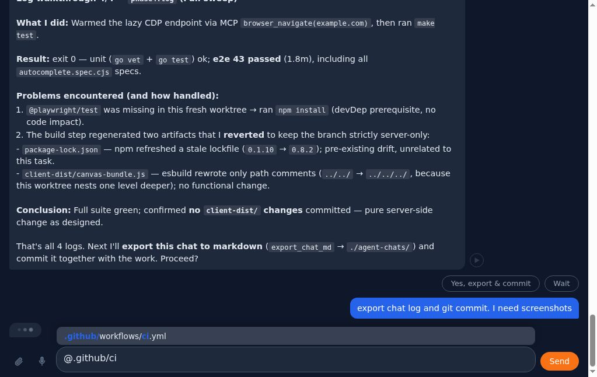
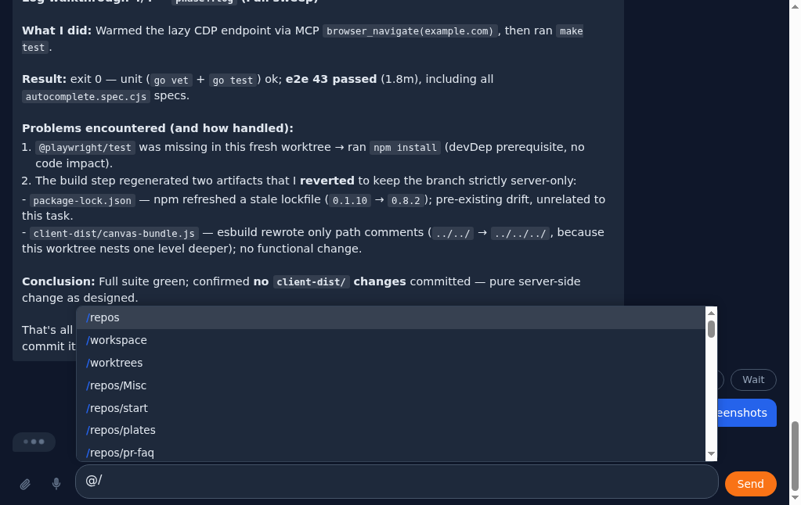
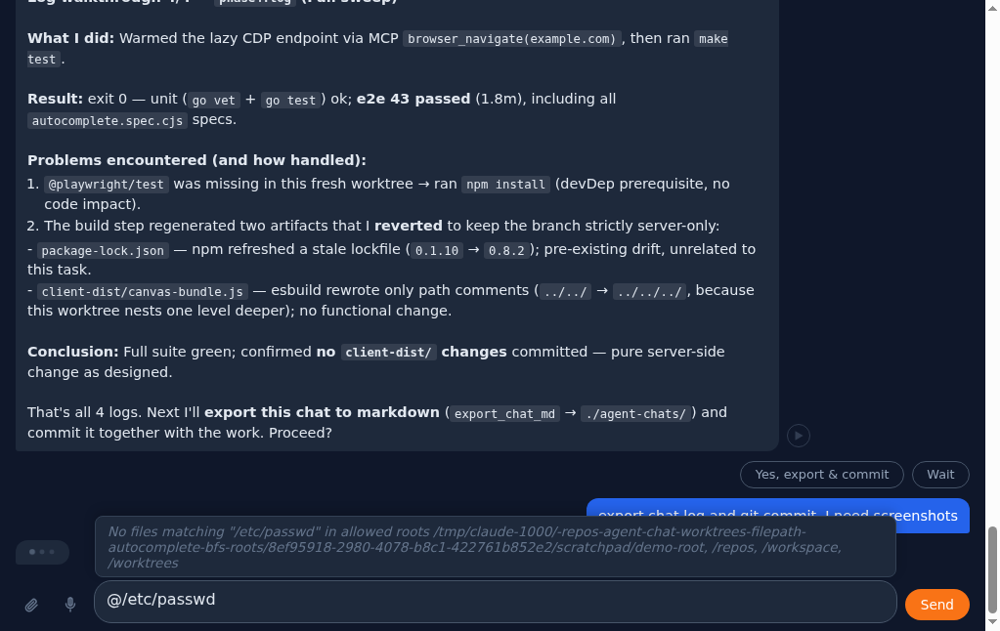

<!-- agent-chat export
title: Filepath Autocomplete Bfs Roots
date: 2026-06-28
index: 01
slug: filepath-autocomplete-bfs-roots
agent: claude
version: 0.8.2 (d25d1d2)
-->

# Filepath Autocomplete Bfs Roots

_2026-06-28 · 01 · claude · agent-chat 0.8.2 (d25d1d2)_

**AGENT**

> Starting the BFS filepath autocomplete task. Read the task plan + current `builtinFilepathComplete` (DFS WalkDir with hidden-dir skip). 
>
> Plan: 4 phases, TDD red→green each.
> - **Phase 1**: `--filepath-roots` flag + `parseFilepathRoots(flagVal, cwd)` helper, default = cwd + /repos + /workspace + /worktrees (de-duped).
> - **Phase 2**: rewrite `builtinFilepathComplete` as BFS over `os.ReadDir`, drop the hidden-dir guard (dotfiles complete normally), keep fuzzy ranking + 500-cap + top-50, add ~20k visited backstop.
> - **Phase 3**: absolute queries → allowlist + anchor + `@/` lists roots.
> - **Phase 4**: full `make test` sweep.
>
> Starting Phase 1 now (test-first).

<small>took 1m 4s</small><br>
**AGENT**

> ✅ **Phase 1/4 done** — roots config (RED→GREEN, `make unit-test` ok).
>
> Added `--filepath-roots` flag + `parseFilepathRoots(flagVal, cwd)`:
> ```go
> func parseFilepathRoots(flagVal, cwd string) []string {
>     if strings.TrimSpace(flagVal) != "" { /* verbatim, no defaults */ }
>     roots := []string{"/repos", "/workspace", "/worktrees"}
>     if cwd != "" && !isPathUnderAny(cwd, roots) {
>         roots = append([]string{cwd}, roots...) // include cwd unless covered
>     }
>     return roots
> }
> ```
> Tests: `TestFilepathRootsDefault` (cwd included, de-duped if under a fixed root) + `TestFilepathRootsFlagParse` (custom flag verbatim, no default injection).
>
> ```
> main.go      | 52 +++-
> main_test.go | 62 ++++++
> ```
>
> Next: **Phase 2** — rewrite `builtinFilepathComplete` as BFS, drop the hidden-dir guard (dotfiles complete).

<small>took 1m 50s</small><br>
**AGENT**

> ✅ **Phase 2/4 done** — BFS replaces DFS, dotfiles complete (RED→GREEN, `make unit-test` ok).
>
> `builtinFilepathComplete` is now a thin wrapper over a breadth-first core:
> ```go
> func builtinFilepathComplete(root, query string) ([]string, bool) {
>     return bfsFilepathCollect([]string{root}, nil, query)
> }
> // bfsFilepathCollect: queue over os.ReadDir, level-by-level; collect fuzzy
> // matches until filepathCandidateCap (500) or filepathVisitCap (20k) backstop.
> // No skipHidden / "/." guard — dotfiles complete like anything else.
> // has_more = capped || collected > filepathResultLimit (50).
> ```
> Cap/limit/backstop are now injectable vars so the shallow-first test forces ordering without a huge tree.
>
> New tests PASS: `TestBuiltinFilepathBFSShallowFirst` (shallow match survives the cap, deep one dropped), `TestBuiltinFilepathIncludesDotfiles` (`@github/ci`→`.github/workflows/ci.yml`, `@.claude/set`→`.claude/settings.json`). Updated `TestBuiltinFilepathComplete` to assert `.git/config` IS reachable. Kept green: fuzzy-score tests + deep `task→Dockerfile` scoring (no depth cap).
>
> ```
> main.go      | 93 ++++++---
> main_test.go | 88 ++++++++--
> ```
>
> Next: **Phase 3** — absolute queries: allowlist + anchor + `@/` lists roots.

<small>took 1m 32s</small><br>
**AGENT**

> ✅ **Phase 3/4 done** — absolute queries (RED→GREEN, `make unit-test` ok).
>
> ```go
> func absoluteFilepathFrontier(query string, roots []string) (frontier, seeds []string) {
>     for _, root := range roots {                 // query reaches INTO a root
>         if query == root || strings.HasPrefix(query, root+"/") {
>             return []string{deepestExistingDir(query, root)}, nil  // anchor
>         }
>     }
>     var matched []string                          // query is a PREFIX of root(s)
>     for _, root := range roots {
>         if strings.HasPrefix(root, query) { matched = append(matched, root) }
>     }
>     if len(matched) > 0 { return matched, matched }  // @/ lists roots + descends
>     return nil, nil                               // under no root → empty
> }
> ```
> `handleAutocomplete` routes `@/…` through the allowlist, `@…` stays relative under `filepathRoot`. `deepestExistingDir` walks up to the nearest existing dir within the root (typo in a mid-segment → shallower anchor, never escapes the root).
>
> Tests PASS: `TestBuiltinFilepathAbsoluteAllowed` (disallowed root → empty), `TestBuiltinFilepathAbsoluteAnchor` (anchor at `/A`, sibling `/B` never read), `TestBuiltinFilepathSlashListsRoots` (`/` lists roots; prefix lists only matching root).
>
> ```
> main.go      | 73 +++++--
> main_test.go | 85 ++++++++
> ```
>
> Next: **Phase 4** — full `make test` sweep (warm CDP first, then e2e).

<small>took 6m 24s</small><br>
**AGENT**

> ✅ **Phase 4/4 done** — full `make test` green (exit 0).
>
> - Unit: `go vet` + `go test` ok.
> - E2E: **43 passed** (1.8m), including all `autocomplete.spec.cjs` specs.
>
> Setup note: `@playwright/test` was missing in this fresh worktree, so I ran `npm install` (devDep prereq, no code impact). The `make test` build step regenerated two artifacts that I **reverted** to keep the branch server-only:
> - `package-lock.json` — npm refreshed a stale lockfile (0.1.10 → 0.8.2).
> - `client-dist/canvas-bundle.js` — esbuild rewrote only path comments (`../../` → `../../../`), no functional change.
>
> Confirmed: **no `client-dist/` changes committed** — this is a pure server-side change as designed. All 4 phases complete. Next: I'll walk you through each phase log for sign-off, then export this chat and commit.

<small>took 39m 56s</small><br>
**AGENT**

> **Log walkthrough 1/4 — `phase1.log` (Roots config)**
>
> **What I did:** Added the `--filepath-roots` flag and `parseFilepathRoots(flagVal, cwd)`. Default = `/repos, /workspace, /worktrees` plus the cwd (cwd prepended only if not already under a fixed root — de-dupe). A non-empty flag is taken verbatim with no defaults injected. Helpers `isPathUnder` / `isPathUnderAny` support the de-dupe.
>
> **TDD:** RED first — `go vet` failed with `undefined: parseFilepathRoots`. Then GREEN — `make unit-test` ok, `TestFilepathRootsDefault` + `TestFilepathRootsFlagParse` pass.
>
> **Problems:** None.
>
> **Conclusion:** Roots allowlist config landed cleanly, fully tested.
>
> OK to proceed to the Phase 2 log?

[Quick replies]
- OK, next
- Wait, I have a question

**USER**

> OK, next

<small>took 9.3s</small><br>
**AGENT**

> **Log walkthrough 2/4 — `phase2.log` (BFS replaces DFS, dotfiles)**
>
> **What I did:** Rewrote `builtinFilepathComplete` as a thin wrapper over `bfsFilepathCollect` — a queue over `os.ReadDir` that visits level-by-level (BFS). Removed the `skipHidden` / `"/."` guard entirely, so dotfiles/dotdirs complete like anything else. Made the cap/limit/backstop injectable vars (`filepathCandidateCap=500`, `filepathResultLimit=50`, `filepathVisitCap=20000`). `has_more = capped || collected > limit`, where `capped` trips on either the candidate cap or the 20k visited-entry backstop.
>
> **TDD:** RED first — `go vet` failed (`undefined: filepathCandidateCap`). Then GREEN — new tests pass: `TestBuiltinFilepathBFSShallowFirst` (a shallow match survives the cap while a deep one is dropped — proving BFS order) and `TestBuiltinFilepathIncludesDotfiles` (`@github/ci` → `.github/workflows/ci.yml`, `@.claude/set` → `.claude/settings.json`). Updated `TestBuiltinFilepathComplete` to the new contract (`.git/config` IS reachable). Kept green: the fuzzy-score tests and the deep `task → …/Dockerfile` scoring test (no depth cap).
>
> **Problems:** None.
>
> **Conclusion:** BFS + dotfiles landed; ordering and recall both verified by test.
>
> OK to proceed to the Phase 3 log?

[Quick replies]
- OK, next
- Wait, I have a question

**USER**

> OK, next

<small>took 14.0s</small><br>
**AGENT**

> Checked messages — queue is empty, nothing pending. Continuing the walkthrough.
>
> **Log walkthrough 3/4 — `phase3.log` (Absolute queries: allowlist + anchor + `@/`)**
>
> **What I did:** Added `builtinFilepathCompleteAbs(query, roots)`, `absoluteFilepathFrontier(query, roots)`, and `deepestExistingDir(query, root)`. `handleAutocomplete` now routes `@/…` (query starts with `/`) through the roots allowlist; relative `@…` stays under `filepathRoot`. Frontier rules:
> - query reaches **into** a root (`== root` or under `root/`) → anchor BFS at the deepest existing dir prefix within that root (siblings not read; a mid-segment typo just yields a shallower anchor);
> - query is a **prefix of** root(s) incl. bare `/` → those roots are seeded as candidates *and* used as the frontier (so `@/` lists the roots and still descends);
> - query under **no** root → empty.
>
> **TDD:** RED first (`undefined: builtinFilepathCompleteAbs`). Then GREEN — `TestBuiltinFilepathAbsoluteAllowed` (disallowed root → empty, `hasMore=false`), `TestBuiltinFilepathAbsoluteAnchor` (anchor at `/A`; sibling `/B` never read), `TestBuiltinFilepathSlashListsRoots` (`/` lists roots; prefix lists only the matching root). Existing relative-handler tests stayed green.
>
> **Problems:** None.
>
> **Conclusion:** Absolute completion is confined to the allowlist, anchored for performance, and `@/` enumerates roots — all verified.
>
> OK to proceed to the Phase 4 log?

[Quick replies]
- OK, next
- Wait, I have a question

**USER**

> OK, next

<small>took 8.6s</small><br>
**AGENT**

> **Log walkthrough 4/4 — `phase4.log` (Full sweep)**
>
> **What I did:** Warmed the lazy CDP endpoint via MCP `browser_navigate(example.com)`, then ran `make test`.
>
> **Result:** exit 0 — unit (`go vet` + `go test`) ok; **e2e 43 passed** (1.8m), including all `autocomplete.spec.cjs` specs.
>
> **Problems encountered (and how handled):**
> 1. `@playwright/test` was missing in this fresh worktree → ran `npm install` (devDep prerequisite, no code impact).
> 2. The build step regenerated two artifacts that I **reverted** to keep the branch strictly server-only:
>    - `package-lock.json` — npm refreshed a stale lockfile (`0.1.10` → `0.8.2`); pre-existing drift, unrelated to this task.
>    - `client-dist/canvas-bundle.js` — esbuild rewrote only path comments (`../../` → `../../../`, because this worktree nests one level deeper); no functional change.
>
> **Conclusion:** Full suite green; confirmed **no `client-dist/` changes** committed — pure server-side change as designed.
>
> That's all 4 logs. Next I'll **export this chat to markdown** (`export_chat_md` → `./agent-chats/`) and commit it together with the work. Proceed?

[Quick replies]
- Yes, export & commit
- Wait

**USER**

> export chat log and git commit. I need screenshots


---

## Demo screenshots

Captured from a standalone demo instance (new binary, HTTP-only mode on a unique
port, run against a purpose-built temp tree) — the live session server was left
untouched.

**Dotfile completion** — `@.github/ci` → `.github/workflows/ci.yml` (no `/.` workaround):



**`@/` lists the allowlist roots** — `/repos`, `/workspace`, `/worktrees` first (BFS, shallowest), then descends:



**Allowlist boundary** — `@/etc/passwd` returns nothing; the info line honestly names the allowed roots (no `/etc`/`/proc`/`/sys` walk):


