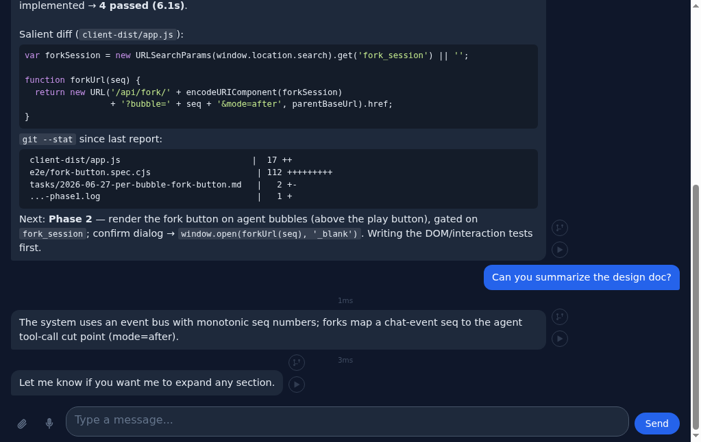
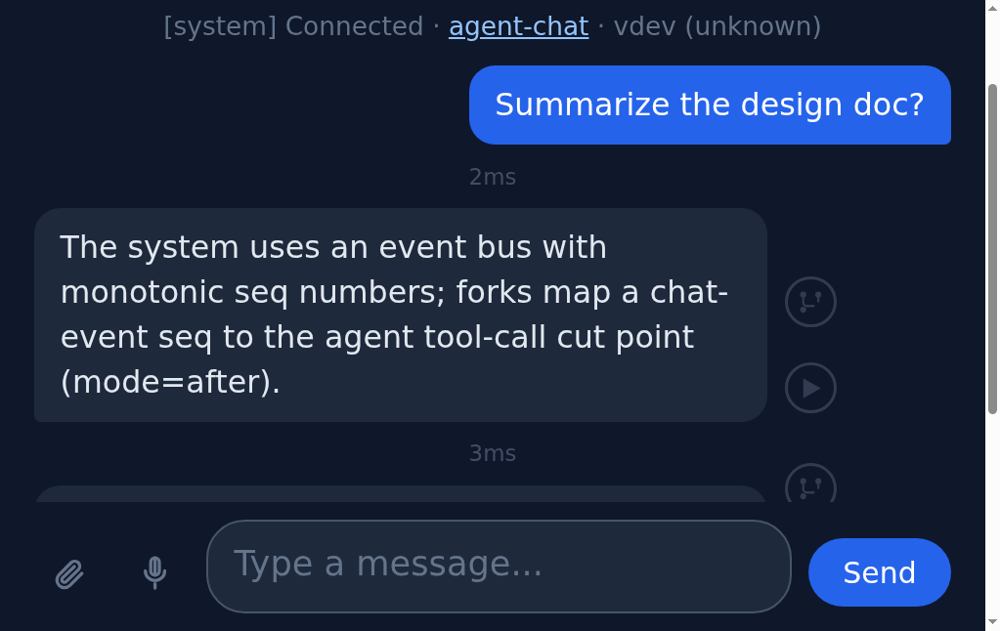
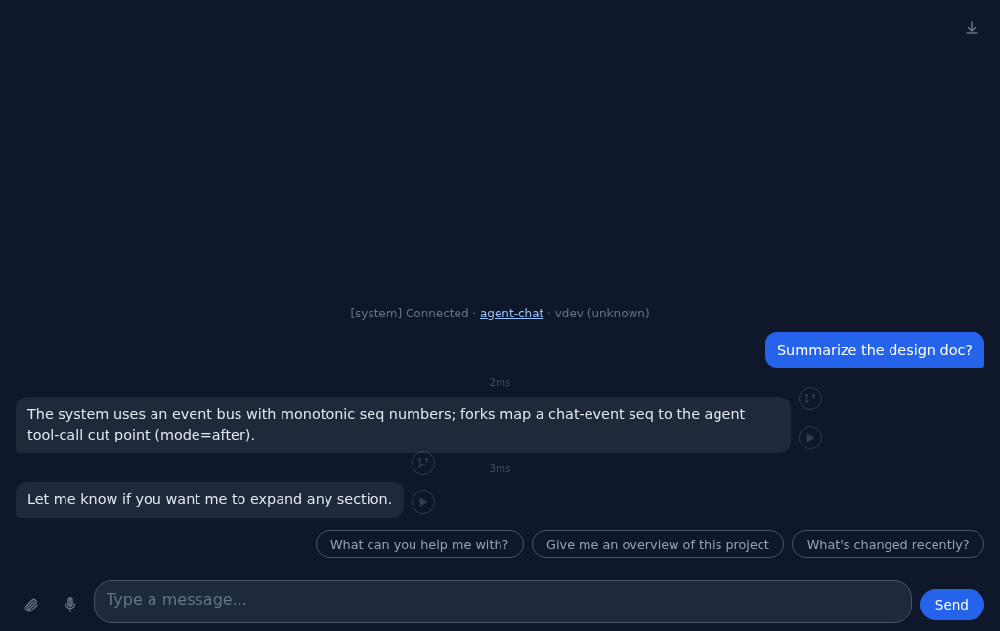
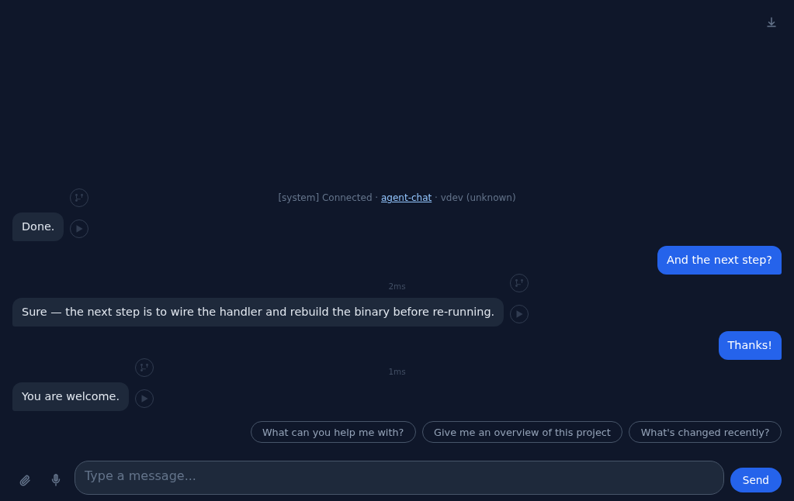
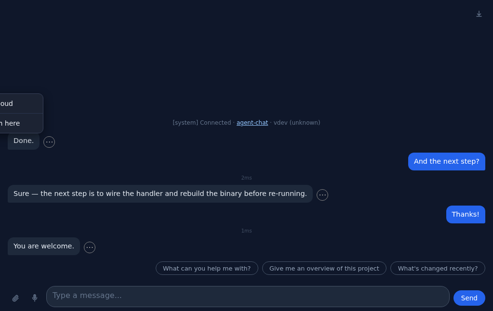
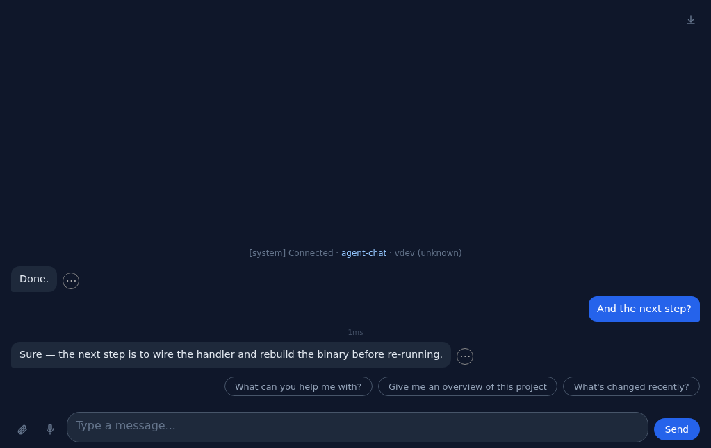
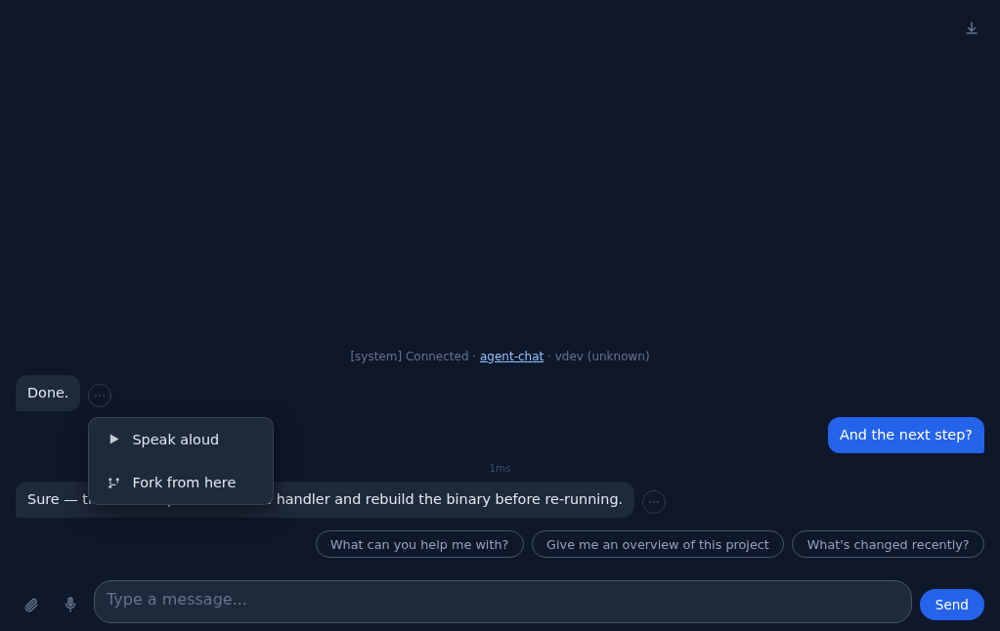

<!-- agent-chat export
title: Per Bubble Fork Overflow Menu
date: 2026-06-28
index: 01
slug: per-bubble-fork-overflow-menu
agent: claude
version: 0.8.2 (d25d1d2)
-->

# Per Bubble Fork Overflow Menu

_2026-06-28 · 01 · claude · agent-chat 0.8.2 (d25d1d2)_

**AGENT**

> Starting **per-bubble fork button**. Explored the codebase:
> - `client-dist/app.js` — `parentBaseUrl` read from `parent_url` param (line 30); TTS play button on agent bubbles via `createTtsButton` (line 329); agent bubbles carry event `seq` via `data.seq`.
> - Existing `parent_url` unit/e2e tests live in `e2e/markdown-images.spec.cjs`.
>
> Plan: 2 TDD phases —
> 1. **Fork URL plumbing**: read `fork_session` param → `forkSession`; add `forkUrl(seq)` helper. Tests mirror the `parent_url` ones.
> 2. **Fork button on agent bubbles**: thread `seq` into bubbles; render fork button (above play button) gated on `fork_session`; confirm dialog → `window.open(forkUrl, '_blank')`. CSS + DOM/interaction tests.
>
> Writing the phase breakdown into the task file now, then starting Phase 1 test-first.

<small>took 3m 30s</small><br>
**AGENT**

> ✅ **Phase 1/2 complete — fork URL plumbing (GREEN)**
>
> TDD: wrote `e2e/fork-button.spec.cjs` first → **4 failed** (`window.forkUrl is not a function`) → implemented → **4 passed (6.1s)**.
>
> Salient diff (`client-dist/app.js`):
> ```js
> var forkSession = new URLSearchParams(window.location.search).get('fork_session') || '';
>
> function forkUrl(seq) {
>   return new URL('/api/fork/' + encodeURIComponent(forkSession)
>                  + '?bubble=' + seq + '&mode=after', parentBaseUrl).href;
> }
> ```
>
> `git --stat` since last report:
> ```
>  client-dist/app.js                          |  17 ++
>  e2e/fork-button.spec.cjs                     | 112 +++++++++
>  tasks/2026-06-27-per-bubble-fork-button.md   |   2 +-
>  ...-phase1.log                               |   1 +
> ```
>
> Next: **Phase 2** — render the fork button on agent bubbles (above the play button), gated on `fork_session`; confirm dialog → `window.open(forkUrl(seq), '_blank')`. Writing the DOM/interaction tests first.

<small>took 11m 49s</small><br>
**AGENT**

> ✅ **Phase 2/2 complete — fork button on agent bubbles (GREEN)**
>
> TDD: 6 rendering/interaction tests written first → 3 meaningful ones RED (no `.bubble-fork-btn`) → implemented → **all 10 fork tests pass**. Full regression: **53 e2e passed (2.5m)** + **unit tests pass** — the shared `addBubble`/`seq` change broke nothing (parent_url, markdown, frozen-reply, welcome specs all green).
>
> Salient diff (`client-dist/app.js`):
> ```js
> function createForkButton(seq) {
>   var btn = document.createElement('button');
>   btn.className = 'bubble-fork-btn';
>   btn.addEventListener('click', function (e) {
>     e.stopPropagation();
>     if (window.confirm('Fork a new session branched from this point? Your current session keeps running.')) {
>       window.open(forkUrl(seq), '_blank');
>     }
>   });
>   return btn;
> }
> // in addBubble, role === 'agent':
> if (forkSession && seq) div.appendChild(createForkButton(seq));
> ```
> seq is threaded through `addBubble`/`addAgentMessage` from the `agentMessage`/`verbalReply` handlers + history replay. CSS mirrors the TTS button at `bottom:36px` (one slot above the play button).
>
> `git --stat` since last report:
> ```
>  client-dist/app.js     | 41 +++++++++++++---
>  client-dist/style.css  | 30 ++++++++++++
> ```
>
> Screenshot below — the **fork icon sits directly above the play (▶) icon** on each agent bubble; the user bubble has neither. Click → confirm → opens `https://parent.example/api/fork/<uuid>?bubble=<seq>&mode=after` in a new tab.
>
> Both phases done. Next: walk you through the phase logs, then final commit + chat export.
>
> <div style="display:flex;flex-wrap:wrap;gap:8px;">
> <a href="./assets/2026-06-28-01-1.png" style="flex:0 1 calc(33% - 8px);max-width:calc(33% - 8px);"></a>
> </div>

<small>took 69m 26s</small><br>
**AGENT**

> Both phases are implemented, all tests pass, and the working tree is clean. Per the wrap-up protocol, let me walk you through each phase log and get your OK.
>
> ## 📋 Phase 1 log — fork URL plumbing (`...-phase1.log`)
>
> **What I did**
> - Wrote `e2e/fork-button.spec.cjs` first with 4 tests: `fork_session` param → `window.forkSession`; empty when absent; `forkUrl(seq)` builds the absolute URL; uuid is percent-encoded.
> - **RED (23:42):** ran against the current binary → **4 failed** as expected (`window.forkUrl is not a function`, `forkSession` undefined).
> - Implemented `forkSession` + `forkUrl(seq)` in `client-dist/app.js` (right after the `parent_url`/`resolveAgainstParent` block), rebuilt the linux binary.
> - **GREEN (23:42):** **4 passed (6.1s)**.
>
> **Problems encountered**
> - None in the logic. One environment snag (not in the log): `npx playwright` couldn't resolve `@playwright/test` because the repo had no `node_modules`, so I ran `npm install` once to set it up (its incidental `package-lock.json` version bump I reverted to keep the diff focused).
>
> **Conclusion**
> - `forkUrl(7)` with `parent_url=https://parent.example/app/page` correctly yields `https://parent.example/api/fork/<uuid>?bubble=7&mode=after`. Plumbing solid.
>
> Are you OK with Phase 1? I'll then walk through Phase 2.

[Quick replies]
- Phase 1 looks good, continue
- Wait, I have a question
- Show me the app.js diff

**USER**

> Beware of fat fingers for how we place play and fork buttons so close

<small>took 33.7s</small><br>
**AGENT**

> Acting on your fat-finger concern. Current spacing: play at `bottom:4px`, fork at `bottom:36px` → only **8px** between them. I'll add a test asserting a comfortable vertical gap (≥12px) between the two buttons (RED at 8px), then bump the fork button up to give ~16px separation (GREEN). The `confirm()` dialog stays as the second line of defense.

<small>took 18m 5s</small><br>
**AGENT**

> ✅ **Fat-finger guard done.** Fork (spawns a new session) was only **8px** above play (TTS) — exactly the kind of accidental tap you flagged.
>
> TDD: added a test asserting the vertical gap between the fork button's bottom and the play button's top stays **≥12px** → RED at 8px → bumped `.bubble-fork-btn` from `bottom:36px` to `bottom:44px` → GREEN, measured **16px** (doubled). Full fork spec: **11 passed**. The `confirm()` dialog remains the second line of defense, so even a misclick won't fork without an explicit "OK".
>
> Screenshot above shows the wider separation. Committed as `fix(fork): widen gap between fork and play buttons (fat-finger guard)`.
>
> ---
>
> Now back to the wrap-up walkthrough. **Phase 1 was covered earlier** (you redirected to the spacing concern, which I read as implicit approval — let me know if you want to revisit it). Here's **Phase 2**:
>
> ## 📋 Phase 2 log — fork button on agent bubbles (`...-phase2.log`)
>
> **What I did**
> - Wrote 6 rendering/interaction tests first. **RED (23:45):** 3 meaningful ones failed (no `.bubble-fork-btn`; clicks timed out); negatives passed trivially.
> - Implemented `createForkButton(seq)`, threaded `seq` through `addBubble`/`addAgentMessage` and the 4 event sites (live `agentMessage`/`verbalReply` + history replay), added CSS. **GREEN (23:47):** 10 passed.
> - **Visual verify** via a throwaway server + MCP browser — fork icon above play, none on user bubbles.
> - **Full regression (23:53):** unit tests pass; **53 e2e passed** — nothing else broke.
> - **Amendment (your feedback):** the fat-finger gap fix above.
>
> **Problems encountered**
> - Demo servers initially **replayed the live session's history** because they inherited this session's `AGENT_CHAT_*` env vars (read-only — no writes/harm). Fixed by launching the last demo with `env -i` for a clean empty session.
> - No correctness issues; the shared `addBubble` signature change was additive (trailing `seq` param), so all existing specs stayed green.
>
> **Conclusion**
> - Feature complete and gated on `fork_session`: button only on agent bubbles with a server `seq`; click → confirm → new tab to `/api/fork/<uuid>?bubble=<seq>&mode=after`. Standalone behaviour unchanged.
>
> Are you OK with Phase 2? On your go-ahead I'll export this chat to markdown (`./agent-chats/`) and make the final commit.

[Quick replies]
- Phase 2 looks good — export & final commit
- Wait, I have a question
- Revisit Phase 1

**USER**

> Screenshots?

<small>took 1m 4s</small><br>
**AGENT**

> Here are the screenshots (clean throwaway session, `?fork_session=demo-uuid`):
>
> **1. Zoomed-in close-up** — on the agent bubble, the **fork icon (branching, top)** sits clearly above the **play/TTS icon (▶, bottom)** with the new ~16px gap. The blue user bubble ("Summarize the design doc?") has **no buttons** — fork is agent-bubbles-only.
>
> **2. Full view** — both agent bubbles each carry the fork button; user bubble has none.
>
> Interaction (not capturable in a static shot — the `confirm()` dialog is a native browser modal): clicking fork pops *"Fork a new session branched from this point? Your current session keeps running."* → on OK, opens `https://parent.example/api/fork/demo-uuid?bubble=12&mode=after` in a new tab; Cancel does nothing. Both paths are covered by the e2e tests.
>
> OK to proceed with the chat export (`./agent-chats/`) and final commit?
>
> <div style="display:flex;flex-wrap:wrap;gap:8px;">
> <a href="./assets/2026-06-28-01-2.png" style="flex:0 1 calc(33% - 8px);max-width:calc(33% - 8px);"></a>
> <a href="./assets/2026-06-28-01-3.png" style="flex:0 1 calc(33% - 8px);max-width:calc(33% - 8px);"></a>
> </div>

[Quick replies]
- Looks good — export & final commit
- Wait, I have a question
- Tweak the spacing more

**USER**

> How bad will it be for 1 liner speech bubbles. 2 line speech bubbles? Screenshots

<small>took 1m 59s</small><br>
**AGENT**

> You were right — the vertical stack is **bad for short bubbles**. Measured: a 1-line bubble is 37px tall, but the fork button at `bottom:44px` puts its top **31px above the bubble**, so it floats up into the gap and collides with the elapsed-time/previous content. See **Image 1 (current)** — "Done." and "You are welcome." have their fork icon orphaned far above the bubble. (2-line bubbles are less bad but the fork still pokes ~14px above.) Note: even the *original* `bottom:36px` had this — stacking a 2nd button above ANY short bubble overflows it.
>
> So the real fix isn't more vertical gap — it's to **stop stacking vertically**. **Image 2 (proposed)**: fork moved *beside* the play button, both anchored at the bubble's bottom. Now:
> - Never floats above — works identically for 1-line, 2-line, and tall bubbles.
> - Play (▶) stays nearest the bubble; **fork sits further out** — so the more dangerous action is the *harder* one to reach with a resting thumb.
> - 12px horizontal gap between them + the `confirm()` dialog → fat-finger safe.
>
> This deviates from the task's "above the play button" wording, so I want your call before I change the CSS + update the gap test:
>
> **A)** Go horizontal (Image 2) — my recommendation.
> **B)** Keep vertical but only render fork on tall bubbles / clamp it inside.
> **C)** Something else you have in mind.
>
> <div style="display:flex;flex-wrap:wrap;gap:8px;">
> <a href="./assets/2026-06-28-01-4.png" style="flex:0 1 calc(33% - 8px);max-width:calc(33% - 8px);"></a>
> <a href="./assets/2026-06-28-01-5.png" style="flex:0 1 calc(33% - 8px);max-width:calc(33% - 8px);"></a>
> </div>

[Quick replies]
- A — go horizontal (side by side)
- B — keep vertical, clamp it
- Let me think / other idea

**USER**

> How about just a … button that brings up both options to fat finger choose?

<small>took 6m 38s</small><br>
**AGENT**

> Mock attached. Each agent bubble now has a single **"⋯"** button anchored at the bottom-right — clean for 1-line, 2-line, and tall bubbles alike, no floating. Tapping it opens a menu of **big, labeled tap targets** ("▶ Speak aloud" / "⑂ Fork from here"), which is exactly your "fat-finger choose".
>
> (Ignore that the menu is clipped off the left edge in the mock — that's just my quick prototype anchoring it the wrong way. The real one will open rightward/downward from the ⋯ and clamp to the viewport.)
>
> My implementation plan (TDD, as a new **Phase 3**):
> - **Menu only when `fork_session` is present.** Standalone agent-chat keeps the current direct ▶ play button untouched — zero behaviour change without the param (preserves the original acceptance).
> - Menu items sized as real tap targets (~44px tall).
> - **The menu selection IS the deliberate gate**, so I'll *drop* the extra `confirm()` dialog when Fork is chosen from the menu — two big labeled choices means you can't fork by accident, and a menu→confirm double-prompt is annoying. (Say the word if you'd rather keep the confirm.)
> - Tests: ⋯ present (not stacked buttons) when fork enabled; standalone keeps plain ▶; menu opens with both items; fork item → `window.open(forkUrl, '_blank')`; speak item → TTS; menu items meet the tap-target size; click-outside closes.
>
> Good to build this?
>
> <div style="display:flex;flex-wrap:wrap;gap:8px;">
> <a href="./assets/2026-06-28-01-6.png" style="flex:0 1 calc(33% - 8px);max-width:calc(33% - 8px);"></a>
> </div>

[Quick replies]
- Yes, build the ⋯ menu (drop confirm)
- Build it but KEEP the confirm
- Wait — adjust the plan

**USER**

> I see the `…` exactly like i am envisioning. But I can’t tell how the options would look like and would it dismiss on clicking anywhere elsewhere?

<small>took 1m 13s</small><br>
**AGENT**

> Here's exactly how it behaves:
>
> **Image 1 — menu open:** tapping ⋯ drops a panel right below it with two full-width rows, each a **44px tap target**: "▶ Speak aloud" and "Fork from here". Fully on-screen (auto-clamps; flips above the button if it'd run off the bottom).
>
> **Image 2 — dismissed:** clicking *anywhere else* closes it (verified: 0 menus left in the DOM). Tapping ⋯ again also toggles it shut.
>
> One note: the fork row's icon shows as a "tofu" box in this quick mock because I used a unicode glyph — the real build will use a proper inline **SVG fork icon** (same crisp style as the existing ▶), so it'll look clean.
>
> If this matches what you're picturing, I'll implement it for real with TDD (Phase 3): ⋯ menu only when `fork_session` is set (standalone keeps the plain ▶, unchanged); menu opens/closes/click-outside-dismiss; "Fork from here" → opens the fork URL in a new tab (the deliberate menu choice replaces the old confirm dialog — say so if you'd rather I keep confirm too); "Speak aloud" → TTS. Then I'll re-run the full suite and finish the wrap-up.
>
> Green light?
>
> <div style="display:flex;flex-wrap:wrap;gap:8px;">
> <a href="./assets/2026-06-28-01-7.png" style="flex:0 1 calc(33% - 8px);max-width:calc(33% - 8px);"></a>
> <a href="./assets/2026-06-28-01-8.png" style="flex:0 1 calc(33% - 8px);max-width:calc(33% - 8px);"></a>
> </div>

[Quick replies]
- Green light — build it with SVG icon
- Build it but keep the confirm too
- Tweak something first

**USER**

> Green light — build it with SVG icon

<small>took 1m 45s</small><br>
**AGENT**

> Building the **⋯ menu (Phase 3)** now, TDD. Plan locked:
> - Agent bubble with `fork_session`+seq → single `.bubble-menu-btn` (⋯); standalone/no-seq → plain ▶ unchanged.
> - Menu: two 44px rows with **inline SVG icons** — "Speak aloud" (TTS) + "Fork from here" (→ `window.open(forkUrl,'_blank')`, no confirm; menu choice is the gate).
> - Toggle on ⋯, **click-outside dismiss**, Esc to close, viewport-clamped (flips up near the bottom).
> - `pulseLastTtsButton` falls back to the menu button so iOS voice-unlock still works.
>
> Rewriting the e2e spec to the menu design first (RED), then implementing.

<small>took 15m 27s</small><br>
**AGENT**

> ✅ **Phase 3 complete — ⋯ overflow menu (GREEN), built with SVG icon as requested.**
>
> TDD: rewrote the spec to the menu design (12 menu tests) → 9 RED → implemented → **16/16 fork tests pass**, **full suite 59 e2e + unit tests pass** (the play→menu change broke nothing).
>
> What shipped:
> - One **⋯** per agent bubble (only with `fork_session`+seq); standalone/no-seq keep the plain ▶, unchanged.
> - Menu: **"▶ Speak aloud"** + **fork-SVG "Fork from here"**, each a 44px row.
> - Toggle on ⋯; **dismiss on outside-click + Escape**; viewport-clamped (flips up near the bottom).
> - Fork row → `window.open(forkUrl, '_blank')` (menu choice is the gate — no extra confirm).
> - `pulseLastTtsButton` falls back to the ⋯ so iOS voice-unlock still works.
> - Removed the dead stacked-fork-button path.
>
> `git --stat`:
> ```
>  client-dist/app.js     | 115 +++++++++++++++----
>  client-dist/style.css  |  62 ++++++++--
> ```
>
> Real render below (menu open on the short "Done." bubble — no floating, proper SVG fork icon). Ready to walk the remaining phase logs and do the export + final commit on your go-ahead.
>
> <div style="display:flex;flex-wrap:wrap;gap:8px;">
> <a href="./assets/2026-06-28-01-9.png" style="flex:0 1 calc(33% - 8px);max-width:calc(33% - 8px);"></a>
> </div>

<small>took 30.5s</small><br>
**AGENT**

> All three phases are implemented, committed, and fully green. Here's the wrap-up across the phase logs (we reviewed most of this live, so I'll keep it tight):
>
> **📋 phase1.log — fork URL plumbing.** RED (4 failed: `forkUrl` missing) → added `forkSession` + `forkUrl(seq)` → GREEN (4 passed). No problems. Conclusion: builds `…/api/fork/<uuid>?bubble=<seq>&mode=after` against `parent_url`.
>
> **📋 phase2.log — per-bubble fork button.** RED → added stacked fork-above-play button + `seq` threading → GREEN (10), full suite 53 green. Then your **fat-finger** catch: gap test RED at 8px → widened to 16px. *This whole approach was later superseded by Phase 3.* Problem noted: demo servers replayed live history via inherited `AGENT_CHAT_*` env (read-only, harmless) — fixed with `env -i`.
>
> **📋 phase3.log — ⋯ overflow menu (the design we landed on).** Your two catches drove this: (1) stacked buttons **float above short 1–2 line bubbles**, (2) you wanted **one ⋯ → menu of fat-finger choices**. RED (9 menu tests) → implemented the menu (SVG icons, outside-click/Esc dismiss, viewport-clamp, TTS-unlock fallback, removed dead fork-button path) → GREEN **16/16**, full suite **59 e2e + unit all green**. No outstanding issues.
>
> **Repo state:** 16 commits on `per-bubble-fork-button` (atop `ea478b6`), working tree clean apart from pre-existing untracked dirs (`.claude`, `.playwright-mcp`, `.swe-swe`).
>
> Are you OK with all three logs? If so, I'll **export this chat to markdown** (`./agent-chats/`) and make the final commit bundling it. Anything you want changed first?

[Quick replies]
- All good — export & final commit
- Wait, I have a question
- Change something first

**USER**

> make build. export chat log and commit

<small>took 8.7s</small><br>
**AGENT**

> Running `make build` (cross-compiles all 6 platforms + npm link) — this is the slow one, ~couple of minutes. Then I'll export the chat to `./agent-chats/` and make the final commit bundling it.

