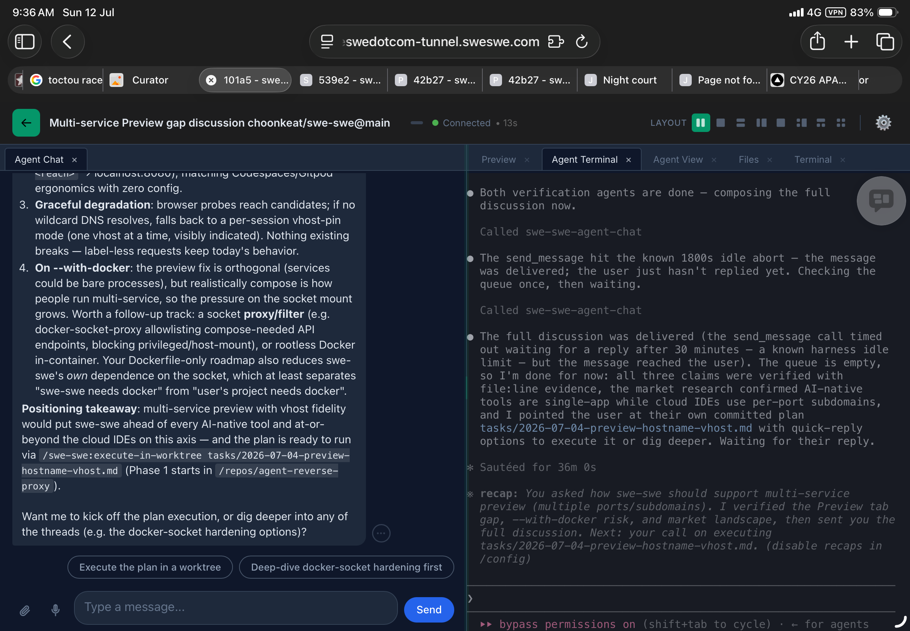

<!-- agent-chat export
title: Idle Abort Reply Loss Fix
date: 2026-07-12
index: 01
slug: idle-abort-reply-loss-fix
agent: claude
version: 0.8.9 (1e4428c)
-->

# Idle Abort Reply Loss Fix

_2026-07-12 · 01 · claude · agent-chat 0.8.9 (1e4428c)_

**USER**

> See other session 101a5a74-e3b9-4f85-a9b4-9cb5ebaf7905 where conversation broken and user had to send the message again. See both chat log and agent terminal output Our fix didn’t work? Discuss
>
> 

> 
> 

<small>took 35.0s</small> 
**AGENT**

> Looking into session 101a5a74 — pulling its chat log and agent terminal output, plus our earlier timeout fix, to see why the send_message block broke again.

<small>took 5m 30s</small> 
**AGENT**

> Checked session 101a5a74's chat log, its terminal scrollback, and both repos. Short answer: **the fix didn't fail — it was never shipped.** The Jul 11 worktree session (`fix-loss-when-timeout`) ended at diagnosis + a proposed fix stack; it wrote memory notes and a TODO.md into the worktree, but made zero code commits. That worktree has since been deleted, agent-chat main has no related commit, and swe-swe's `claude mcp add … swe-swe-agent-chat` line (templates.go:823) still has no timeout knob. Session 101a5a74 then replayed the diagnosed bug exactly.
>
> ## What the logs show (the consumed-but-orphaned mode, live)
>
> 1. `send_message` #1 delivered the big multi-service-preview discussion. Claude Code idle-aborted the call at ~1800s — but **agent-chat's server-side handler never got cancelled** and stayed blocked on the queue as a zombie consumer.
> 2. The agent recovered gracefully: `check_messages` → empty → "waiting", turn ended (the "Sautéed for 36m" recap in your screenshot).
> 3. **84 minutes later** you replied. The chat log shows your message consumed **8ms after arrival**, stamped `send_message seq=1` — the zombie call #1, not any live call. Its response went back on an abandoned request ID and was discarded. Reply gone.
> 4. Six seconds later the nudge woke the agent; `check_messages` found the queue empty (zombie already ate it), so it sent the "Still here — recap" bubble and you had to retype your question. Your retyped message was consumed by the live `send_message` #2 and worked fine.
>
> So every mechanism we *do* have behaved as designed — delivery of the agent bubble, the wake-up nudge (6s!), the recap recovery. The one thing that loses data is precisely the unimplemented piece: consumption isn't ack-gated, so a dead call can still eat a reply.
>
> ## The proposed (still unbuilt) fix stack, from the Jul 11 session
>
> 1. **Pending-ack / at-least-once consumption in agent-chat** — the real fix. `WaitForMessagesStamped` already selects on `ctx.Done()` (eventbus.go:339), but Claude Code's idle abort demonstrably never cancels the server-side context, so we can't rely on cancellation. Instead: hold blocking-consumed messages in limbo until a *subsequent* MCP call acks receipt; a following `check_messages` re-delivers them. In this session that would have handed your reply to the 6-seconds-later nudge — zero loss.
> 2. **New idea worth adding**: have `send_message` emit MCP progress notifications every ~60s while blocked — spec-compliant clients reset their tool timeout on progress, which would prevent the 1800s idle abort entirely, agent-chat-only change.
> 3. **swe-swe config knob** (longer/disabled MCP tool timeout for the agent-chat server) — belt-and-braces.
> 4. **Queue-restore-on-startup** — for the restart-wipes-queue case, separate failure mode.
>
> Want me to implement #1 (+#2) in agent-chat now? The deleted worktree's TODO is recoverable from the session log if we want its exact plan.

[Quick replies]
- Implement pending-ack + progress keepalive
- Recover the old TODO.md first
- Just the progress-notification keepalive

**USER**

> Implement pending-ack + progress keepalive

**USER**

> Stop

<small>took 12.6s</small> 
**AGENT**

> Stopped — I hadn't touched any code yet, so there's nothing to roll back. The pending-ack + progress-keepalive implementation is on hold.
>
> How would you like to proceed?

[Quick replies]
- Resume the implementation
- Discuss the design first
- Recover the old TODO.md and compare plans
- Drop it for now

**USER**

> Process keepalive = the one that consumes token while chat sits idle for hours? Elaborate

<small>took 35.3s</small> 
**AGENT**

> No — zero tokens. It's easy to conflate two very different "keepalives":
>
> **1. Model-level polling (what you're thinking of — and what we are NOT proposing).** The tool returns "no reply yet" every N minutes, the model wakes up, burns an inference round, and calls `send_message`/`check_messages` again. Every cycle is a real API call consuming tokens, hours of idle = hours of poll turns. Bad.
>
> **2. MCP progress notifications (the proposal).** While one `send_message` call stays blocked, the agent-chat *server process* writes a tiny JSON-RPC `notifications/progress` line onto the stdio pipe every ~60s. This is protocol plumbing between the agent-chat binary and the Claude Code harness — it never reaches the model, never enters the conversation context, and triggers no inference. Per the MCP spec, a client receiving progress for an in-flight request resets its timeout clock, so the 1800s idle abort never fires.
>
> The key background fact: **a blocked tool call costs nothing while blocked.** When the model calls `send_message`, its API turn ends at the tool-use block; there is no open API request while the harness waits for the tool result. Tokens are only spent when the result comes back and the model resumes. So chat sitting idle for hours = the Go process parked on a channel + one heartbeat line per minute on a local pipe. The token meter doesn't move.
>
> Two honest caveats:
> - **Needs empirical verification that Claude Code honors it.** The spec says clients *should* reset timeout on progress (and clients may enforce a maximum total timeout regardless). Also, servers can only send progress if the client attached a `progressToken` to the request — if Claude Code doesn't, we can't send progress at all. Cheap to test: build it, block a call >30min, see if it survives. If it doesn't work it's harmless (ignored notifications), and pending-ack still guarantees no reply is lost.
> - What you may remember eating tokens during long idles is different machinery: the recap-on-wake bubbles, stop-guard nudges, or the pi HTTP bridge's 30× silent retries re-POSTing `send_message`. None of that is this.
>
> So the design is: pending-ack = correctness (no reply ever lost, works on all transports), progress keepalive = comfort (the abort mostly stops happening at all). Proceed with both?

[Quick replies]
- Yes, implement both
- Pending-ack only
- Verify Claude Code honors progress first

**USER**

> Is there a lightweight verification that Claude (and other agents we support) will honor it? Otherwise, let’s just tdd implement both here and now

<small>took 1m 53s</small> 
**AGENT**

> Two lightweight verifications running: (1) grepping this machine's real Claude Code ↔ agent-chat MCP logs for `progressToken` — if Claude Code never attaches one, the server can't even send progress; (2) asking the Claude Code docs agent whether it resets tool timeout on progress notifications. Then starting TDD on both features.

<small>took 11m 33s</small> 
**AGENT**

> Verification done — good news on both counts:
>
> 1. **Claude Code sends a `progressToken`** on every MCP tools/call (probed with a scratch MCP server + real `claude -p` run).
> 2. **Progress notifications DO reset the ~30-min stdio idle abort** (`CLAUDE_CODE_MCP_TOOL_IDLE_TIMEOUT`, the exact abort from session 101a5a74). Probe: 15s idle limit + 45s tool → survives with progress every 5s, aborts without. They do NOT extend the hard `MCP_TOOL_TIMEOUT` (~28h) — fine, that's not our failure mode.
> 3. Bonus forensics: the idle abort sends **no `notifications/cancelled`** — which is exactly why the aborted send_message lives on server-side as a zombie that later steals your reply. So the fix set is: progress keepalive + kill-zombie-on-next-call + pending-ack redelivery. (Codex/Gemini/Goose don't honor progress per docs — keepalive is harmless there; the pending-ack layer covers them.)
>
> Now TDD-ing: writing failing unit tests for (a) single-active-waiter (a new MCP call cancels the orphaned blocking wait so it can't steal), (b) limbo/pending-ack redelivery via check_messages, (c) the keepalive ticker.

<small>took 9m 51s</small> 
**AGENT**

> Done — both features are implemented, TDD-style, and the full suite is green (all unit tests + 69 Playwright E2E via `make test`).
>
> **Verification first (your question):** yes, there was a lightweight check, and it changed the design for the better:
> - Probed with a scratch MCP server + real `claude -p` runs: Claude Code **does send a `progressToken`**, and progress notifications **do reset** the 30-min stdio idle abort (`CLAUDE_CODE_MCP_TOOL_IDLE_TIMEOUT`) — a 45s tool survived a 15s idle limit with progress pings, and aborted without them. They do *not* extend the hard `MCP_TOOL_TIMEOUT` (~28h), which isn't our failure mode.
> - Key forensic bonus: the idle abort sends **no `notifications/cancelled`** — proving the orphaned `send_message` really is a server-side zombie that steals the next reply. Codex/Gemini/Goose don't honor progress (per docs), so for them the keepalive is a harmless no-op and the pending-ack layer is the safety net.
>
> **What was built** (in `eventbus.go` + `tools.go`, 15 new unit tests):
> 1. **Single-active-waiter (zombie killer).** Every agent-facing tool call now cancels any still-blocked previous wait — a new call proves the old one is dead client-side, so it can never again consume your reply into a dead request. This alone fixes the exact session-101a5a74 sequence: your reply would have stayed queued and the 6-seconds-later nudge would have picked it up.
> 2. **Pending-ack (limbo) redelivery.** Every batch delivered to the agent is retained un-acked; `check_messages` redelivers it behind a `---REDELIVERY---` sentinel ("ignore if already handled") until a working call (send_progress, draw, export) acks it or a newer delivery supersedes it. This covers the other loss mode: reply delivered but the response lost in transit (stdio reset — 50 occurrences in the historical logs).
> 3. **Progress keepalive.** While `send_message`/`send_verbal_reply`/`draw` block, agent-chat emits a progress notification every 60s on the request's token, so the 30-min idle abort simply stops happening on Claude Code. The orchestrator tools (swe-swe's `send_chat_message` etc.) deliberately don't cancel waits — they're supposed to *wake* the blocked call, not kill it.
>
> The linux binary is rebuilt (`npm-platforms/linux-x64/bin/agent-chat`); running sessions pick it up on their next restart. Changes are uncommitted: `eventbus.go`, `tools.go`, and their test files. Want me to commit?

[Quick replies]
- Commit it
- Commit + bump/publish npm release
- Show me the diff first

**USER**

> commit. git push. make build.

**USER**

> export chat and git commit

<small>took 1m 8s</small> 
**AGENT**

> All done:
>
> - **Committed** `6301293` — "fix(mcp): survive harness idle aborts without losing user replies" (4 files, +502/−13: the two source files plus their tests).
> - **Pushed** to `github.com:choonkeat/agent-chat` main (1e4428c → 6301293).
> - **`make build`** cross-compiled all 7 platform binaries and re-linked the npm wrapper.
>
> Note the running sessions (including this one) still use the old binary until their agent-chat process restarts — new sessions get the fix immediately. Two loose ends you may want later: an npm version bump/publish so `npx @choonkeat/agent-chat` users get it, and the deferred restart case (a SIGTERM wipes the in-memory queue + limbo — that's the "queue-restore-on-startup" follow-up, not covered by this commit).

