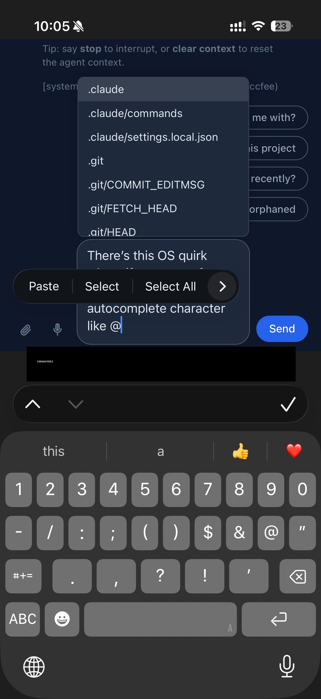
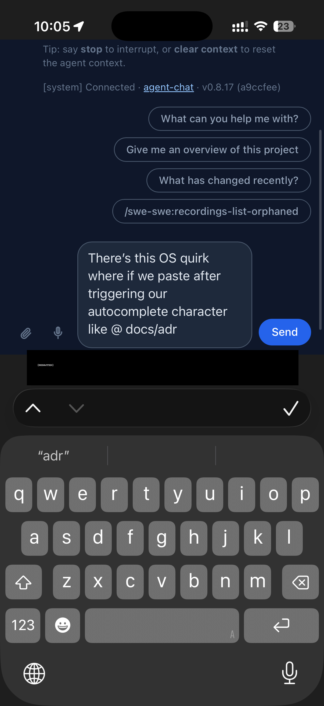

<!-- agent-chat export
title: Strip Os Added Space On Paste Into Autocomplete Trigger
date: 2026-07-22
index: 02
slug: strip-os-added-space-on-paste-into-autocomplete-trigger
session: addf857f2c422fcc
agent: claude
version: 0.8.17 (a9ccfee)
-->

# Strip Os Added Space On Paste Into Autocomplete Trigger

_2026-07-22 · 02 · claude · agent-chat 0.8.17 (a9ccfee)_

**USER**

> There’s this OS quirk where if we paste after triggering our autocomplete character like @ docs/adr <— notice we got a space prefix added for us and breaking our autocomplete. Can we detect that when autocomplete is activated, a paste should strip whitespace prefix?
>
> 

> 
> 
> 

<small>took 1m 6s</small> 
**AGENT**

> Fixed in `client-dist/app.js` — restart this session's agent-chat server to try it (I can't restart it without killing your UI).
>
> 1. `chatInput` paste handler now checks: is the autocomplete dropdown open AND is the cursor still inside a trigger token (`findTrigger`)? If yes and the pasted text starts with spaces/tabs, it strips them and inserts via `insertAtCursor` (`app.js:998`).
> 2. Only leading `[ \t]` is stripped, only on that path — normal pastes and image/file pastes are untouched.
> 3. `insertAtCursor` uses `execCommand('insertText')` so native undo and the `input` event (which re-queries autocomplete) still work.
> 4. Built to `npm-platforms/linux-x64/bin/agent-chat`; `make unit-test` passes.
>
> Next: restart the server, type `@`, then paste `docs/adr` — the dropdown should stay filtered instead of showing everything.

[Quick replies]
- I'll restart and test
- Run the e2e tests too
- Commit this

**USER**

> make build so in this server (we have npm link) we’ll start using this new local version

<small>took 19.6s</small> 
**AGENT**

> `make build` done — all 6 platform binaries rebuilt and `npm link` re-run, so the linked `agent-chat` now points at the paste-fix build.
>
> The running server is still the old process. Restart this session's agent-chat to load it, then: type `@`, paste `docs/adr` — the dropdown should stay filtered instead of resetting to the full list.

[Quick replies]
- Restarting now
- Commit this
- Run the e2e tests

**USER**

> Commit this

<small>took 13.9s</small> 
**AGENT**

> Committed `122616d` — `client-dist/app.js` only. Not pushed.
>
> Left unstaged on purpose: `agent-chats/` (this session's log + assets, plus the regenerated index) and untracked `.claude/`, `.pi/`.
>
> Next: restart the agent-chat server and paste-test `@` + `docs/adr`.

[Quick replies]
- Push it
- Commit the chat log too
- Nothing else

**USER**

> Run /swe-swe:commit-session-chat-log to freeze, scrub and commit this session's chat log. When the commit has landed, end this session by calling the swe-swe MCP tool end_session with uuid ccecf57a-7026-4a0b-8651-18052a5db25b. If you cannot commit it (for example a screenshot leaks a secret), say so and do NOT end the session.

