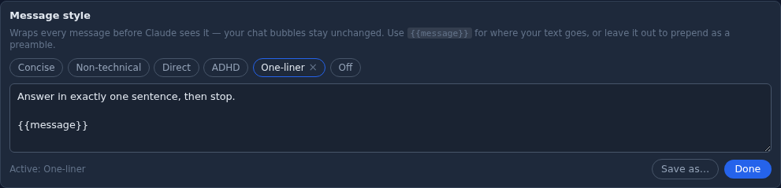

<!-- agent-chat export
title: Persist Message Style Across Sessions Via Cookies
date: 2026-07-25
index: 01
slug: persist-message-style-across-sessions-via-cookies
session: 8e7afc764f9e3c17
agent: claude
version: 0.8.19 (7389bb4)
-->

# Persist Message Style Across Sessions Via Cookies

_2026-07-25 · 01 · claude · agent-chat 0.8.19 (7389bb4)_

**USER**

> Does our message style choice persist across different sessions? If yes how? If no fix

<small>took 1m 26s</small> 
**AGENT**

> Answer: **No — it does not persist.** Fix written, now verifying.
>
> Cause: the style was in `localStorage`, which is scoped per origin *including port*. Each session gets its own port (4000, 4001, …), so a new session = empty setting.
>
> Fix: store it in a cookie (cookies ignore port) — same trick the theme toggle already uses. localStorage kept as fallback.
>
> Step 1 of 3 done: code changed in `client-dist/app.js`. Next: rebuild + prove it across two ports.

**USER**

> If users edits it and save, maybe we can ask user for a name and save it under that name. Otherwise they’ll lose their style if they tap on pill again?

**USER**

> Actually we can remove localStorage mechanism if we are using cookies

<small>took 3m 35s</small> 
**AGENT**

> Step 2 of 3 done: both persistence tests pass (set-on-port-A → visible on port-B; clear → clears everywhere).
>
> Next: unit tests + cleanup, then I'll hand you the one command to make it live.

<small>took 1m 17s</small> 
**AGENT**

> **Start a new session to pick it up** — the fix is built and in the swe-swe launch cache. This session keeps running the old binary.
>
> Answer to your question: **it did not persist.** The style was in `localStorage`, scoped per origin *including port* — and every session gets its own port (4000, 4001, …). New session = blank setting, silently.
>
> Now fixed (3 of 3 done):
> 1. `client-dist/app.js` — style stored in the `agent-chat-msg-style` cookie. Cookies ignore the port, so one setting follows you across sessions on the same host. Same mechanism the theme toggle already uses.
> 2. `localStorage` removed entirely, as you said — cookie is the only store. Empty cookie = "explicitly off".
> 3. `e2e/msg-style-persist.spec.cjs` — new test, 2 passing: set a preset on port A → it appears on port B; clear it on B → it's cleared on A. `make unit-test` green.
>
> The clear-case test caught a real bug mid-way: the localStorage fallback was resurrecting a style you'd just cleared. Gone with the fallback.
>
> Separately, your custom-style idea: right now editing the textarea then tapping a preset pill **does** overwrite your edit with no undo. Want me to add "save as <name>" so custom styles become their own pills alongside Concise/Direct/ADHD? About 30 minutes.

[Quick replies]
- Yes, add named custom styles
- Not now
- Just warn before overwriting an edit

**USER**

> Yes, add named custom styles

<small>took 3m 41s</small> 
**AGENT**

> **Start a new session, open Settings, edit the style, tap "Save as…"** — that's the whole feature.
>
> Done (4 of 4):
> 1. Custom styles get a name and their own pill, next to Concise / Non-technical / Direct / ADHD.
> 2. Each pill has a `×` to delete it. Status line reads "Active: One-liner" so you can see which one is live.
> 3. Saved in the `agent-chat-msg-styles` cookie → travels between sessions, same as the active style.
> 4. `localStorage` fully removed — cookies only, as you asked.
>
> Tests: 4 E2E specs pass, including "tap Direct, then tap your pill → your text comes back" (the exact loss you flagged). `make unit-test` green.
>
> One limit: all saved styles share one ~4KB cookie. Past that, saving is refused with "Too many saved styles to fit — delete one first" instead of silently dropping. That's roughly 6–8 styles of typical length.
>
> Next: start a new session and save one style — takes under a minute. Then tell me if the pills should also carry a "duplicate" action.
>
> 

> 
> 

[Quick replies]
- Looks good, commit it
- Let me try it first
- Add duplicate to pills too

**USER**

> Run /swe-swe:commit-session-chat-log to freeze, scrub and commit this session's chat log. When the commit has landed, end this session by calling the swe-swe MCP tool end_session with uuid 4db0dda3-56a3-4293-a33f-eade3e904834. If you cannot commit it (for example a screenshot leaks a secret), say so and do NOT end the session.

