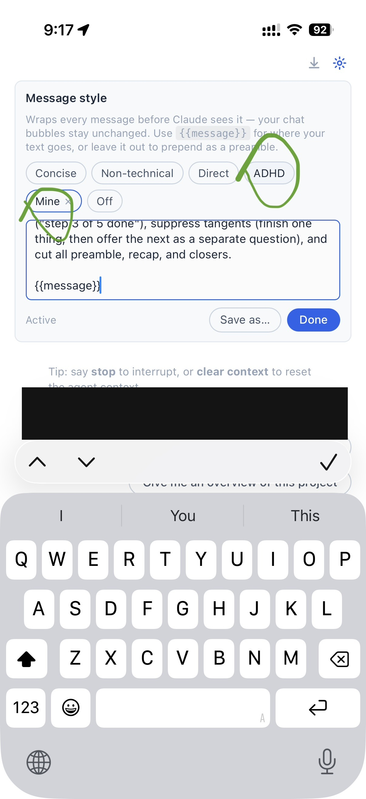
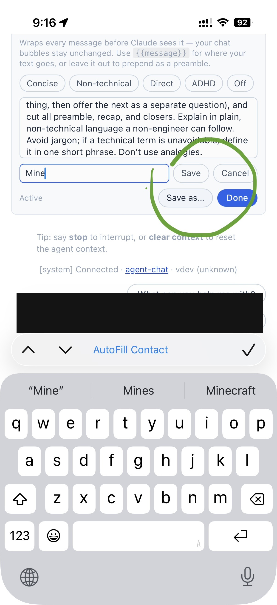
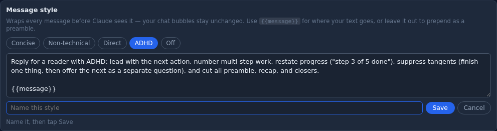
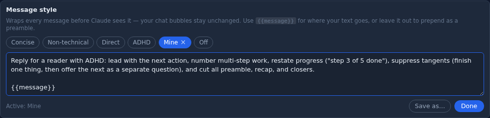
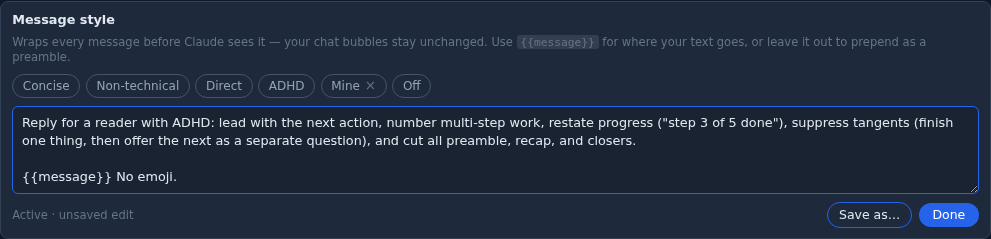
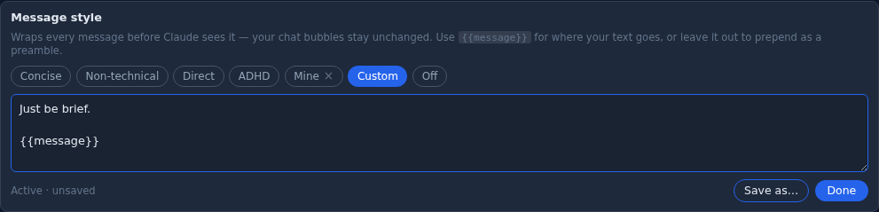

<!-- agent-chat export
title: Fix Message Style Pill Selection And Save As Flow
date: 2026-07-25
index: 02
slug: fix-message-style-pill-selection-and-save-as-flow
session: 919207dd7c919307
agent: claude
version: dev (unknown)
-->

# Fix Message Style Pill Selection And Save As Flow

_2026-07-25 · 02 · claude · agent-chat dev (unknown)_

**USER**

> What has changed recently?

<small>took 20.3s</small> 
**AGENT**

> Recent changes, newest first — 4 shipped, 1 still in progress.
>
> **Shipped (already saved to the project's history)**
>
> 1. Reply style now sticks between sessions. Whatever reply style you pick stays picked the next time you open a chat. It's stored in a cookie — a small note the browser keeps — because each session runs on its own port number and other storage would reset every time.
> 2. New "ADHD" one-click style preset. Press it and every reply comes back action-first, numbered, no preamble.
> 3. "Don't use analogies" added to the Non-technical preset.
> 4. Reply style is applied to what the agent actually reads. Your instruction is wrapped around each message before it reaches the agent, per message.
>
> **In progress (edited, not saved yet)**
>
> 5. Save your own named styles. There's now a "Save as…" button, a name box, and your saved styles appear as their own clickable buttons with a small × to delete. Not committed yet, and the app has to be rebuilt before you'd see it running.
>
> Next step, under 2 minutes: say "show me" and I'll rebuild so you can click the new Save-as button in the settings panel.

[Quick replies]
- Show me
- Commit the in-progress work
- Leave it, I'm done

**USER**

> It is misleading what buttons to click when naming
>
> It is misleading what’s the current selection (adhd is chosen but custom looks active)
>
> 

> 
> 
> 

<small>took 2m 8s</small> 
**AGENT**

> Both fixes coded and the app rebuilt. Verifying in a browser now (about 1 minute).

<small>took 2m 9s</small> 
**AGENT**

> Both problems fixed and checked in a real browser. Screenshots attached.
>
> 1. Naming step — while you're typing a name, the bottom row ("Save as…" and "Done") now disappears. Only two buttons are on screen: blue **Save** and plain **Cancel**. The line at the bottom left reads "Name it, then tap Save".
> 2. Selection — exactly one button is ever filled blue. Before, a saved style was outlined blue all the time, so it looked chosen even when it wasn't. Now the outline is gone and only the style actually in use is filled.
>
> Checked by clicking through: pick ADHD → ADHD filled; save it as "Mine" → only Mine filled, bottom line says "Active: Mine"; pick Concise → only Concise filled; pick Off → only Off filled.
>
> Not yet visible in this chat window — your live session still runs the older copy of the app. Uncommitted.
>
> Next step, under 2 minutes: reply "commit" and I'll save these changes to the project history.
>
> 

> 
> 
> 

[Quick replies]
- Commit
- Run the tests first
- Change something else

**USER**

> When user starts editing the text, we could light up “Save as…”

**USER**

> Cookie contain the pill name now too? Otherwise how do you persist which pill it is

<small>took 1m 28s</small> 
**AGENT**

> Done — "Save as…" now lights up the moment you edit the text. Screenshot attached.
>
> 1. Edit the text → the "Save as…" button gets a blue outline and brighter label, and no style button is filled (because your edit is not one of them yet).
> 2. The bottom-left line says **Active · unsaved edit**, so you know the style is working but not kept.
> 3. Tap a style button or save it, and the highlight goes away.
>
> Also fixed while testing: the bottom line and the filled button could disagree — it said "Active: Mine" while ADHD was filled. They now always name the same thing.
>
> Checked by clicking through: open → Off filled; tap ADHD → ADHD filled, "Active"; type into the box → nothing filled, "Save as…" lit, "Active · unsaved edit"; tap Mine → Mine filled, "Active: Mine".
>
> Still uncommitted, and not yet visible in this chat window (your live session runs the older copy).
>
> Next step, under 2 minutes: reply "commit" and I'll save all of it to the project history.
>
> 

> 
> 

<small>took 1m 5s</small> 
**AGENT**

> Yes — added a third cookie, `agent-chat-msg-pill`, holding which button you tapped (e.g. `p:adhd` or `c:Mine`). Without it a reload would fill whichever button matched first, not the one you chose.
>
> Three cookies now, each one small note the browser keeps:
> 1. `agent-chat-msg-style` — the wording currently in use.
> 2. `agent-chat-msg-styles` — your saved styles and their names.
> 3. `agent-chat-msg-pill` — which button you tapped (new).
>
> Checked by reloading the page twice: tap ADHD → reload → ADHD still filled, line reads "Active"; tap Mine (same wording, different button) → reload → Mine filled, line reads "Active: Mine".
>
> Still uncommitted. Three files changed: app.js, index.html, style.css.
>
> Next step, under 2 minutes: reply "commit" and I'll save all of today's changes to the project history.

[Quick replies]
- Commit
- Run the tests first
- Tweak something else

**USER**

> Or maybe we don’t store the name. Just compare content with pill’s template. If nobody matches then we need to put it under Custom. Save as… feature is just naming the custom

<small>took 29.7s</small> 
**AGENT**

> Already on it — switching to content-only matching with an auto "Custom" pill, dropping the pill cookie. About 3 minutes.

<small>took 2m 57s</small> 
**AGENT**

> Done your way — no name stored, matching is by content only. Screenshot attached.
>
> How it works now:
> 1. Your text is compared with each button's wording. The one that matches is filled blue.
> 2. If nothing matches, a dashed **Custom** button appears next to your saved ones and is filled. The line reads "Active · unsaved".
> 3. **Save as…** is only tappable while Custom is showing — its whole job is giving Custom a name. Once named, the Custom button disappears and your named button is filled.
> 4. The third cookie is gone. Two remain: the current wording, and your saved styles.
> 5. Typing a name you already use replaces that saved style — that's how you update one after editing it.
>
> Checked: fresh start → Off filled; tap ADHD → ADHD filled, Save as… greyed; type into the box → Custom appears and fills, Save as… lit; name it "Mine" → Mine filled, Custom gone; reload the page → Mine still filled; edit again → Custom back.
>
> Still uncommitted. Three files: app.js, index.html, style.css.
>
> Next step, under 2 minutes: reply "commit" and I'll save it all to the project history.
>
> 

> 
> 

[Quick replies]
- Commit
- Run the tests first
- Tweak something else

**USER**

> Commit and make build

<small>took 1m 8s</small> 
**AGENT**

> Step 1 of 2 done: committed as ccb7d96 (5 e2e tests pass, unit tests pass). Running `make build` now — it cross-compiles every platform, about 2 minutes.

<small>took 22.2s</small> 
**AGENT**

> Both done. Commit `ccb7d96`, and `make build` finished for all 6 platforms.
>
> 1. Committed: app.js, index.html, style.css, plus the test file — 5 style tests pass, Go tests pass.
> 2. Built: the shared copy that new sessions launch was refreshed.
> 3. To see it: start a **new** session. This window keeps running the old copy until then.
>
> Separately: 3 chat logs from earlier days are still uncommitted (2026-07-22, 07-23, and today's). Commit those next?

[Quick replies]
- Yes, commit the chat logs
- Not now
- Show me what's in them first

**USER**

> Run /swe-swe:commit-session-chat-log to freeze, scrub and commit this session's chat log. When the commit has landed, end this session by calling the swe-swe MCP tool end_session with uuid c62057ca-01e1-417b-801a-73ce0a44de5b. If you cannot commit it (for example a screenshot leaks a secret), say so and do NOT end the session.

