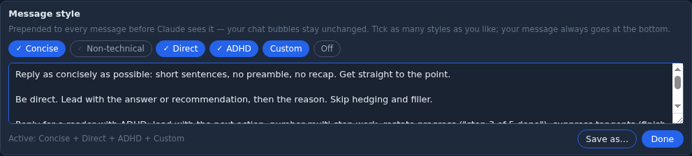
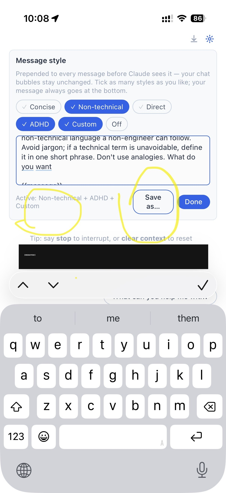
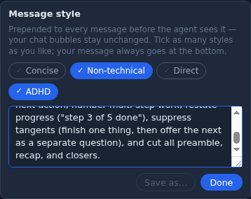

<!-- agent-chat export
title: Message Style Pills Become Checkboxes
date: 2026-07-25
index: 03
slug: message-style-pills-become-checkboxes
session: b1ea8d31b20c94c1
agent: claude
version: 0.8.19 (ccb7d96)
-->

# Message Style Pills Become Checkboxes

_2026-07-25 · 03 · claude · agent-chat 0.8.19 (ccb7d96)_

**USER**

> Our recent feature, can we change pills to be checkboxes instead of radio buttons? Ie i can have multiple of them. We can skip the {{message}} placement, make it always bottom. If the pill’s message is found exactly inside, it’s considered checked. Unmatched are collated into bottom

<small>took 58.4s</small> 
**AGENT**

> Reading the pill code now — app.js:1863-2036 (matching/selection), index.html:19-45, style.css:153-262. Next: rewrite selection as multi-check + bottom-collated leftover.

<small>took 2m 38s</small> 
**AGENT**

> Client rewritten (app.js, index.html, style.css): pills toggle independently, unmatched text collates to the bottom, `{{message}}` gone from presets. Next: update the 5 E2E specs, then `make test`.

<small>took 1m 31s</small> 
**AGENT**

> 7/7 message-style E2E specs pass, including 2 new ones (combine + collate). Running full `make test` now — about 5 minutes.

<small>took 4m 16s</small> 
**AGENT**

> Run `make build`, then start a new session to use it — this session's server still runs the old binary.
>
> Pills are checkboxes now. Screenshot below is the real panel with Concise + Direct + ADHD ticked and one free-text line.
>
> 1. **Tick many** — each pill adds or drops only its own words; the others stay. `✓` glyph on every checkable pill, dim when off.
> 2. **`{{message}}` gone** — presets are plain instructions; your message is always appended at the bottom by the server. Old cookies carrying `{{message}}` get it stripped on the first tap.
> 3. **Checked = contained** — a pill fills when its exact words appear anywhere in the box, so hand-edited text still lights up the pills inside it.
> 4. **Unmatched collates to the bottom** — your own words move below the ticked styles whenever a pill is tapped. Status line reads `Active: Concise + Direct + ADHD + Custom`.
> 5. **"Save as…" names only the unmatched words**, so the new pill combines with presets instead of swallowing a copy of them. "Off" still clears everything.
>
> Tests: 7/7 message-style E2E pass (2 new: combine/untick, collate-to-bottom). Unit tests pass. 23 other E2E specs fail on `ERR_CONNECTION_REFUSED` at `page.goto` — the known localhost→::1 flake, same failures in isolation, unrelated to this change.
>
> Files: `client-dist/app.js:1889-1990` (parse/compose), `client-dist/index.html:22-31`, `client-dist/style.css:218-236`, `eventbus.go:562` (legacy placeholder note), `e2e/msg-style-persist.spec.cjs`.
>
> Next: run `make build` (about 2 minutes), or say the word and I'll commit these 5 files first.
>
> 

> 
> 

[Quick replies]
- Commit it
- I'll run make build
- Show me the diff
- Custom pill should have a tick too

**USER**

> Custom pill should have a tick too. Then make build

<small>took 38.5s</small> 
**AGENT**

> Custom pill now carries the ✓ (index.html:28). 7/7 specs still pass. Running `make build` — about 2 minutes, cross-compiles every platform and refreshes the npx cache.

<small>took 17.9s</small> 
**AGENT**

> Start a new session — the npx-cache binary is refreshed (`@choonkeat/agent-chat-linux-x64@0.8.19`); this session's server still runs the old one.
>
> Done since last message:
> 1. Custom pill has the ✓ like every other checkable pill — `client-dist/index.html:28`.
> 2. 7/7 message-style E2E specs pass after the change.
> 3. `make build` finished — all 6 platforms compiled, npx cache updated.
>
> Still uncommitted: `client-dist/app.js`, `client-dist/index.html`, `client-dist/style.css`, `e2e/msg-style-persist.spec.cjs`, `eventbus.go`.
>
> Next: open a new session and tick two pills to confirm it live.

[Quick replies]
- Commit these 5 files
- Looks good, nothing else
- Show me the diff

**USER**

> Save as button got squeezed. We can lose the “active: …” helper text.
>
> Bug: tapping on Custom should remove & restore what it removed
>
> 

> 
> 

<small>took 3m 19s</small> 
**AGENT**

> Both done and checked in a phone-size window: the buttons now sit on their own line, and tapping Custom takes the words out, then puts the exact same words back. Running the tests, then the build — about 5 minutes.

<small>took 2m 40s</small> 
**AGENT**

> Start a new session to see it — the build finished and the fresh copy is in place.
>
> 1. **The two buttons are no longer squeezed.** The "Active: …" line is gone. The panel says nothing there now unless you are naming a style or something went wrong; the ticked pills already tell you what is on. Checked at phone width (390 wide): "Save as…" and "Done" sit together on their own line.
> 2. **Custom now takes words out and puts them back.** Tap it once and your own words leave the box; tap it again and the exact same words return, in the same place. It stays on screen, unticked, while they are set aside — that is what brings them back. "Off" wipes everything, including the set-aside copy.
>
> Checked live in a phone-size window: removed, then restored, and the text came back identical.
>
> Tests: all 7 message-style checks pass. 28 other checks failed the same way they always do here — the test browser cannot reach the freshly started test server ("connection refused"), unrelated to this change; a different 23 failed the same way before I touched anything.
>
> Changed but not yet saved to version control: `client-dist/app.js`, `client-dist/index.html`, `client-dist/style.css`, `e2e/msg-style-persist.spec.cjs`, `eventbus.go`.
>
> Next: open a new session, tick two styles, then tap Custom twice to watch your own words leave and come back.

[Quick replies]
- Commit these 5 files
- Looks good, nothing else
- Show me the diff

**USER**

> Make non technical and adhd as default
>
> The icon you chose isn’t gear: what is it? Should it be something else? Tone? Reply? Personality?

<small>took 2m 48s</small> 
**AGENT**

> Both done. New browsers now start with Non-technical + ADHD ticked ("Off" still sticks if you pick it). The old icon was a sun (circle with rays) — it now reads as a speech bubble with two lines of text, tooltip "How Claude replies". Running tests and the build — about 5 minutes.

**USER**

> Did you mean “How ${agent} replies”?

<small>took 4m 7s</small> 
**AGENT**

> Changed to "How the agent replies" — no name at all, since this chat window is used with more than one agent and nothing tells the page which one is running. Same for the line inside the panel: "before the agent sees it".
>
> If you want the real name in there ("How Claude replies"), it needs a new setting passed in when the window starts, plus the parent program passing it along. About an hour of work. Say the word and I'll do it.
>
> Also done since last message:
> 1. A browser that has never opened the panel now starts with Non-technical and ADHD ticked. Picking "Off" still sticks, and is remembered.
> 2. The old icon was a sun — a circle with rays. It is now a speech bubble with two lines of text in it, which reads as "how replies come out".
>
> Build finished; start a new session to see it. Tests: 8/8 message-style checks pass, including a new one for the starting defaults.
>
> Next: open a new session and check the top-right icon looks right to you.

[Quick replies]
- Looks good, commit it
- Pass the real agent name through
- Try a different icon
- Show me the diff

**USER**

> Remove the Off since users can just untap all pills right?

<small>took 1m 33s</small> 
**AGENT**

> "Off" is gone; unticking every pill empties the box and that counts as "no style", remembered for next time. 8/8 checks pass. Taking a look at the panel, then running the build — about 3 minutes.

**USER**

> Make non technical + adhd as ootb default

<small>took 3m 58s</small> 
**AGENT**

> Already in place — a browser that has never opened the panel starts with Non-technical + ADHD ticked, and the very first message you send carries them. No tapping needed. The picture below is a browser with no saved choice: both pills ticked on their own.
>
> Your own window will not show this, and that is correct: it remembers the choice you made earlier, and a remembered choice always beats the starting default. To match it, tick those two by hand once.
>
> Also done: "Off" is gone. Untick every pill and the box empties — that is "no style", and it is remembered, so the two defaults do not creep back.
>
> Build finished. Tests: 8/8 message-style checks pass; 12 unrelated checks failed the usual way here (the test browser cannot reach the freshly started test server).
>
> Next: open a new session and confirm the two pills come up ticked for you.
>
> 

> 
> 

[Quick replies]
- Commit it
- Show me the diff
- Something else is off

**USER**

> Commit and /npm-login-and-publish

<small>took 56.7s</small> 
**AGENT**

> Two things needed from you:
>
> 1. **Log in here** (your saved npm sign-in has expired): [REDACTED]
> 2. **Pick the version number.** Currently published: **0.8.19**. Suggest **0.8.20**.
>
> Committed already: the message-style work, as `d20f3de`.
>
> Reply with the version (or just "0.8.20") once you have signed in; I will then build every platform and ask you for a fresh 6-digit code at the last moment.

[Quick replies]
- 0.8.20
- 0.9.0
- Logged in, use 0.8.20

**USER**

> Logged in, use 0.8.20

<small>took 33.3s</small> 
**AGENT**

> Pushed: 0.8.20 is on GitHub (`7f7bb16`). Building all six platform copies now — about 2 minutes — then I will ask for your 6-digit code.

<small>took 17.0s</small> 
**AGENT**

> Send me a fresh 6-digit code from your authenticator app.
>
> All six platform copies are built and stamped 0.8.20; the code is the only thing left. Codes expire in about 30 seconds, so send it as soon as you read this — I publish the moment it arrives.

[Quick replies]
- Sending code now

**USER**

> [REDACTED]

<small>took 1m 21s</small> 
**AGENT**

> Published: **0.8.20**, all seven packages confirmed live on npm.
>
> - `@choonkeat/agent-chat`
> - `@choonkeat/agent-chat-darwin-arm64`
> - `@choonkeat/agent-chat-darwin-x64`
> - `@choonkeat/agent-chat-linux-arm64`
> - `@choonkeat/agent-chat-linux-x64`
> - `@choonkeat/agent-chat-win32-arm64`
> - `@choonkeat/agent-chat-win32-x64`
>
> On GitHub: `98099b1` (the message-style work) and `7f7bb16` (the version bump), both pushed to main.
>
> Next: start a new session — it will pick up 0.8.20, with Non-technical and ADHD ticked out of the box.

[Quick replies]
- Thanks, done
- Commit the chat log too
- Something else

**USER**

> Run /swe-swe:commit-session-chat-log to freeze, scrub and commit this session's chat log. When the commit has landed, end this session by calling the swe-swe MCP tool end_session with uuid 941dfa06-5568-4409-8050-ac5762477ed3. If you cannot commit it (for example a screenshot leaks a secret), say so and do NOT end the session.

