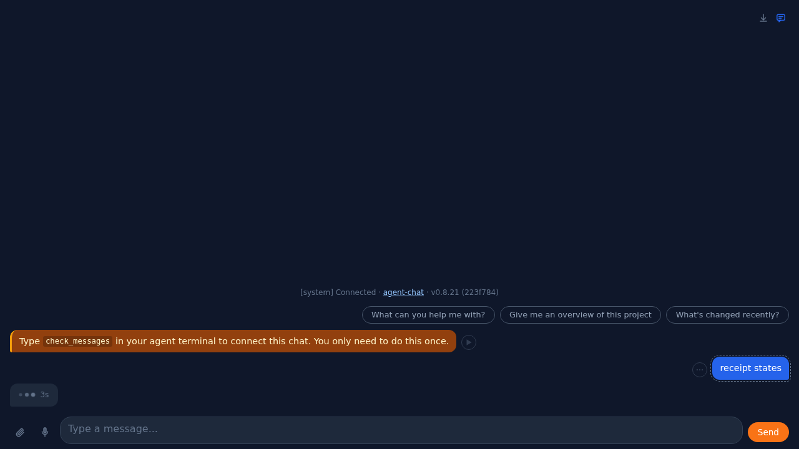
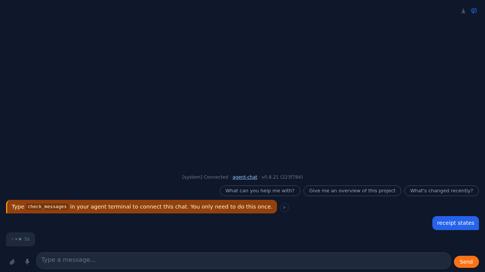
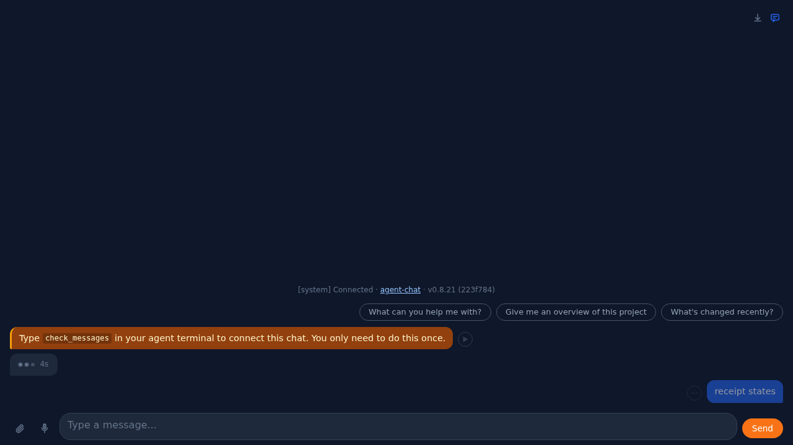

<!-- agent-chat export
title: Unread Until Proven Read Tdd Fix For The Lying Read Receipt
date: 2026-08-01
index: 01
slug: unread-until-proven-read-tdd-fix-for-the-lying-read-receipt
session: 4173203940611362
agent: claude
version: 0.8.21 (adbb262)
-->

# Unread Until Proven Read Tdd Fix For The Lying Read Receipt

_2026-08-01 · 01 · claude · agent-chat 0.8.21 (adbb262)_

**USER**

> Tdd fix @tasks/2026-08-01-read-receipt-lies-on-terminal-breakout.md

<small>took 18.1s</small> 
**AGENT**

> Starting: read-receipt fix, test-first. Step 1 of 6 — reading the code the plan points at (eventbus.go, tools.go, app.js).

<small>took 1m 14s</small> 
**AGENT**

> Step 1 of 6 done — read eventbus.go, tools.go, app.js, style.css, and the two e2e specs that touch pending bubbles.
>
> Step 2 of 6: writing the failing Go tests first (three-state read receipts).

<small>took 2m 23s</small> 
**AGENT**

> Step 2 of 6 done — 8 new Go tests, all green after the server change. `userMessagesRead` now exists and only fires on the agent's next tool call.
>
> Step 3 of 6: browser side — the new "delivered but unacknowledged" bubble state.

<small>took 3m 1s</small> 
**AGENT**

> Step 3 of 6 done — app.js/style.css now render three states; new e2e spec `e2e/read-receipt-states.spec.cjs` written.
>
> Step 4 of 6: rebuilding the binary (client-dist is embedded) and running `make test`.

<small>took 7m 21s</small> 
**AGENT**

> Step 5 of 6 done — ADR `docs/adr/2026-08-01-three-state-read-receipt.md` + CHANGELOG written. Full `make test` running now (~6 min); unit and e2e already passed separately.

<small>took 27.7s</small> 
**AGENT**

> Still running `make test` (unit + 97 e2e specs, ~6 min). No action needed — I'll report the result.

<small>took 5m 29s</small> 
**AGENT**

> Done — `make test` passes (unit + 96 browser tests, exit 0). Next: say "commit it" and I'll stage the 11 files and commit.
>
> **What changed, plainly:** a message you send now has three looks instead of two.
>
> 1. **Dim** — sitting in the agent's inbox, nobody has picked it up.
> 2. **Dashed outline** (new) — something picked it up, but nothing has confirmed it arrived. The `⋯` button stays here, so "Send as interrupting" is one click away. This is the state your bug produced.
> 3. **Plain blue** — genuinely read. Only happens once the agent actually talks to the chat again.
>
> The old code jumped straight from 1 to 3 the instant anything grabbed the message — including the dead leftover request from a terminal break-out. So it said "read" when nobody had read it, and it removed the one button that would have rescued you.
>
> **Delete** now only shows in state 1. In state 2 the message has already left the inbox, so deleting it can't work.
>
> Screenshots below: dashed-outline state, then read state.
>
> **Files:** `eventbus.go`, `tools.go`, `client-dist/app.js`, `client-dist/style.css`, tests in `eventbus_test.go` / `tools_test.go` / new `e2e/read-receipt-states.spec.cjs`, plus `docs/adr/2026-08-01-three-state-read-receipt.md` and CHANGELOG.
>
> One caveat: this session's chat server is still the old binary, so you won't see the new styling here until it restarts.
>
> 

> 
> 
> 

[Quick replies]
- Commit it
- Show me the diff first
- Make the state-2 outline more obvious
- Leave it uncommitted

**USER**

> Can frontend be told it’s effectively the same as unread user speech bubble? Then there’s a bunch of concept/code/ui/ux reuse

<small>took 50.4s</small> 
**AGENT**

> Yes — collapsing it into the existing unread bubble works. Doing it now.
>
> Step 1 of 4: frontend — drop the new `.delivered-agent` style and keep the bubble in the plain unread state until it's proven read.

<small>took 2m 48s</small> 
**AGENT**

> Step 1 of 4 done — one unread state again; the hand-over now only sets `data-handed-over` to hide Delete. Net: 25 lines of new CSS gone, one fewer bubble style to reason about.
>
> Step 2 of 4: rebuilding and running the tests.

<small>took 7m 23s</small> 
**AGENT**

> Step 2 of 4 done — 96/96 browser tests and all Go tests pass on the simplified version.
>
> Step 3 of 4: updating the design note and changelog to describe the simpler model.

<small>took 1m 17s</small> 
**AGENT**

> Done — your way. Next: say "commit it" and I'll stage the 11 files and commit.
>
> All tests pass again (Go tests + 96 browser tests).
>
> **What it does now:** a message you send stays in the existing unread look — dim, below the spinner, `⋯` button — until the agent actually proves it received it. No new bubble style at all.
>
> The only thing that changes when the message leaves the agent's inbox: **Delete** disappears from the `⋯` menu. It has to — deleting works by pulling the message back out of the inbox, and it's no longer there. "Send as interrupting" stays, which is the whole rescue.
>
> **What the reuse bought:**
> 1. The new bubble style is gone — 25 lines of styling deleted, back to 3 lines of reworded comments.
> 2. One concept instead of two: unread means unread, whoever is holding it.
> 3. History replay, the menu, the below-the-spinner placement, the tooltip — all unchanged code.
>
> Real new frontend code is about 10 lines: mark the bubble as handed-over, hide Delete when it is, and clear the unread state on the new confirmation signal instead of on the old one.
>
> Screenshots: message picked up but unconfirmed (still dim, still has `⋯`), then confirmed read.
>
> Same caveat as before: this session's chat server runs the old binary, so you'll see the new behaviour only after it restarts.
>
> 

> 
> 
> 

[Quick replies]
- Commit it
- Show me the diff
- I want a visual difference after all
- Leave it uncommitted

**USER**

> Commit it

<small>took 32.8s</small> 
**AGENT**

> Committed as `a63ff53` on `main` — 13 files, not pushed. Next: say "push it" if you want it on the remote.
>
> Note: I committed straight to main rather than opening a branch, matching the last several commits in this repo. Say the word if you'd rather it sat on a branch — it's one command to move it.
>
> Not included in the commit: the chat-log files under `agent-chats/`, and `.claude/` / `.pi/`. Those are separate.
>
> Separately: the fix is in the binary on disk but this session is still running the old one, so the chat you're looking at won't behave differently until it restarts. Want me to look at how to restart it?

[Quick replies]
- Push it
- Move it to a branch instead
- How do I restart the server?
- Nothing else

**USER**

> /swe-swe:commit-session-chat-log and git push

