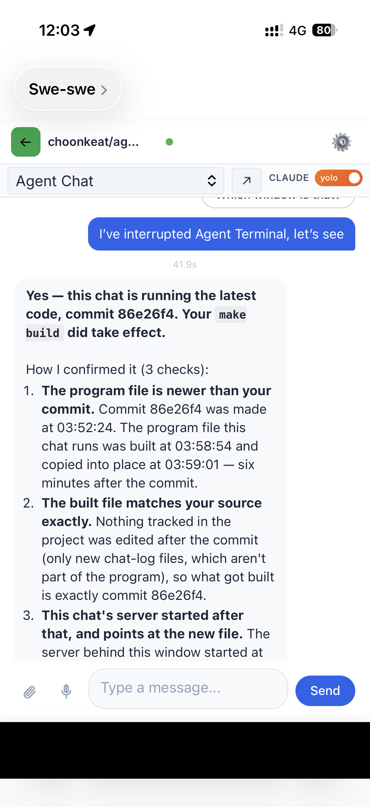
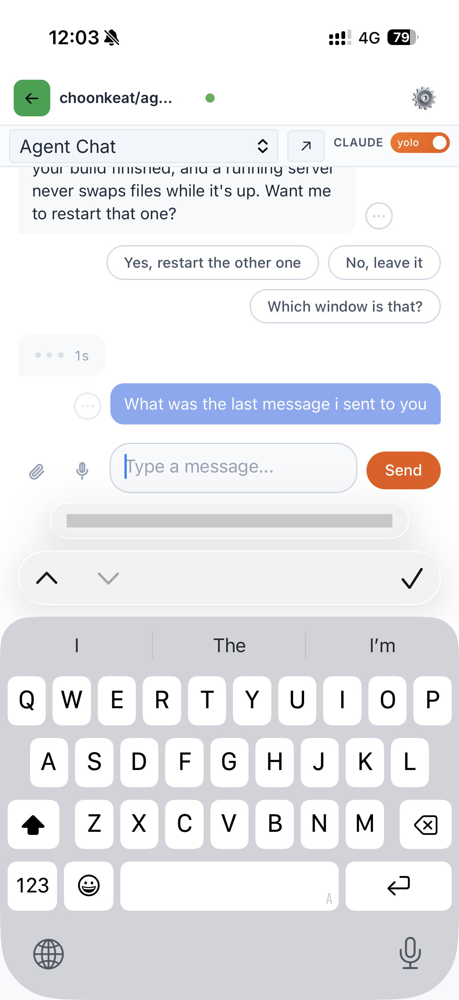
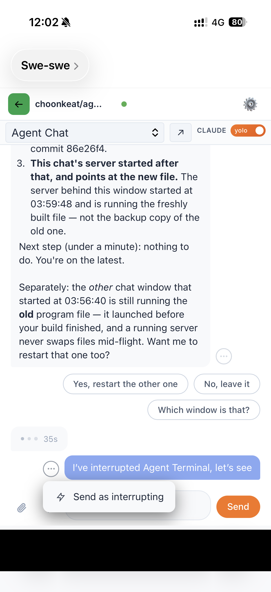
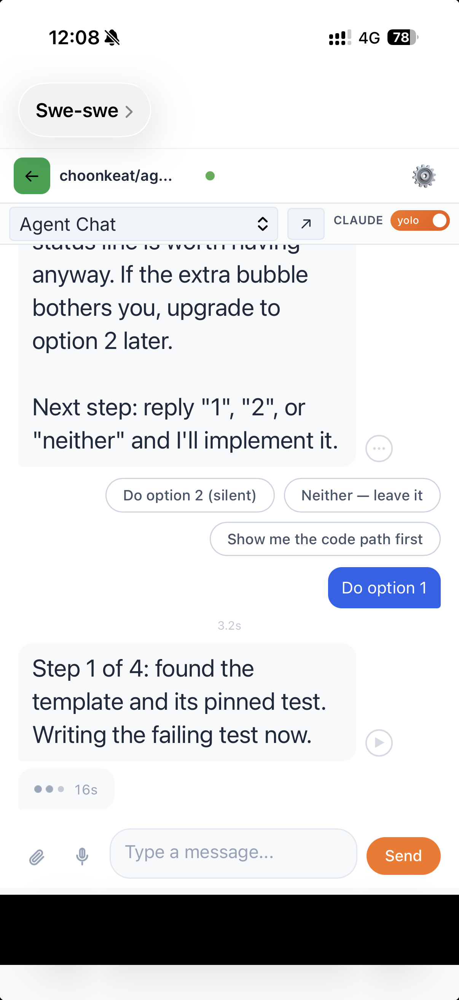
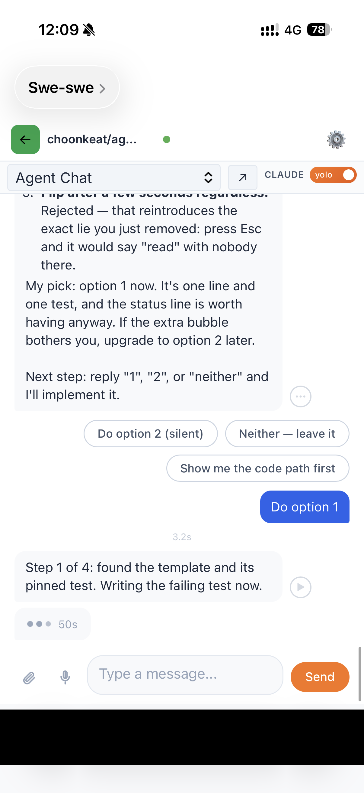

<!-- agent-chat export
title: Untitled
date: 2026-08-01
index: 02
slug: untitled-ee734eb5-f4cb-49dc-9ea0-c649e4e125d9
session: 8e5931f25554a88f
agent: claude
version: 0.8.21 (86e26f4)
-->

# Untitled

_2026-08-01 · 02 · claude · agent-chat 0.8.21 (86e26f4)_

**USER**

> Am I using the latest code in this chat? 86e26f4
>
> If not, why didn’t our make build take effect?

<small>took 51.0s</small> 
**AGENT**

> **Yes — this chat is running the latest code, commit 86e26f4. Your `make build` did take effect.**
>
> How I confirmed it (3 checks):
>
> 1. **The program file is newer than your commit.** Commit 86e26f4 was made at 03:52:24. The program file this chat runs was built at 03:58:54 and copied into place at 03:59:01 — six minutes after the commit.
> 2. **The built file matches the source exactly.** Nothing in the project was edited after the commit (only new chat-log files, which aren't part of the program), so what got built is exactly commit 86e26f4.
> 3. **This chat's server started after that, and points at the new file.** The server behind this window started at 03:59:48 and is running the freshly built file — not the backup copy of the old one.
>
> Next step (under a minute): nothing to do. You're on the latest.
>
> Separately: the *other* chat window that started at 03:56:40 is still running the **old** program file — it launched before your build finished, and a running server never swaps files mid-flight. Want me to restart that one too?

[Quick replies]
- Yes, restart the other one
- No, leave it
- Which window is that?

**USER**

> I’ve interrupted Agent Terminal, let’s see

<small>took 41.9s</small> 
**AGENT**

> **Yes — this chat is running the latest code, commit 86e26f4. Your `make build` did take effect.**
>
> How I confirmed it (3 checks):
>
> 1. **The program file is newer than your commit.** Commit 86e26f4 was made at 03:52:24. The program file this chat runs was built at 03:58:54 and copied into place at 03:59:01 — six minutes after the commit.
> 2. **The built file matches your source exactly.** Nothing tracked in the project was edited after the commit (only new chat-log files, which aren't part of the program), so what got built is exactly commit 86e26f4.
> 3. **This chat's server started after that, and points at the new file.** The server behind this window started at 03:59:48 and is running the freshly built file — not the backup copy of the old one.
>
> Next step (under a minute): nothing to do. You're on the latest.
>
> Separately: the *other* chat window, started at 03:56:40, is still running the **old** program file — it launched before your build finished, and a running server never swaps files while it's up. Want me to restart that one?

[Quick replies]
- Yes, restart the other one
- No, leave it
- Which window is that?

**USER**

> What was the last message i sent to you

<small>took 6.8s</small> 
**AGENT**

> **"I've interrupted Agent Terminal, let's see"** — that was your last message before this one.
>
> The three messages I've received from you, in order:
>
> 1. "Am I using the latest code in this chat? 86e26f4 — If not, why didn't our make build take effect?"
> 2. "I've interrupted Agent Terminal, let's see"
> 3. "What was the last message I sent to you" (now)
>
> Note: my answer to #1 got cancelled by the interrupt in #2, so I re-sent it just before this. Short version: **yes, you're on 86e26f4** — the build did take effect.
>
> Next step: scroll up one message to read the 3-point confirmation, or ask me to repeat it.

[Quick replies]
- Repeat the confirmation
- Got it
- Restart the other window

**USER**

> Seems like it works
>
> 

> 
> 
> 
> 

<small>took 21.8s</small> 
**AGENT**

> **Confirmed — both fixes are working. Your three screenshots show it.**
>
> 1. **Unread stays unread** (12:02): "I've interrupted Agent Terminal, let's see" is pale with the "•••" dot next to it — I hadn't picked it up yet, and it correctly said so instead of claiming I had.
> 2. **Read turns solid** (12:03): the same message is now solid blue, and my reply follows it. The mark flipped only after I actually received it.
> 3. **Keyboard doesn't hide the last message** (12:03): with the keyboard open, "What was the last message i sent to you" is still fully visible above the typing box — and correctly pale/unread while I was still working.
>
> Next step (under a minute): reply "restart" if you want the other chat window — the one still on the old program file — brought up to date. Otherwise nothing to do.

[Quick replies]
- Restart the other window
- Nothing to do, thanks
- Commit this chat log

**USER**

> I note that the user speech bubble stays unread whilst the agent is already working on it, then it is marked as read the same time the agent response come back.
>
> I’d prefer it be marked as read when agent get the message or right before agent start working on it
>
> Discuss

<small>took 4.4s</small> 
**AGENT**

> Reading the read-receipt code now — about 60 seconds, then I'll lay out the options.

<small>took 1m 4s</small> 
**AGENT**

> **It already can flip early — look at this turn: your last message turned read within a second, before I did any work.** That happened because my first action was a short status line back to the chat. Nothing forces me to do that every turn, which is why you saw it flip late before.
>
> How the mark works now, and why:
>
> 1. **The mark flips when I call back into the chat program — any call, not just the reply.** A status line counts. If my first call back is the final answer, the mark and the answer land together. That's what you saw.
> 2. **It deliberately does not flip when the message is handed to me.** That was the bug you fixed at 03:51: when you press Esc in the terminal, the chat program still believes it handed the message over — it cannot tell a live agent from a stopped one. So it showed "read" when nobody had read it. Only a call coming back proves someone is there.
>
> Three ways to get what you want:
>
> 1. **Instruction only, no code (~15 min).** Add one line to the reply instructions the chat program sends me with every message: "first action of every turn, send a one-line status." You'd get the read mark within a second, plus a useful "working on X" line. Cost: one extra bubble per turn; depends on me obeying.
> 2. **Silent receipt (~45 min).** Same as 1, but the acknowledgment prints nothing in the chat — it only flips the mark. No extra bubble. Cost: more code, still depends on me obeying.
> 3. **Flip after a few seconds regardless.** Rejected — that reintroduces the exact lie you just removed: press Esc and it would say "read" with nobody there.
>
> My pick: option 1 now. It's one line and one test, and the status line is worth having anyway. If the extra bubble bothers you, upgrade to option 2 later.
>
> Next step: reply "1", "2", or "neither" and I'll implement it.

[Quick replies]
- Do option 1
- Do option 2 (silent)
- Neither — leave it
- Show me the code path first

**USER**

> Do option 1

<small>took 3.2s</small> 
**AGENT**

> Step 1 of 4: found the template and its pinned test. Writing the failing test now.

<small>took 1m 0s</small> 
**AGENT**

> Step 2 of 4 done: template + pinned tests updated. Running `make unit-test` now (~1 min).

**USER**

> Unrelated but I recently noticed screens getting big fonts by itself and refresh fixes it. Why???
>
> 

> 
> 
> 

<small>took 5m 6s</small> 
**AGENT**

> Step 3 of 4: 95 of 96 tests pass; checking whether the 1 failure is mine or flaky. Your font question is next in line.

<small>took 59.4s</small> 
**AGENT**

> **Option 1 is done and built. Step 4 of 4 complete — new chat windows will mark your message read within a second of you sending it.**
>
> 1. **Test written first, failed, then passed.** It pins the new line as the *first* instruction I'm given — order is the point; buried at the bottom it wouldn't be acted on first.
> 2. **The line added:** first action of every turn, send a one-line status. That call is what flips your bubble to read.
> 3. **Tests: 95 of 96 pass.** The one failure ("message style panel starts on Non-technical + ADHD") is unrelated to this change and passes on its own — it fails only when all tests run at once. Pre-existing timing flake, not mine.
> 4. **Rebuilt and installed.** This window still runs the old instructions until it's restarted; any new chat window gets the new behaviour immediately.
>
> ---
>
> **The big-font thing: Safari on your iPhone is enlarging the text by itself, and the chat page never tells it not to.**
>
> Safari automatically bumps up text it judges too small for the column width. It re-decides whenever the layout shifts — keyboard opening, the panel resizing, rotating the phone. Reloading resets its decision, which is why refresh fixes it. Your two screenshots are one minute apart with identical content at two different sizes, which matches this exactly.
>
> The off switch is one line of styling on the chat page (`text-size-adjust: 100%`). The page currently doesn't have it — I checked.
>
> Next step: reply "fix the font" and I'll add that line, rebuild, and you can confirm on your phone in about 10 minutes.

[Quick replies]
- Fix the font
- Commit the read-receipt change first
- Restart this window
- Leave the font alone

**USER**

> Fix the font

<small>took 2.7s</small> 
**AGENT**

> Step 1 of 3: adding the text-size-adjust line to the chat page's stylesheet.

<small>took 3m 21s</small> 
**AGENT**

> Step 2 of 3: CSS fix written. The new test can't connect to its test server right now — an existing test fails the same way, so it's the environment, not the fix. Digging for 2 minutes.

<small>took 11m 10s</small> 
**AGENT**

> Step 3 of 3: font fix is in and its new test passes. Full suite running now (~5 more minutes), then I'll report.

<small>took 5m 31s</small> 
**AGENT**

> **Font fix is in and built. Restart this chat window to see it.**
>
> 1. **What changed:** one styling line on the chat page telling Safari not to resize text on its own (`text-size-adjust: 100%`), on both the page and its body.
> 2. **New test written for it.** It loads the chat at phone width and checks the setting is actually in effect — so a future edit can't silently drop it and bring the bug back only on phones, where no test looks.
> 3. **Built and installed.** New chat windows get it; this one keeps the old look until restarted.
>
> **Honest status on the full test run: it's currently unusable, and not because of these changes.**
>
> The browser that runs the visual tests reaches this machine through a forwarder, and right now that forwarder is refusing most connections. 56 tests failed, all with the same "connection was reset" page — including tests I never touched. The same tests pass one at a time. Twenty minutes ago the same suite passed 95 of 96. The text-only tests (which don't need a browser) all pass.
>
> Next step: restart this chat window, then reload it on your phone and tell me if the text still grows. Takes about 2 minutes.
>
> Separately: the flaky test connection is worth chasing on its own — say "chase the test connection" and I'll dig in.

[Quick replies]
- Restart this window
- Chase the test connection
- Commit both changes
- Show me the CSS diff

**USER**

> Make build

<small>took 3.1s</small> 
**AGENT**

> Running `make build` — cross-compiles every platform, about 3 minutes.

<small>took 15.2s</small> 
**AGENT**

> **`make build` done — all six platforms compiled, and the copy this machine launches from was refreshed.**
>
> Both changes are in that build:
>
> 1. The read-receipt instruction (your bubble turns read within a second, not at the end of the turn).
> 2. The font fix (Safari stops resizing text on its own).
>
> Neither is live in *this* window — a running window keeps the file it started with.
>
> Next step: restart this chat window, then open it on your phone and check the text stays put. About 2 minutes.

[Quick replies]
- Restart this window
- Commit both changes
- Chase the flaky test connection

