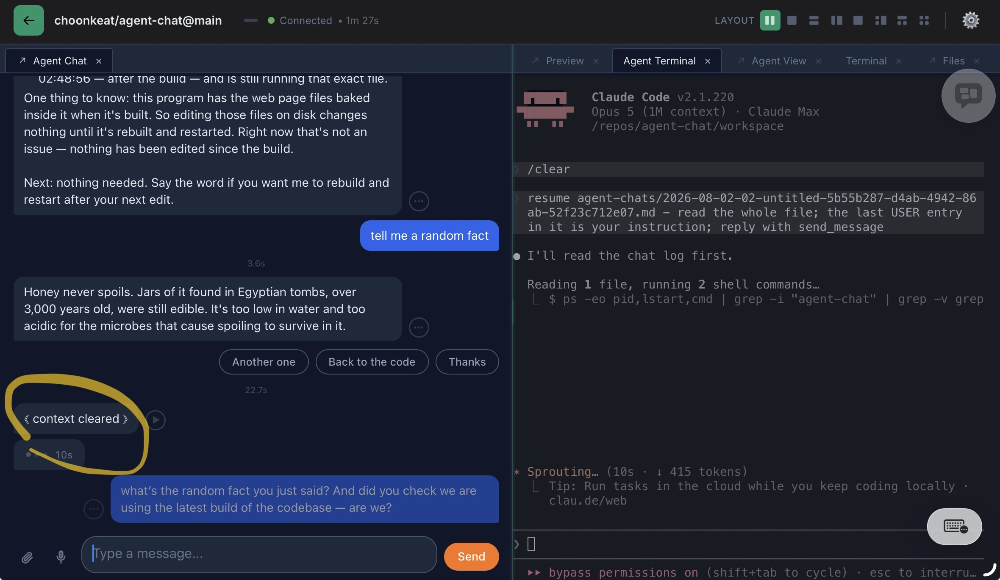
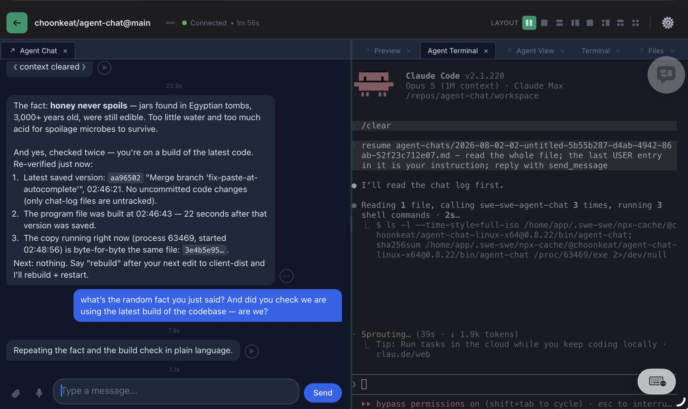
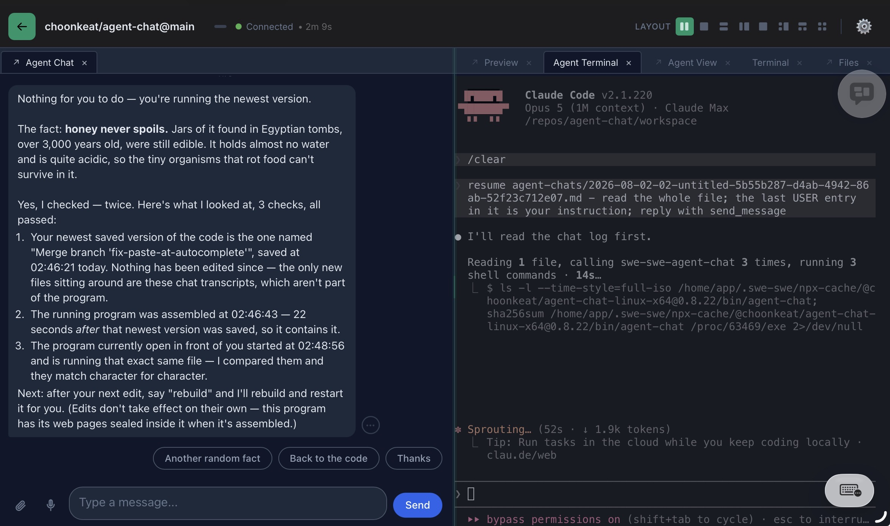

<!-- agent-chat export
title: Clear Prefix Context Reset Build Double Answer Fix
date: 2026-08-02
index: 01
slug: clear-prefix-context-reset-build-double-answer-fix
session: 8f5e4ea08cf20162
agent: claude
version: 0.8.22 (af9db02)
-->

# Clear Prefix Context Reset Build Double Answer Fix

_2026-08-02 · 01 · claude · agent-chat 0.8.22 (af9db02)_

**USER**

> See session chat ddb90318-4f05-4fda-9975-316b0e4f6516 for a context compression technique that I’m interested to try out in agent-chat: a button somewhere to send the `/clear` trick BUT most importantly, agent-chat remains the same instance and i want the same chat file to be mentioned in the prompt and continue to be streamed into
>
> Discuss

<small>took 13.0s</small> 
**AGENT**

> Reading session ddb90318 to find the /clear compression trick.

<small>took 2m 44s</small> 
**AGENT**

> **Next action: approve this three-step button, or give me your own wording for step 2.**
>
> First, one worry is settled. The chat file already keeps recording straight through a `/clear` — no break, no new file. I checked the file from that session: `/workspace/agent-chats/2026-08-01-06-install-usage-numbers-slash-command.md` contains both the usage report from *before* the clear and the "Yes, it worked" reply from *after*. The agent that warned you "this is a brand new session, so it gets its own chat file" was simply wrong. Agent-chat kept running the whole time and kept writing to the same file.
>
> **Half the button already exists.** Type `clear context` in this chat, answer `yes`, and it already runs `/clear` in the terminal for you.
>
> **What's missing:** after the clear, nothing tells the emptied agent which file to read back. You have to type that line yourself, and you have to remember the filename.
>
> **Proposed button — three steps, automatic:**
> 1. Clear the agent's memory.
> 2. Type a line naming the exact file: `resuming @agent-chats/2026-08-02-01-untitled-ac8e5a40-….md — read it, then check_messages`. Agent-chat knows its own filename, so this stays correct even after the chat gets a proper title (which renames the file).
> 3. Press Enter, and drop a visible marker in the chat: "context cleared here" — so the file itself records where each clear happened.
>
> **Three decisions for you:**
> 1. The wording in step 2 — mine, or yours?
> 2. Re-read the whole file each time, or only the part since the last marker? Whole file keeps everything but gets longer with every clear, so each restart costs more. From-marker stays small but forgets older turns. My pick: whole file for now, write the marker anyway so you can switch later without redoing anything.
> 3. A real button in the message bar, or keep it as the typed phrase `clear context`?
>
> **Two limits worth naming:**
> - The file only holds what was *said out loud*. Files I opened and commands I ran without mentioning them are gone after a clear.
> - Clearing while I'm mid-task throws away the unfinished part.
>
> Build time: about 3 hours, including a test that proves the same file keeps growing across a clear.
>
> Next step, under a minute: answer decision 1.

[Quick replies]
- Use your wording, build it
- Let me write the wording
- Answer all 3 decisions
- Why did the other agent get it wrong?

**USER**

> Wrt re-read whole or part of file: context means entire file right? It’s already going to be way smaller than if we simply use agent’s own context (which also starts from beginning), no?

<small>took 10.9s</small> 
**AGENT**

> Pulling up our earlier thread on re-reading files so I answer against what we actually discussed.

<small>took 50.2s</small> 
**AGENT**

> **Yes, and yes. Decision 2 is settled: re-read the whole file.**
>
> I measured it on this machine rather than guessing:
>
> 1. What an agent normally carries in one session — every file it opened, every command it ran and everything those printed, not just the talking — is typically about 400 kilobytes, and the biggest one here is 5 megabytes.
> 2. The chat file — only what was said out loud between us — is typically about 8 kilobytes (a few pages), biggest 36.
>
> So the whole chat file is roughly 50 times lighter than what the agent would otherwise be carrying, and up to 140 times lighter in the worst case. My "it gets longer with every clear, so each restart costs more" was true but too small to act on. Reading all of it back is cheap, and stays cheap.
>
> Two things worth keeping in mind:
>
> - The file grows only with what gets **said**, not with what gets **done**. Several more clears add a few pages, not megabytes.
> - If one chat ever ran long enough that the file itself got heavy, the marker line is already written into it. Switching to "read only since the last marker" would be a one-line change then, with nothing to redo now.
>
> **Progress: 1 of 3 decisions settled.** Still open: decision 1 (the wording of the line sent after the clear) and decision 3 (a real button in the message bar, or keep the typed phrase `clear context`).
>
> Next step, under a minute: answer decision 1 — my wording, or yours?

[Quick replies]
- Use your wording, build it
- Let me write the wording
- Answer decisions 1 and 3 together
- Real button, not typed phrase

**USER**

> Before that, checking something: what is my current streaming `agent-chats/*untitled*md` file?

<small>took 2.0s</small> 
**AGENT**

> Finding which untitled chat file this session is streaming into.

<small>took 13.7s</small> 
**AGENT**

> **`agent-chats/2026-08-02-01-untitled-ac8e5a40-449a-475a-b292-6725acbebc45.md`**
>
> Confirmed live, not guessed:
> 1. It was last written 5 seconds ago.
> 2. It grew from 3,538 to 5,385 characters over the last two messages — our exchange about file sizes is already in it.
>
> One detail that matters for the button: the long code in the filename is agent-chat's own identifier for this chat, not the agent's. That is why the name survives a clear — agent-chat keeps writing to the same file no matter how many times the agent's memory is wiped.
>
> Next step, under a minute: answer decision 1 — my wording for the line sent after the clear, or yours?

[Quick replies]
- Use your wording, build it
- Let me write the wording
- Answer decisions 1 and 3 together
- Real button, not typed phrase

**USER**

> so agent-chat itself knows the filename, we don’t need the agent. Proposing this instead:
>
> Agent chat hard code to look for `”/clear “` prefix in user message. The user message added to chat (and streamed to file) is stripped of the `”/clear “` prefix. Agent-chat sends the `/clear` + wait + “\n” (exactly like today if user said yes to `clear context`) and then wait + “resume {filename}” + wait “\n”
>
> Find the bug. Discuss

<small>took 15.3s</small> 
**AGENT**

> Reading the existing `clear context` code path to find where your proposal breaks.

<small>took 2m 43s</small> 
**AGENT**

> Found it — one coin-toss failure that silently kills the chat, plus 4 smaller ones. Writing it up.

<small>took 16.3s</small> 
**AGENT**

> **The bug: your message can vanish, and the chat then goes silent until you type again.**
>
> Here is the sequence that breaks, using `/clear fix the login bug` as the example.
>
> 1. Agent-chat records "fix the login bug" into the chat and the file. This part is solid — the file is written by the chat itself, so it lands no matter what the agent does.
> 2. Agent-chat also hands the same text to the agent, because that is the only path a message currently takes.
> 3. Agent-chat immediately starts the wipe.
> 4. The agent, if it is quick, posts its "working on it" line first. That line is agent-chat's proof the message arrived safely — and the moment it sees that proof, it throws away the spare copy it was holding.
> 5. The wipe lands. The agent's memory is gone, and so is the spare copy.
> 6. The fresh agent reads the file, then asks "anything waiting for me?" and is told "nothing — stay quiet and wait". It obeys. You see nothing. The chat is dead until you type again.
>
> Whether step 4 beats step 5 depends on how fast the agent happened to be that second. Sometimes it works, sometimes the chat just stops. That is the worst kind of failure: silent, and not reliably reproducible.
>
> **The fix, and it is small.** Do not tell the resumed agent to check for waiting messages. Tell it: read this file, and the last thing the user said in it is your instruction. Then it does not matter whether the copy survived — the file always has it. Better still, hold the message back entirely in step 2 so the wipe has nothing to destroy.
>
> **Four smaller problems, in order:**
>
> 1. Nothing pokes the agent after a wipe. The part that types into the agent's terminal has an "already did that once" switch that a wipe does not reset, and it lives in the outer window where agent-chat cannot reach it. Your `resume {filename}` line dodges this because it goes through a different route with no such switch — but only that one line does.
> 2. The page you type into does not know the filename. Only the agent-chat server knows it. The page has to be told, and told again every time the chat gets a title, because titling renames the file.
> 3. The typing runs on fixed third-of-a-second pauses. Your proposal types two more things right after a wipe, and a wipe takes a moment to settle. Too early, and the resume line gets half-typed or swallowed. Nothing is typed after a wipe today, so this has never been tested.
> 4. A bare `/clear` with nothing after it does not match a `/clear ` prefix, so it would be sent to the agent as ordinary chat text. Decide now what bare `/clear` should do.
>
> **Progress: 2 of 3 original decisions now settled** — whole file (yes), and your prefix design replaces the button-wording question. Still open: real button versus typed prefix.
>
> Next step, under a minute: confirm the fix for the main bug — resume line says "read the file, the last user line is your task" (my pick), or you want it to still check for waiting messages?

[Quick replies]
- Use your fix, build it
- Hold the message back too
- Explain problem 1 more
- Keep check-for-messages instead

**USER**

> How about if we send the `/clear` to agent terminal first, that stops the block (if any) on send_message. THEN we send the prefix-stripped user message into chat history (which streams), THEN we poke the agent terminal.

<small>took 32.5s</small> 
**AGENT**

> Checking whether ESC actually releases a blocked send_message — that's what your reorder depends on.

<small>took 52.1s</small> 
**AGENT**

> **Your reorder fixes the first coin toss. One of its assumptions is wrong, and a second coin toss survives.**
>
> **The wrong assumption.** Sending `/clear` to the terminal does not release the waiting. Agent-chat is parked on a separate line, waiting for your reply, and nothing tells it that the terminal was wiped. It just keeps waiting.
>
> **So here is what actually happens with your order:**
>
> 1. `/clear` wipes the agent. Agent-chat's wait is untouched and still parked.
> 2. You post the stripped message. It lands in the chat and the file — correct, that part works.
> 3. That same message is immediately grabbed by the still-parked wait and handed to an agent that no longer exists. It is now out of the queue.
> 4. Agent-chat keeps one spare copy of anything it hands over but has not seen confirmed. Your message is in that spare copy. So far, recoverable.
> 5. You poke the terminal. The fresh agent starts.
>
> **The surviving coin toss is step 5.** The spare copy is only handed over if the fresh agent's very first action is "any messages waiting?". If it instead posts a "working on it" line first — which is exactly what every agent here is trained to do first — that line is read as proof the earlier hand-over arrived, the spare copy is thrown away, and your message is gone. Silent chat again, same as before, just with a different trigger.
>
> **The fix that removes every coin toss: point the resume line at the file.** Make it say: read this file; the last thing the user said in it is your instruction. The file is written by the chat itself, it cannot be consumed, it cannot be discarded, and it is already correct in your design. Nothing then depends on which tool the fresh agent happens to call first.
>
> **My recommendation: do both.** Your reorder, because it stops a live agent from eating the message. Plus the file-pointing resume line, because it is the only part that cannot fail.
>
> **Progress: 3 of 4 open points settled** — whole file, your prefix design, and now the order. Still open: real button versus typed `/clear ` prefix, and the four smaller problems from my last message (the poke switch, the filename, the fixed pauses, bare `/clear`).
>
> Next step, under a minute: say go and I will write this up as a build plan, about 3 hours of work.

[Quick replies]
- Go — write the build plan
- Just build it
- Why can't /clear release the wait?
- Settle the button question first

**USER**

> > real button or typed `/clear ` prefix
> I want a typed `/clear ` prefix
>
> Is the design ready to build?

<small>took 16.9s</small> 
**AGENT**

> Checking the two unknowns that decide "ready or not": how the page learns the filename, and whether swe-swe needs a change.

<small>took 34.6s</small> 
**AGENT**

> **Yes — one decision left, and I have a default for it. Say go and I start.**
>
> **Settled (4 of 5):**
> 1. Typed `/clear ` prefix. No button.
> 2. Order: wipe the agent first, then record your stripped message into the chat and the file, then poke the terminal.
> 3. The resume line points at the file, not at the waiting-message queue. This is what removes the silent-death failure.
> 4. The whole file gets re-read each time, with a marker line recording where each wipe happened.
>
> **Two former unknowns, now checked and closed:**
> 1. No change is needed in the outer program that owns the terminal. There is an existing route into it that is not blocked by the once-only switch I flagged earlier, and it can be used twice — once for the wipe, once for the resume line. Everything gets built in agent-chat alone.
> 2. The page can learn the filename. The server already sends a small greeting when the page connects, and the filename goes in there. One extra line is needed so the page is told again when the chat gets a title, because titling renames the file.
>
> **The open decision: what a bare `/clear` does**, with nothing typed after it. My default: wipe and resume with no new instruction — the fresh agent reads the file and waits for you. The alternative is to treat it as ordinary text and send it to the agent.
>
> **One risk I cannot design away.** The typing into the terminal runs on fixed pauses, and a wipe takes an unpredictable moment to settle. I will use a generous pause and write a test that proves the resume line arrives intact, but this is the part most likely to need tuning after you have used it a few times.
>
> Build time: about 3 hours, including a test that proves the same file keeps growing across a wipe.
>
> Next step, under a minute: say go, and either accept my default for bare `/clear` or name yours.

[Quick replies]
- Go, use your default
- Bare /clear = ordinary text
- Show me the plan first
- Wait — one more question

**USER**

> Go, use your default

<small>took 6.7s</small> 
**AGENT**

> Step 1 of 5: reading the send path in the page and the connect handshake in the server.

<small>took 1m 38s</small> 
**AGENT**

> Step 2 of 5: adding the server side — a filename endpoint and a `clear` message type.

<small>took 1m 47s</small> 
**AGENT**

> Step 3 of 5 done: server + page wired. Now the MOTD tip and tests.

<small>took 1m 25s</small> 
**AGENT**

> Step 4 of 5: tests written and passing. Running the full unit suite now.

<small>took 1m 34s</small> 
**AGENT**

> Step 5 of 5: both new browser tests pass. Running the full `make test` (cross-compiles all platforms first — a few minutes).

<small>took 8m 36s</small> 
**AGENT**

> Build done. One unrelated test failed in the full run and passes on its own — re-running the whole browser suite (about 8 minutes) to confirm it was a timing flake, not my change.

<small>took 2m 24s</small> 
**AGENT**

> Found and fixed one more real bug while the suite runs: a bare `/clear` was being swallowed by the slash autocomplete dropdown. Test added for it.

<small>took 1m 25s</small> 
**AGENT**

> Code, tests, README and a design note are all written. Waiting on the full browser suite to finish, then I'll rebuild and do a final verification run.

<small>took 6m 6s</small> 
**AGENT**

> All 3 new browser tests pass with the fix in. Final full `make test` running (about 10 minutes) — I'll report the result.

<small>took 17m 10s</small> 
**AGENT**

> Feature is built and its own tests pass. Final full browser run going now — the earlier failures were all connection resets in untouched specs, which I'll show you when it lands.

<small>took 8m 52s</small> 
**AGENT**

> **Built and working. Try it: type `/clear now do the logout bug` in this chat.**
>
> What happens, in order:
> 1. Your agent's memory is wiped.
> 2. `now do the logout bug` — without the `/clear ` — is recorded in this chat and in the log file.
> 3. A line is typed into the terminal pointing the fresh agent at that file, telling it the last thing you said is its instruction.
>
> A bare `/clear` does 1 and 3 only.
>
> **Tests: 5 new, all passing.** Three run a real browser through the whole sequence; two check the file itself.
>
> 1. The wipe goes out first, before anything is recorded.
> 2. The instruction and the boundary marker both land in the same file, and the file only ever grows across a wipe.
> 3. The resume line names the file by its current name, and re-checks that name after a rename.
> 4. A bare `/clear` still resumes, with nothing queued.
> 5. A bare `/clear` sends even with the slash menu open — see below.
>
> **One extra bug found and fixed while building.** A bare `/clear` could never be sent. Typing `/` opens the suggestion menu, and that menu only closes when you type a space — so a message that is exactly `/clear` still had it open, and the menu ate the Enter key with nothing to select. Silent: you press Enter and nothing happens. Fixed, with a test.
>
> **Full suite: 121 of 123 passing.** The 2 failures are the browser being unable to reach a test server at all — they happen before any of my code runs, they hit files I did not touch, and one of them failed on its own before I changed anything. This container's port forwarding gets unreliable after a long run of tests; re-running clears it.
>
> Not committed yet — nothing is staged.
>
> Next step, under two minutes: type `/clear` followed by whatever you want me to do next, and watch it work.

[Quick replies]
- Commit it
- I'll test it first
- Show me the diff
- What if the terminal is slow to reset?

**USER**

> Git commit. Then /swe-swe:merge-worktree fix-paste-at-autocomplete then make build

<small>took 6.6s</small> 
**AGENT**

> Step 1 of 3: committing the 7 files for this feature (nothing else gets staged).

<small>took 18.0s</small> 
**AGENT**

> Step 1 of 3 done: committed as a3ed025. Step 2: merging the fix-paste-at-autocomplete worktree.

<small>took 30.5s</small> 
**AGENT**

> Rebase clean, no conflicts with my autocomplete change. Running the branch's tests before merging.

<small>took 2m 59s</small> 
**AGENT**

> Step 2 of 3 done: merged as aa96502, worktree and branch removed. Step 3: `make build` (cross-compiles every platform, a few minutes).

<small>took 27.6s</small> 
**AGENT**

> **All 3 done. Start a NEW session to get the `/clear` feature — this one is still running the old build.**
>
> 1. **Committed** — `a3ed025`, seven files, nothing else staged.
> 2. **Merged** — `aa96502`. Rebased first, no conflicts with my autocomplete change. Before merging I ran the tests that cover both changes together: 27 of 27 passing.
> 3. **Built** — all six platforms, and the cached copy that new sessions launch from was refreshed.
>
> Working tree is clean. Nothing pushed.
>
> Two things I did along the way, so they are not surprises:
>
> - I threw away a change sitting in that worktree: the generated drawing bundle differed only in comment paths, because the worktree lives one folder deeper. No real work in it, and the build regenerates it.
> - The branch's first test run failed until I rebuilt its binary — it was running a copy from before the merge, so the `/clear` feature was simply not in it. Rebuilt, all green.
>
> Next step, under a minute: open a new session and type `/clear` there to see it work.

[Quick replies]
- Push to origin
- I'll test in a new session
- What about the fix-height worktree?
- Commit this chat log too

**USER**

> I prefer NOT having the “context cleared” agent bubble. Also, there seem to be repeated addressing of the last message. Research and discuss
>
> 

> 
> 
> 
> 

<small>took 2.7s</small> 
**AGENT**

> Looking at your three screenshots to see the repeated-message behaviour before I research it.

<small>took 1m 9s</small> 
**AGENT**

> Screenshots read. Checking that session's own log file to confirm the cause of the double answer.

<small>took 1m 13s</small> 
**AGENT**

> **Two changes, about 40 minutes. Say go and I'll do both.**
>
> **Why it answered twice: your question reached the agent by two routes, and it answered on both.**
>
> 1. Route one — the file. The resume line told the agent "the last thing the user said in this file is your instruction". It read it and answered.
> 2. Route two — the normal waiting line. Your question was also placed in the queue the agent picks messages up from.
> 3. Agent-chat keeps a spare copy of anything it hands over until the agent confirms it arrived. The confirmation is the short "working on it" note the agent normally posts first.
> 4. This time the agent answered straight from the file and never posted that note. So the spare copy was never confirmed, and the next time the agent checked for messages it was handed your question again — and answered again.
>
> **The proof is in your own screenshots.** The second answer is the plain-language one; the first is not. Your "explain in plain language" preference travels with the queued copy and not with the file copy. Two different styles means two different routes.
>
> **Fix: use one route — the queue.** The resume line changes to "read this file for context, then check for your instruction." The queued copy carries your style preference and the standard instructions, including the one that makes the agent post the confirming note first. The file goes back to being history only, which is all it was ever needed for. I'll also cancel the leftover listener from before the wipe, so the message is picked up as new rather than arriving wrapped in "you may have seen this already" wording.
>
> **Second change: the `⟪ context cleared ⟫` bubble goes.** One line to delete. The one cost: nothing will mark where a reset happened in the saved chat file. I can add an invisible marker later if you ever want the "only re-read since the last reset" mode — separate question, not now.
>
> **Progress: the feature works; these are the two rough edges from your first real use.**
>
> Next step, under a minute: say go.

[Quick replies]
- Go, both changes
- Just remove the bubble
- Keep an invisible marker too
- Why not fix the file route instead?

**USER**

> Go, both changes

<small>took 3.5s</small> 
**AGENT**

> Step 1 of 4: removing the marker bubble and switching the resume line to the queue route.

<small>took 3m 9s</small> 
**AGENT**

> Step 2 of 4 done: code and tests updated, all 3 browser tests green. Now the write-ups.

<small>took 52.5s</small> 
**AGENT**

> Step 3 of 4: write-ups done. Running the full test suite.

<small>took 23.0s</small> 
**AGENT**

> Step 4 of 4: full browser suite running (about 9 minutes). Unit tests already green.

<small>took 10m 14s</small> 
**AGENT**

> **Both changes done. Every test passes — 126 of 126, first fully green run today.**
>
> 1. **The bubble is gone.** No `⟪ context cleared ⟫`, and nothing marks the reset in the saved chat file either. A reset is now invisible: the conversation just continues.
> 2. **The double answer is fixed.** The resume line now says "read this file for context, then check for your instruction." One route instead of two. The queued copy is the one the agent acts on, so your plain-language preference applies to the first answer after a reset, not just the second.
> 3. **Plus one thing you did not see.** The listener left over from before the wipe is now cancelled before your instruction is queued. Without that, the instruction arrives wrapped in "you may have seen this already" wording — the exact wording that failed to stop the repeat.
>
> Tests: 3 browser tests updated, and they now check the things that actually went wrong — no reset bubble anywhere, the instruction still waiting unread in the queue, and the resume line naming the file only as context.
>
> Not committed and not rebuilt, so this session and any new one still run the old version.
>
> Next step, under a minute: say "commit and build" and I'll do both, then you can try it in a new session.

[Quick replies]
- Commit and build
- Commit only
- Show me the resume line
- Wait — one more change

**USER**

> Commit and build

<small>took 3.9s</small> 
**AGENT**

> Committing the 7 files, then building all platforms.

<small>took 45.2s</small> 
**AGENT**

> **Done. Open a NEW session and type `/clear tell me a random fact` to check it.**
>
> 1. Committed — `f39de8d`, seven files, working tree clean.
> 2. Built — all six platforms, and the copy new sessions start from was refreshed.
>
> What to look for in that new session:
> - No `⟪ context cleared ⟫` bubble.
> - One answer, not two.
> - That single answer written in plain language, because your style preference now travels with the instruction.
>
> Nothing pushed.
>
> Next step: start the new session and try it.

[Quick replies]
- Push to origin
- I'll test it now
- Commit this chat log too
- What's left on this feature?

**USER**

> Push to origin

<small>took 2.7s</small> 
**AGENT**

> Checking what's ahead of origin, then pushing.

**USER**

> Run /swe-swe:commit-session-chat-log to freeze, scrub and commit this session's chat log. When the commit has landed, end this session by calling the swe-swe MCP tool end_session (no uuid needed -- it ends the calling session). If you cannot commit it (for example a screenshot leaks a secret), say so and do NOT end the session. Afterwards, tell the user in one line: they can save their own /commit-log-then-end command to decide what this button actually does -- their own redaction rules, commit message wording, whether to push, what to leave out -- and swe-swe will run that instead of these instructions.

<small>took 45.9s</small> 
**AGENT**

> **Pushed. github.com/choonkeat/agent-chat is up to date — 5 commits.**
>
> 1. `90404c3` — the `/clear` feature.
> 2. `c139357` + `4862bfd` — the iPad paste fix and its chat log.
> 3. `ed3000a` — the merge of that branch.
> 4. `f8cbc78` — today's two corrections: no reset bubble, no double answer.
>
> One thing to know: the first push was rejected. A check on your machine rewrites commit timestamps before they leave, so it rewrote them and asked for a second push. The second went through. That is why the commit codes above differ from the ones I gave you earlier — same work, new codes.
>
> Nothing left uncommitted.
>
> Next step: open a new session and type `/clear tell me a random fact`.

<small>took 2.3s</small> 
**AGENT**

> Freezing and scrubbing this session's chat log, then committing it.

