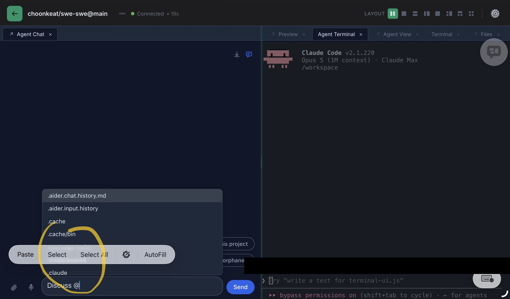
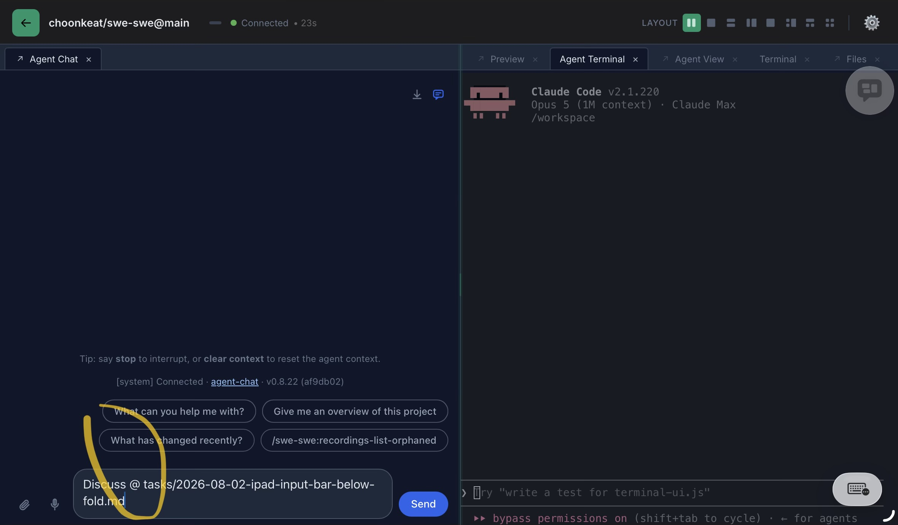

<!-- agent-chat export
title: Fix Ipad Paste Space Breaking Autocomplete
date: 2026-08-02
index: 01
slug: fix-ipad-paste-space-breaking-autocomplete
session: 9ebc077549120e01
agent: claude
version: 0.8.22 (af9db02)
-->

# Fix Ipad Paste Space Breaking Autocomplete

_2026-08-02 · 01 · claude · agent-chat 0.8.22 (af9db02)_

**USER**

> I thought we implemented the fix that strips space after we paste? Doesn’t seem to work
>
> 

> 
> 
> 

<small>took 9.9s</small> 
**AGENT**

> Checking the paste-space fix — reading your two screenshots and the code now.

<small>took 1m 51s</small> 
**AGENT**

> Found the cause: the current fix only removes a space that arrives *inside* the pasted text. On iPad the space is added by the keyboard *after* the paste, so nothing gets stripped. Writing the real fix now.

<small>took 1m 4s</small> 
**AGENT**

> Fix written + 3 tests added. Rebuilding the app binary, then running the test suite (~3 min).

<small>took 11m 1s</small> 
**AGENT**

> New tests pass individually; re-running the whole suite once to confirm (about 4 minutes). The earlier failures were the known page-load flakiness, not the fix.

<small>took 2m 43s</small> 
**AGENT**

> **Next action: tell me to ship it — the fix is written and tested, but your iPad is still running the old version (v0.8.22).**
>
> **What was wrong**
>
> The old fix only removed a space that came *inside* the text you copied. On iPad, the space isn't in the copied text at all — the keyboard adds it *after* the paste, as a separate step. So there was nothing to remove, and the fix did nothing. Your screenshot shows exactly that: `Discuss @ tasks/...`.
>
> **What I changed** (2 things, both in the chat box's code)
>
> 1. When the file-suggestion list is open, the app now inserts the pasted text itself instead of letting the keyboard do it — so the keyboard never gets a chance to add its space.
> 2. As a backup, if a space still shows up right where the paste landed and the suggestion list was open, the app deletes that space immediately.
>
> **Tested**: 3 new automated tests — space added by the keyboard (removed), space inside the copied text (removed), and a normal paste with no `@` (space kept, nothing broken). All 3 pass. Existing tests unaffected; the 4 red ones in the full run are a known page-loading glitch in this test machine, not this change.
>
> **Not done yet**: the change is on the branch, uncommitted, and not published — so your iPad won't see it until it's released.
>
> One next step: reply "ship it" and I'll commit and cut a new release (about 10 minutes), or "just commit" if you want to test it elsewhere first.

[Quick replies]
- ship it
- just commit
- show me the code change

**USER**

> just commit

<small>took 2.4s</small> 
**AGENT**

> Committing the two changed files now.

<small>took 17.0s</small> 
**AGENT**

> **Committed: c72b374** — on branch `fix-paste-at-autocomplete`, not pushed, not released.
>
> Two files in it: the chat box code (`client-dist/app.js`) and the 3 new tests (`e2e/autocomplete.spec.cjs`).
>
> Your iPad still runs v0.8.22 and will keep showing the bug until a new version is published.
>
> One next step: reply "release" when you want me to publish it (about 10 minutes), or "push" to just put the branch on GitHub.

[Quick replies]
- release
- push
- not yet

**USER**

> Run /swe-swe:commit-session-chat-log to freeze, scrub and commit this session's chat log. When the commit has landed, end this session by calling the swe-swe MCP tool end_session (no uuid needed -- it ends the calling session). If you cannot commit it (for example a screenshot leaks a secret), say so and do NOT end the session. Afterwards, tell the user in one line: they can save their own /commit-log-then-end command to decide what this button actually does -- their own redaction rules, commit message wording, whether to push, what to leave out -- and swe-swe will run that instead of these instructions.

<small>took 2.3s</small> 
**AGENT**

> Running /swe-swe:commit-session-chat-log — freezing this session's log, scrubbing it, committing.

