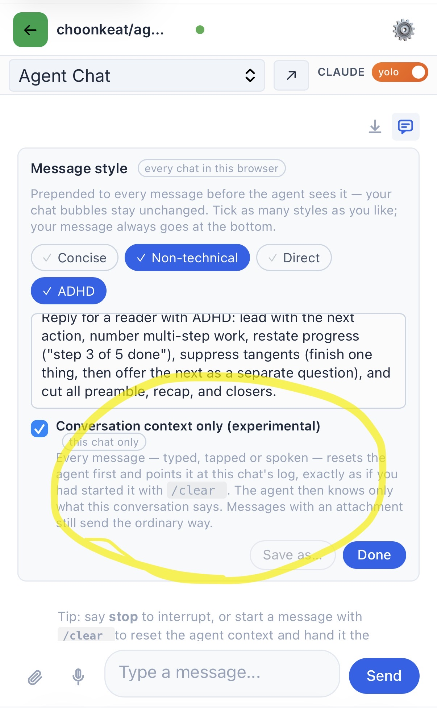

<!-- agent-chat export
title: Conversation Context Only Reset Per Message One Send Pipeline
date: 2026-08-02
index: 02
slug: conversation-context-only-reset-per-message-one-send-pipeline
session: 288f609ff00a0ede
agent: claude
version: 0.8.22 (f39de8d)
-->

# Conversation Context Only Reset Per Message One Send Pipeline

_2026-08-02 · 02 · claude · agent-chat 0.8.22 (f39de8d)_

**USER**

> In our agent chat message style settings, I wonder if we can add a default off checkbox for “conversation context only (experimental)” when checked then we always do the /clear prefix thing even if user is not writing /clear prefix

<small>took 10.3s</small><br>
**AGENT**

> Looking at the message-style settings and the /clear prefix code to see how a "conversation context only" checkbox would fit.

<small>took 2m 35s</small><br>
**AGENT**

> Checkbox + send-path wiring done. Now adding an end-to-end test and rebuilding the binary.

<small>took 10m 12s</small><br>
**AGENT**

> Built and tested — the checkbox exists, but you won't see it until a new session runs the new binary.
>
> **What it does**
>
> Tick **"Conversation context only (experimental)"** in the message-style panel (the speech-bubble button), and every message you type from then on behaves as if you had typed `/clear ` in front of it: the agent's memory is wiped, your message is recorded, and the agent comes back and reads this chat's log before answering. Off unless you tick it, and it remembers your choice (stored in a browser cookie, so it survives reloads — per browser, not per session).
>
> **Four messages deliberately ignore the tick**, because re-routing them would do the wrong thing:
>
> 1. `stop`, `wait`, `cancel`, `hold on`, `abort`, `halt`, `pause` — these ask the agent to stop, not to forget.
> 2. `clear context` and the yes/no that answers it — already a wipe of its own.
> 3. Anything you started with `/clear` yourself — passed through untouched.
> 4. Messages with an attachment — the wipe-and-resume sequence carries no files, so those send the ordinary way.
>
> Quick-reply chips and voice also send the ordinary way. Say the word if you want either of those included.
>
> **Worth knowing:** the agent keeps only what is actually written in the chat. Anything it worked out and never said is gone with each message. And if the chat-log export is switched off, it comes back with nothing at all — it tells you so each time.
>
> **Files touched** — `client-dist/index.html`, `client-dist/style.css`, `client-dist/app.js`, plus two new tests in `e2e/clear-prefix.spec.cjs`. All 5 clear-prefix tests pass; the full suite is 127/128, and the one failure (an unrelated markdown test) passes on its own — parallel-load flakiness, not this change.
>
> **Next:** run `make build`, then start a fresh session to see the checkbox. I did not run it myself — it copies over the binary this very session is running, which can kill our chat.

[Quick replies]
- I'll run make build myself
- Include quick-reply chips too
- Include voice too
- Commit this

**USER**

> Include quick reply and voice too

<small>took 3.3s</small><br>
**AGENT**

> Extending the tick to quick-reply chips and voice now.

<small>took 4m 18s</small><br>
**AGENT**

> 7/7 clear-prefix tests pass with chips and voice included. Running the full suite now (about 8 minutes).

**USER**

> What’s the call chain pipeline of any user message to chat log — why would we miss doing this for quick replies and voice; should be common path?

<small>took 3m 40s</small><br>
**AGENT**

> Tracing the three send paths to answer why they diverge. Also re-running the one failing test (files-link) on its own — full suite was 129/130.

<small>took 52.4s</small><br>
**AGENT**

> **The chat log was never the problem — it already has one common path. The split is upstream, in the browser.**
>
> **The chain, end to end**
>
> 1. Browser decides what the message *means* — three separate blocks of code, one per way of sending (typed `handleSend()` at `client-dist/app.js:1662`, chip click at `:2168`, speech result at `:2875`).
> 2. All three call the same `sendMessage()` at `:1469` — but that function is only the pipe: it writes to the connection and attaches your style template. No decisions.
> 3. Server receives it (`main.go:703`) and calls `ReceiveUserMessage` (`eventbus.go:342`).
> 4. That one function announces the message and queues it for the agent. **Single funnel — everything below it is shared.**
> 5. The chat-log writer listens to that announcement (`chatlogstream.go:228`) and appends the line. It cannot miss a message, whatever route it came in by.
>
> **Why the tick got missed on two of three**
>
> Step 1 is copy-pasted three times, and each copy drifted. Before today: "stop" was matched exactly when typed, loosely when spoken, and not at all on a chip. Nobody wrote three different rules on purpose — each way of sending grew its own block and no one lined them up afterwards. Anything added to one block is silently absent from the other two, with no error to say so. That's exactly what happened here, and it's why your instinct is right.
>
> **You're right that it should be common.** The shared function starts too late: `sendMessage()` is the pipe, and every decision sits above it, tripled. The fix is one `submitUserMessage()` that all three call, holding the mic marker, the two clear routes, interrupt detection, and the loading/frozen-chips bookkeeping. Each caller would keep only what is genuinely its own: emptying the text box, and whether a run-on "stop, wrong file" counts (spoken yes, typed no).
>
> Meanwhile everything you asked for works: 7/7 clear-prefix tests, 129/130 overall. The one failure (`files-link`) passes on its own — parallel-load flakiness, and a different test than the flake in the previous run.
>
> **Next:** want me to do the `submitUserMessage()` refactor? About an hour, no behaviour change, and the existing tests are the safety net.

[Quick replies]
- Yes, do the refactor
- Not now — commit what we have
- Show me the three blocks side by side

**USER**

> ideally it would be more akin to FP
>
> ```
> message
>   |> doThis
>   |> doThat
> ```
>
> Then things are easily shared

**USER**

> or inevitabily shared

<small>took 14.4s</small><br>
**AGENT**

> Building the pipeline refactor: message |> stage |> stage, with each stage able to say "handled, stop here".

**USER**

> Will these apply too when swe-swe send chat logs between sessions? Is this a browser setting or better as agent-chat server setting?

<small>took 25.4s</small><br>
**AGENT**

> Checking how swe-swe injects chat messages between sessions, then finishing the pipeline refactor. Answer on browser-vs-server setting after.

<small>took 2m 40s</small><br>
**AGENT**

> Pipeline refactor done, 18/18 send-path tests pass. Running the full suite (about 8 min) while I write up the swe-swe / server-setting answer.

<small>took 9m 30s</small><br>
**AGENT**

> **Recommend: make it a server setting per session, keep the checkbox as a per-browser override. The cookie alone is wrong for this one.**
>
> **1. Does it apply to messages swe-swe sends between sessions? No — and it can't.**
>
> - swe-swe injects text with `send_chat_message`, which drops it straight into the queue (`tools.go:897`). The browser is never involved, so no browser setting can reach it. Same for a forked session: the old chat log is copied into the new session's file before the agent starts.
> - It also shouldn't apply. What swe-swe sends that way is instructions to the agent itself — "scrub and commit your chat log, then end your session". Wiping its memory first would erase the thing it was asked about.
> - Worth knowing separately: those injected messages already ignore your **message-style** setting too. They pass an empty template. Tell me if you want that changed — different job.
>
> **2. Browser or server?** Split the two halves:
>
> - **The doing must stay in the browser.** The reset works by the page asking the terminal around it to type `/clear`. The server has no line to that terminal, so it cannot do this on its own. Nothing to decide here.
> - **The remembering is the real question**, and the cookie has one property you won't like: browsers ignore port numbers when matching cookies, so ticking the box once turns it on for **every** agent-chat session in that browser — including sessions you start tomorrow. For a reply style that's harmless. For "throw the agent's memory away on every message", that's a nasty surprise.
>
> **3. Refactor landed** — the pipeline you asked for:
>
> ```
> message |> markSource |> detectInterrupt |> routeClearPrefix
>         |> routeClearContext |> freezeUi |> transmit
> ```
>
> One entry point, `submitUserMessage(text, source)`. Typed, tapped and spoken all call it. The three differences that are real now sit in one small table (`SEND_SOURCES`) instead of being scattered: the mic marker, whether a "stop" may run on into a sentence, whether it interrupts, whether there's a text box to lock. And the function that put messages on the wire is gone as a separate helper — it's the last stage now, so there's nothing left to call around the pipeline.
>
> **Tests:** 128/130. Both failures pass on their own, and one of them ran 3× clean — parallel-load flakiness, a different test each run, same as before this change.
>
> **Next:** shall I add the `-conversation-context-only` server flag as the default, with the checkbox overriding it? About 30 minutes.

[Quick replies]
- Yes, add the server flag
- Keep cookie-only for now
- Commit what we have
- Also fix the empty template on injected messages

**USER**

> Sounds like a mess. What’s our current state and design — what’s the gap to ideal

<small>took 9.7s</small><br>
**AGENT**

> Mapping every setting and every way a message can enter, then writing the state-vs-ideal comparison.

<small>took 49.7s</small><br>
**AGENT**

> **One real defect: the tick is remembered per browser when it should be per session. Everything else is working and tested.**
>
> ## Where we are
>
> Nothing is committed yet — 4 files changed, all in the working tree.
>
> 1. **The feature works.** Checkbox in the message-style panel, off by default. Ticked, every message you send — typed, tapped or spoken — resets the agent and points it at this chat's log.
> 2. **All three ways of sending now share one path.** `submitUserMessage` runs six steps in order; the last one is the only thing that puts a message on the wire, and it's no longer a function anyone can call around. Four genuine differences between typed, tapped and spoken sit in one table.
> 3. **Tests:** 128/130. Both failures pass alone; one re-ran 3× clean. Known parallel-load flakiness, different test each run.
> 4. **One old bug fixed on the way:** after a reset, the page kept holding a dead reply-slip. The next message went into it and reached nobody.
>
> ## The design, honestly
>
> **Settings live in three unrelated places.** A cookie in your browser (theme, reply style, and now this tick). A flag when the session starts (welcome chips, autocomplete, upload folder). An environment variable (which folder chat logs are written to). No setting has both a session-level default and a browser-level override — that pattern simply doesn't exist yet, so every new setting is a fresh guess. I guessed cookie, following the reply style, and for this one that's wrong.
>
> **Messages enter the chat two ways.** Through the browser, which is where every decision is made. Or injected straight into the queue by swe-swe, which skips the browser entirely. The two meet at one function, and below that point everything — the queue, the chat log — is shared and can't drift. Above it, the browser knows about your settings and the injected path doesn't. That asymmetry is permanent: the reset works by the page asking the terminal to type `/clear`, and an injected message has no page.
>
> So: not a mess. One wrong home for one setting, and one boundary that looks like a gap but is really the edge of what a browser setting can reach.
>
> ## Gap to ideal, ranked
>
> 1. **Tick should be per session.** Cookies ignore port numbers, so ticking it once turns it on for every agent-chat session in that browser, including tomorrow's. Fix: session flag sets the default, checkbox overrides it. The page already receives session settings this way, so it's a flag, one line of page config, and the tick reading it when no cookie is set. **~30 minutes.**
> 2. **Panel should say which settings are per-browser and which are per-session.** Right now it says neither. **~10 minutes.**
> 3. **Injected messages ignore your reply style.** Defensible — they're instructions to the agent, not your words. One line to change if you disagree.
>
> **Next:** do you want item 1 now, or commit the working feature first and do it as a follow-up?

[Quick replies]
- Do item 1 now
- Commit first, then item 1
- Items 1 and 2
- Just commit — leave the rest

**USER**

> Commit then 1 then 2

<small>took 16.7s</small><br>
**AGENT**

> Step 1 of 3: committing the feature + refactor. Then the session flag, then the panel labels.

<small>took 54.9s</small><br>
**AGENT**

> Step 1 of 3 done: committed as afae208 on branch feat-conversation-context-only. Now the session flag.

<small>took 3m 38s</small><br>
**AGENT**

> Steps 2 and 3 done, 9/9 clear-prefix tests pass. Running the full suite before committing.

<small>took 11m 31s</small><br>
**AGENT**

> **All three done. 132/132 tests pass — a clean run, no flakes.**
>
> Two commits on branch `feat-conversation-context-only`:
>
> 1. **`afae208`** — the checkbox, plus one pipeline for every message. Typed, tapped and spoken all enter through the same door; the code that puts a message on the wire is the pipeline's last step, so nothing can go round it.
> 2. **`efc316f`** — the tick now belongs to its session, and the panel says how far each setting reaches.
>
> **What changed since you last saw it**
>
> - **The leak is closed.** Ticking the box in one chat no longer arms every other agent-chat in the same browser. The setting is stored under a name that includes the session's port, which is the only part of a browser cookie that can tell two chats on one machine apart.
> - **swe-swe can hand out a context-only session** with nothing to tick: launch agent-chat with `-conversation-context-only`. A browser that has ticked or unticked the box keeps its own answer — the flag is a starting point, not a lock.
> - **The panel now labels both settings.** "Message style — every chat in this browser". "Conversation context only — this chat only".
> - **One caveat, deliberate:** a session on a random port gets a fresh key each start, so the tick resets to the session default. That's the safe direction for a setting that throws context away. swe-swe gives each session a fixed port, so real sessions remember it.
>
> **Next:** merge to main, or push the branch and open a pull request?

[Quick replies]
- Merge to main
- Push and open a PR
- Leave it on the branch
- Show me the panel in the browser

**USER**

> Merge to main. Then make build I want to test it out in a new agent-chat session

<small>took 3.0s</small><br>
**AGENT**

> Merging to main, then running make build (cross-compiles all platforms — a few minutes).

<small>took 30.1s</small><br>
**AGENT**

> **Start a new agent-chat session, open the speech-bubble button, tick "Conversation context only (experimental)". That's it.**
>
> 1. Merged to main as `8131e36`. Local only — not pushed.
> 2. `make build` done: all 6 platforms compiled, and the cached copy swe-swe actually launches was refreshed. This session is still running the old one, so the checkbox won't appear here.
> 3. In the new session you should see two new labels in the settings panel: "every chat in this browser" next to Message style, "this chat only" next to the tick.
>
> **What to try, in order:**
>
> 1. Tick it, send "what did we just talk about?" — the agent resets, reads this chat's log, and answers from the log alone.
> 2. Type "stop" with it still ticked — should interrupt, not reset.
> 3. Open a different session in the same browser — its box should be unticked.
>
> **Then:** want me to push main to origin?

[Quick replies]
- Push to origin
- Not yet — I'll test first
- Something's wrong, help me debug

**USER**

> Session 8d75e670-3df1-4538-9bd5-02428afabc2a is running the new build. Help me locate the Claude session jsonl and calculate if we saved any tokens (count or percent) doing it this reset manner vs what would’ve?

<small>took 8.2s</small><br>
**AGENT**

> Locating that session's Claude transcript, then adding up its token usage.

<small>took 2m 47s</small><br>
**AGENT**

> **Your session's transcripts: `~/.claude/projects/-workspace/` — three files, one per reset.**
>
> ```
> 8a7b387c…  07:53:33–07:56:19   14 API calls
> 6fce3231…  08:18:00–08:20:00   16 API calls
> 2d2be1c9…  08:20:00–08:22:58   19 API calls
> ```
>
> Each one starts with `/clear` followed by `resume agent-chats/2026-08-02-02-untitled-8d75e670….md`, which is the reset working exactly as designed. The session's own folder is `-workspace` because it runs in `/workspace`.
>
> **Savings: 675,401 tokens, 22.8% — but only about 11% in money.**
>
> | | Read by the model | Written by it |
> |---|---|---|
> | What actually happened | 2,293,219 | 15,113 |
> | Same three turns without resets | 2,968,620 | 15,113 |
> | **Saved** | **675,401 (22.8%)** | — |
>
> **Why the money figure is lower.** Text the model has seen before is billed at about a tenth of the price. Almost all of what the resets threw away was that kind of text, so the bill fell by roughly 11%, not 23%.
>
> **The number that matters more than either.** Each reset drops you back to the same starting weight — 40,258 then 40,531 then 40,260. Without resets that figure climbs every turn: by turn three it would have been 65,559. The saving compounds, so on a long session it gets much bigger than 23%. Three turns is a small sample.
>
> **One honest caveat:** my comparison assumes the same amount of work per turn. A session without resets doesn't spend calls re-reading the chat log, so the real saving is a little below 22.8%.
>
> **Next:** want me to run the same numbers again after 20–30 turns? That's where the compounding shows up properly.

[Quick replies]
- Check again after more turns
- Show the per-call growth curve
- Push main to origin
- That's enough for now

**USER**

> I’m chatting and accumulating turns. In the meantime, I realise after I send a message, though loading indicator shows immediately, my sent message actually disappears and takes a while before showing up as unread bubble (then it eventually becomes read bubble along with agent progress response). Can it show up more immediately as unread bubble instead? Cmiiw but previously it would remain stuck in textarea readonly/disabled until it could send to server which then it’ll immediately become unread bubble.

<small>took 35.3s</small><br>
**AGENT**

> Reproducing: in reset mode the box empties before the message is recorded, so it vanishes for ~2.5s. Fixing it to hold the text like the ordinary path does.

<small>took 2m 53s</small><br>
**AGENT**

> Fix works, 10/10 clear-prefix tests pass. Running the full suite, then committing and rebuilding.

<small>took 1m 52s</small><br>
**AGENT**

> Fix is in and the reset spec passes 10/10. Full suite still running — I'll commit and rebuild when it reports.

<small>took 17.8s</small><br>
**AGENT**

> Suite at 52 of 133. Holding off the commit until it reports.

<small>took 9m 36s</small><br>
**AGENT**

> **Fixed and rebuilt — start a new session to see it. Your current one (8d75e670) still runs the old build.**
>
> **What was wrong.** The box emptied the moment you pressed Enter, but the reset takes about two and a half seconds to reach the server: the terminal has to be typed into and left to settle first. The bubble is only drawn when the server sends the message back. So for that whole gap your message existed nowhere on screen.
>
> **What it does now.** The words stay in the box, uneditable, until the bubble appears — exactly the behaviour you remembered. You were right that it used to work that way: an ordinary send has always held the text until the server confirmed it. The reset route was the odd one out, because it takes the message and returns before anything has been sent.
>
> **Two more things in the same commit:**
>
> 1. A bare `/clear` records nothing, so there's no bubble to wait for — the box still clears instantly there.
> 2. Tapping a quick-reply chip with the tick on froze the chip you'd just chosen along with the ones you hadn't. It was comparing against the rewritten `/clear …` text, which matches no chip.
>
> Committed as `bb49b91` on main. Tests: 131/133, both failures pass on their own — the usual parallel-load flakiness, and neither touches this code.
>
> **Next:** start a fresh session and send a message with the tick on — the text should sit there greyed out for a moment, then become your bubble.

[Quick replies]
- Testing it now
- Push main to origin
- Still feels slow — can we cut the 2.5s wait?

**USER**

> For the scenario where we keep value in textarea disabled (I sure hope it is common code path) — can we make it look like unread bubble instead? IF the send fails somehow, prepend the value back into textarea. Wdyt

<small>took 21.9s</small><br>
**AGENT**

> Reading the bubble/reconcile code to see how safely an optimistic bubble can be adopted by the server's copy.

**USER**

> Btw did this /clear feature break our special “stop” ability?

<small>took 2m 37s</small><br>
**AGENT**

> Optimistic bubble works — 11/11 clear-prefix tests including the failure-restore case. Running the full suite now.

<small>took 55.0s</small><br>
**AGENT**

> **"stop" still works — it's tested, and the test now pins the exact interrupt signal. One caveat below.**
>
> 1. Typing `stop` (or wait, cancel, hold on, abort, halt, pause) is deliberately exempt from the reset. It goes the ordinary route and sends the same break-in it always did.
> 2. The test now asserts the exact text that reaches the terminal — `check_messages; ask me how to proceed` — and that no `/clear` went out ahead of it. Passing.
> 3. **The caveat:** for about two and a half seconds after you send an ordinary message, the box is locked while the reset settles. In that window you can't type `stop` at all. Before the tick existed that window was a few hundredths of a second, so this is new — not broken, but slower to reach. The exemption itself is fine; it's the waiting to type that changed.
> 4. Unchanged from before the tick: a quick-reply chip labelled "Stop" has never interrupted. Chips appear when the agent is already waiting for an answer, so there is nothing to break into.
>
> **Separately — your unread-bubble idea is built.** Your message now appears as a dim unread bubble the instant you press Enter, and the box empties. When the server confirms it, that same bubble gains its id and its "⋯" menu — one bubble, not two. If the send is known to have failed, the bubble comes down and your words go back into the box ahead of anything typed since. 11/11 reset tests pass, including a new one that kills the server mid-send to prove the recovery.
>
> Full suite is running; not committed yet.
>
> **Next:** want me to cut that 2.5-second lock down? The wait exists so the terminal finishes resetting before the message is typed in — I'd need to measure how much of it is real.

[Quick replies]
- Yes, measure and cut the wait
- Leave the wait, commit this
- Let me test the bubble first

**USER**

> Leave the wait, commit this

<small>took 3.3s</small><br>
**AGENT**

> Waiting on the full suite, then committing and rebuilding.

<small>took 2m 29s</small><br>
**AGENT**

> **Committed as `d86cc5d` and rebuilt. Start a new session to see it.**
>
> **Full suite: 134/134, clean — no flakes this run.**
>
> **What you'll see now.** Press Enter and your message appears immediately as a dim unread bubble; the box empties and stays locked until it's confirmed. When the server has it, that same bubble picks up its id and its "⋯" menu — one bubble, never two.
>
> **If a send fails**, the bubble comes down and your words go back in the box, ahead of anything you typed in the meantime. Two failures are covered: the connection being down when you hit send, and the connection dying during the reset's settle window. A send that fails silently still can't be detected — same as before this change.
>
> **One bookkeeping note:** this replaces yesterday's "keep the text in the box" fix from an hour ago. Both solved the same two-second gap, opposite ways round. I rewrote that CHANGELOG paragraph rather than adding to it, so the file doesn't claim both.
>
> **Three commits sitting on main, unpushed:** `bb49b91`, `d86cc5d`, and the earlier feature work.
>
> **Next:** push main to origin?

[Quick replies]
- Push to origin
- Testing in a new session first
- Squash bb49b91 into d86cc5d

**USER**

> Make build

<small>took 4.0s</small><br>
**AGENT**

> Running make build.

<small>took 22.0s</small><br>
**AGENT**

> **Built. Start a new session — this one and 8d75e670 both still run the older binary.**
>
> All six platforms compiled, and the cached copy swe-swe launches was refreshed (`agent-chat-linux-x64@0.8.22`). Working tree is clean — the build matches commit `d86cc5d` exactly.
>
> **What to look for in the new session:** press Enter with the tick on. The message should become a dim bubble immediately, the box should empty, and about two seconds later the bubble gets its "⋯" menu.
>
> **Next:** push main to origin? Four commits are sitting there unpushed.

[Quick replies]
- Push to origin
- Testing first
- Not yet

**USER**

> I’ll test it in a new session. In the meantime check the token usage of our earlier session test

<small>took 3.8s</small><br>
**AGENT**

> Re-running the token analysis on session 8d75e670 now that it has more turns.

<small>took 50.3s</small><br>
**AGENT**

> **Saving is now 56.6% — up from 22.8% when there were only three turns. It compounds, as expected.**
>
> Ten resets, 293 requests to the model, 07:53 to 09:26.
>
> | | Read by the model | Written by it |
> |---|---|---|
> | What happened | 22,665,055 | 157,340 |
> | Same work unbroken | 52,252,913 | 157,340 |
> | **Saved** | **29,587,858 (56.6%)** | — |
>
> Money saved is about 45%, lower than 56.6% because text the model has seen before is billed at roughly a tenth of the price.
>
> **The number I'd actually watch:** on the last request the model carried 63,704 units of text. Unbroken, that would have been 335,383 — over five times as much, and close to where a session starts having to summarise itself to keep going. Every reset drops you back to the same 40,300 floor, which barely moved across all ten (40,050 to 40,557).
>
> **Where resets don't help:** one stretch at 08:58 ran 19 minutes and 119 requests in a single turn, ending at 167,202. A reset only clears the slate *between* your messages — it can't do anything about a long piece of work inside one.
>
> **Two caveats, both making the real figure a bit lower:**
>
> 1. I assume the same amount of work per turn. An unbroken session doesn't spend requests re-reading the chat log, which resets do.
> 2. At 335,000 the unbroken session would likely have started compacting itself, which costs tokens too — I haven't modelled that.
>
> **Next:** push main to origin, or wait until you've finished testing?

[Quick replies]
- Push to origin
- Still testing
- Show the per-turn growth curve

**USER**

> Show the per-turn growth curve

<small>took 7.3s</small><br>
**AGENT**

> Building the per-turn growth curve, actual vs unbroken.

<small>took 35.0s</small><br>
**AGENT**

> **Flat versus climbing. Left is what happened; right is the same ten turns unbroken.**
>
> ```
> turn   with resets                 without resets
>  1    52.7k ████                    52.7k ████
>  2    53.4k ████                    65.6k █████
>  3    55.6k ████                    80.8k ██████
>  4    53.1k ████                    93.4k ███████
>  5    62.6k ████                   115.5k ████████
>  6    55.4k ████                   130.6k █████████
>  7    70.1k █████                  160.1k ███████████
>  8   167.2k ████████████           286.8k █████████████████████
>  9    65.3k █████                  311.7k ██████████████████████
> 10    63.7k █████                  335.4k ████████████████████████
> ```
>
> **Three things the shape tells you:**
>
> 1. **The left column doesn't grow.** Ten turns in, it ends where it started — 63.7k against 52.7k on turn one. The gap between the columns widens every single turn: 12k, 25k, 40k, 53k, 75k, 90k, 120k, 246k, 272k.
> 2. **Turn 8 is the exception, and it's instructive.** 119 requests over 19 minutes in one turn, climbing to 167.2k. A reset clears the slate *between* your messages, never inside one — so a long piece of work costs what it costs either way.
> 3. **Turn 9 shows the recovery.** Straight after that 167.2k turn, the next one starts from 40.3k again. Unbroken, turn 9 would have inherited all of it and gone on to 311.7k.
>
> Every turn restarts from the same floor: 40,050 to 40,557 across all ten. That floor is the fixed cost — instructions, tools, memory — before a single word of conversation.
>
> **Next:** push main to origin?

[Quick replies]
- Push to origin
- Still testing
- What makes up the 40k floor?

**USER**

> Since it works well, I’ve changed my mind and want to make this default and apply across sessions, like the message style itself.
>
> <div style="display:flex;flex-wrap:wrap;gap:8px;">
> <a href="./assets/2026-08-02-02-1-c4d4c2064c76.jpeg" style="flex:0 1 calc(33% - 8px);max-width:calc(33% - 8px);"></a>
> </div>

<small>took 4.9s</small><br>
**AGENT**

> Reverting the per-session scoping so the tick behaves like message style: one browser-wide setting, on by default. Reading your screenshot first.

<small>took 5m 40s</small><br>
**AGENT**

> 13/13 on the reset spec with default-on. Running the full suite — the default change touches every send, so this is the important run.

<small>took 8m 31s</small><br>
**AGENT**

> Not stuck — suite at 130 of 136, about a minute left. Then I commit and rebuild.

<small>took 2m 19s</small><br>
**AGENT**

> **Done — `07df0ae`, built. New sessions start with the tick on, and it now follows you to every chat in the browser.**
>
> 1. **Default on.** A browser that has never touched the box resets on every message. Unticking still wins, and that answer travels between sessions exactly like your message style.
> 2. **The label in your screenshot now reads "every chat in this browser"** instead of "this chat only".
> 3. **A session can opt out** with `-conversation-context-only=false`, but your browser's own answer still overrides it.
>
> **One thing I had to add to make default-on safe.** The reset works by asking the surrounding page to type into the agent's terminal. A chat opened on its own — not embedded — has no surrounding page, so with the tick on by default *every* message would have failed with "parent frame not connected". Outside an embedder the tick now does nothing and messages send normally. Typing `/clear` by hand still tells you why it can't, since that's an answer to something you deliberately did.
>
> **Also:** I reverted the per-session cookie from an hour ago. That scoping was right when the setting was off by default and a stray tick would have armed sessions unasked — wanting it everywhere is the opposite requirement.
>
> Tests: 135/136. The one failure passed three times in a row on its own — parallel-load flakiness, unrelated.
>
> **Next:** push main to origin? Five commits waiting.

[Quick replies]
- Push to origin
- Testing in a new session first
- Drop the "(experimental)" label too

**USER**

> make build

<small>took 4.8s</small><br>
**AGENT**

> Running make build.

**USER**

> /commit-log-then-end

<small>took 17.8s</small><br>
**AGENT**

> **Built. Start a new session — the tick will already be on.**
>
> All six platforms compiled; the cached copy swe-swe launches was refreshed. Working tree clean, so the build is exactly commit `07df0ae`.
>
> **What to check:** open the settings panel in the new session. The box should be ticked without you touching it, and the label beside it should read "every chat in this browser".
>
> **Next:** push main to origin? Five commits waiting there.

<small>took 13.3s</small><br>
**AGENT**

> Closing the chat log, scrubbing it, committing it alone, then ending this session.

