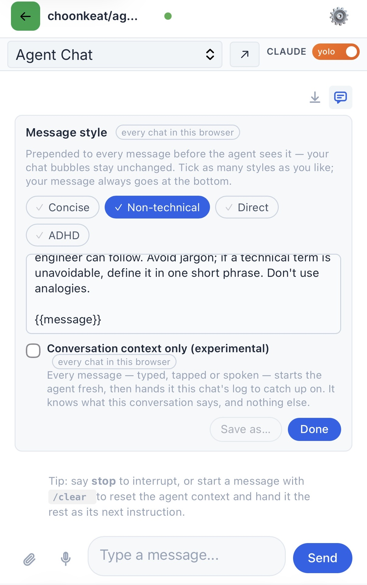

<!-- agent-chat export
title: Read Receipts Flip On Check Messages Drawing Replies Join The Normal Path
date: 2026-08-02
index: 05
slug: read-receipts-flip-on-check-messages-drawing-replies-join-the-normal-path
session: 9bea072a3d73b1dd
agent: claude
version: 0.9.0 (82ce495)
-->

# Read Receipts Flip On Check Messages Drawing Replies Join The Normal Path

_2026-08-02 · 05 · claude · agent-chat 0.9.0 (82ce495)_

**USER**

> In normal vs /clear mode, how does a user message reply to a blocking send_message get into unread mode and what makes it flip to read mode?
>
> Iirc, when agent is busy and user sends message, it goes into chat log as unread thus reflected as unread in ui. When agent calls check message, that flips the message to read which updates the ui to read regardless of whether agent responds <— this part is very good ux and I’d like to keep it for ALL forms of user message

<small>took 9.4s</small><br>
**AGENT**

> Reading the read/unread code paths for normal vs /clear mode.

<small>took 1m 37s</small><br>
**AGENT**

> **Short answer: a message is unread the moment it exists, and only proof the agent is alive flips it to read. Both modes use the same rule — they differ only in who draws the bubble and when.**
>
> ### Normal mode (agent parked in a blocking send_message)
>
> 1. You hit send. The server records the message and tells every open tab about it right away. The bubble is drawn dim, below the spinner, with the "⋯" menu (Delete / Send as interrupting). It is born unread — nothing has to happen to make it unread.
> 2. The parked send_message picks it up and hands it to the agent. The server announces "handed over". The bubble stays dim. The only change: Delete disappears, because the message has left the waiting line and there is nothing left to pull back.
> 3. It flips to read when the agent makes its **next** call to any agent-chat tool — send_progress, send_message, check_messages, draw. That next call is the proof the message reached a living agent. The bubble un-dims, moves above the spinner, loses the "⋯".
>
> Why not flip at step 2: if you press Escape in the agent's terminal, the parked call is dead but still pulls messages out of the waiting line. Flipping there would show "read" for something nobody read (`eventbus.go:400`, `client-dist/app.js:1447`).
>
> ### /clear mode (every message wipes the agent's memory first)
>
> 1. The browser draws the bubble itself, dim and unread, before the server has it — the reset takes about two seconds of typing into the agent's terminal. No "⋯" yet, because unsending needs an id only the server can give.
> 2. The browser wipes the agent. The server cancels the parked send_message so the now-dead agent cannot swallow your message (`main.go:742`).
> 3. The server records the message and echoes it back; the bubble you already see takes over that copy, gains its id and its "⋯". Still dim.
> 4. The fresh agent is sent to check_messages, pulls the message, "handed over" fires, Delete drops off. Still dim.
> 5. Flips to read on that fresh agent's next agent-chat call — normally the send_progress it is instructed to send first.
>
> ### One correction to your recollection
>
> check_messages does not flip the message it just pulled. It flips whatever was pulled **before** it. The message it pulls flips on the call after that. In practice this is invisible, because the agent is told to send a progress line immediately — that line is what marks your bubble read.
>
> Separately: two kinds of user message skip unread entirely and show as read the instant they are sent — replies to a permission prompt, and taps on a drawing's quick-reply buttons. The server itself consumes those, so no agent ever confirms them. Want me to check whether those two should get the same dim-then-flip treatment?

[Quick replies]
- Yes, check those two paths
- No, leave them as-is
- Show me the code for the read flip

**USER**

> Question: when browser sends /clear to agent terminal, it uses websocket or relies on the agent terminal frame being open?
>
> > taps on a drawing's quick-reply buttons
>
> Ideally this should go exactly the same path as a user typed message. Discuss
>
> > check_messages does not flip the message it just pulled. It flips whatever was pulled before it. The message it pulls flips on the call after that.
>
> This is the delay I’m trying to fix. Imo it should flip upon check_messages. Discuss

<small>took 12.9s</small><br>
**AGENT**

> Checking the /clear delivery path and the check_messages drain code.

<small>took 1m 2s</small><br>
**AGENT**

> **Recommendation up front: flip on check_messages (about 30 minutes), then put the drawing replies back on the normal path (about an hour). Both are safe. Details below.**
>
> ### 1. How /clear reaches the agent terminal
>
> It uses the surrounding page, not the chat's own connection. Two channels, both needed:
>
> 1. The chat asks the page around it to interrupt the agent. The terminal pane types Escape, then `/clear`, then Enter into the agent's terminal.
> 2. Only then does the chat use its own connection to record your instruction so the fresh agent can collect it.
>
> So it depends on the terminal pane being present and connected in the same page. Open the chat on its own and it says "Cannot clear context: parent frame not connected." The two-second wait between the two steps is the terminal being given time to settle.
>
> ### 2. Drawing quick replies — you're right, and it's worse than just the chips
>
> The chip is not the only thing affected. After the agent draws something with reply buttons, the **next message of any kind** — typed, spoken, or tapped — goes out as an "answer to the drawing" instead of a normal message. That path loses four things:
>
> 1. It never enters the waiting line, so it is marked read the instant it is sent — no dim bubble at all.
> 2. Attachments are dropped. That send carries text only.
> 3. Your message-style setting is dropped, so the agent gets raw text.
> 4. There is no recovery copy. If the drawing call died, your reply dies with it — no redelivery.
>
> Fix: make the drawing wait on the same waiting line as send_message, and delete the separate answer channel entirely. Then every user message has exactly one route, and dim-then-flip works there for free. About an hour including tests.
>
> Ordinary quick replies (the ones under a normal agent message) are already fine — tapping one just fills the box and sends normally.
>
> ### 3. Flipping on check_messages itself — agreed, and the objection doesn't apply here
>
> The delayed flip exists for one specific danger: send_message parks for minutes waiting for you, and if you press Escape in the terminal, that parked call is dead but still pulls your message out of the line. Marking it read there would be a lie.
>
> check_messages cannot be in that state. It pulls and returns immediately — the agent is provably alive at the moment it calls, because it just called. There is no parking window to be killed during.
>
> What you would give up: if the agent crashes in the split second between the server answering and the agent reading, the bubble shows read when nothing read it. The existing recovery already covers this — that batch is re-handed to the agent on its next check_messages, so it still gets answered.
>
> My proposal: flip immediately for check_messages; keep the delayed flip only for messages pulled by a parked send_message. That removes the lag you notice most — after a context reset, where the bubble sits dim while the fresh agent starts up.
>
> **Next step: say go and I'll do item 3 first (about 30 minutes), then item 2.**

[Quick replies]
- Go — item 3 first
- Do both, 3 then 2
- Do item 2 first instead
- Wait — more questions

**USER**

> Do both, 3 then 2

**USER**

> Tdd

<small>took 5.4s</small><br>
**AGENT**

> Starting item 3: making check_messages mark its own batch read. Reading the drain code and its tests now.

<small>took 1m 45s</small><br>
**AGENT**

> Step 1 of 2 done (tests green): check_messages and barge-in now mark read on the spot. Starting item 2 — putting drawing replies on the normal message path, tests first.

<small>took 4m 15s</small><br>
**AGENT**

> Step 2 of 2: draw replies now take the normal message path; the private ack channel is gone. Unit tests pass. Updating the 3 E2E specs that assumed the old two-call read flip.

<small>took 13m 53s</small><br>
**AGENT**

> **Both done, tests green. To see it live: run `make build` (about 3 minutes), then restart this session — the running server is the old binary.**
>
> ### What changed
>
> 1. **A bubble goes read the instant `check_messages` drains it.** Same for a barge-in riding back on a returning `send_progress`. One new bus method (`DrainMessagesProven`, `eventbus.go:463`) marks the batch read as it hands it over.
> 2. **The parked-`send_message` case is untouched.** That drain can still come from a dead waiter, so it stays dim until the agent's next call — the escape hatch you wanted kept.
> 3. **Replies to a drawing are now ordinary messages.** `draw` parks on the message queue like `send_message`, through one shared `waitForUserReply` (`tools.go:182`). Attachments, message-style template, unsend, redelivery and dim-then-flip all now apply to them.
> 4. **The private answer channel is deleted** — `CreateAck`/`ResolveAck`, `pendingAckId`, the `ack_id` field, and the `ack` websocket message. There is now exactly one route from the box to the agent.
>
> ### Tests
>
> - 9 new Go tests (immediate-read drains, barge-in receipt, and the shared reply path incl. template + voice + cancellation). `make unit-test` passes.
> - E2E: the receipt spec was rewritten — one test proves the single-call flip, a new one parks a real blocking `send_message` to prove the delayed flip still works there. `read-receipt-states`, `agent-unsend`, `agent-busy-pending`: 9 passed.
> - Full suite: 136 passed, 2 failed — `markdown-images` and `welcome-replies`, both unrelated to this work and both passing when re-run on their own (the known port-forwarder flakiness).
>
> Files: `eventbus.go`, `tools.go`, `main.go`, `client-dist/app.js`, 3 E2E specs, 3 Go test files, `CHANGELOG.md` (Unreleased section).
>
> Separately: `SPEC3.md` and `tdspec/src/*.elm` still document the answer channel I deleted. Both were already behind reality (neither mentions read receipts, unsend, or redelivery). Want me to bring them up to date?
>
> **Next step: `make build`, then restart the session and tap a quick reply — the bubble should flip the moment the agent picks it up.**

[Quick replies]
- Run make build now
- Commit this first
- Yes — update SPEC3.md and tdspec
- Show me the diff

**USER**

> In our message style settings panel, rephrase the checkbox helper text
>
> ```
> Every message clears the agent context first and points it at this chat's log. The agent then knows only what this conversation says.
> ```
>
> Then git commit and make build

<small>took 3.5s</small><br>
**AGENT**

> Rewriting the checkbox helper text, then committing and running make build.

<small>took 1m 14s</small><br>
**AGENT**

> **Committed and built. Start a NEW session to see it — this session is still running the old binary.**
>
> 1. Helper text now reads: "Every message — typed, tapped or spoken — starts the agent fresh, then hands it this chat's log to catch up on. It knows what this conversation says, and nothing else." Dropped the `/clear` reference, since the checkbox is the whole point of not having to type it.
> 2. Commit `3c390c6` on main — 13 files, both read-receipt fixes plus the wording.
> 3. `make build` finished: all 6 platforms rebuilt, and the cached binary this machine launches sessions from was refreshed.
>
> The refresh script says it plainly: a running session keeps the binary it started with. Open a new session, tap a quick reply, and the bubble should un-dim the moment the agent picks it up.
>
> **Next step: open a new session and send one message to confirm the flip is instant.**

[Quick replies]
- Will do
- Update SPEC3.md and tdspec next
- Push to origin
- Something looks wrong

**USER**

> Helper text didn’t change in my new chat
>
> <div style="display:flex;flex-wrap:wrap;gap:8px;">
> <a href="./assets/2026-08-02-05-1-78ce05efd43a.jpeg" style="flex:0 1 calc(33% - 8px);max-width:calc(33% - 8px);"></a>
> </div>

<small>took 2.4s</small><br>
**AGENT**

> Checking the screenshot and which binary the new chat is serving.

<small>took 21.1s</small><br>
**AGENT**

> **It did change — your screenshot is showing the new wording.**
>
> What you're looking at: "Every message — typed, tapped or spoken — starts the agent fresh, then hands it this chat's log to catch up on. It knows what this conversation says, and nothing else."
>
> What it said before: "…resets the agent first and points it at this chat's log, exactly as if you had started it with `/clear `. The agent then knows only what this conversation says."
>
> The change was small: "resets" became "starts fresh", and the `/clear` mention is gone. If it read as unchanged, the rephrase was too timid.
>
> Two ways to go, pick one:
>
> 1. Use the exact sentence you pasted, word for word.
> 2. Cut it much shorter — "The agent forgets everything except this conversation. Every message re-reads the chat from the top."
>
> **Next step: say 1 or 2, or paste the wording you want and I'll drop it in and rebuild.**

[Quick replies]
- 2 — go shorter
- 1 — use my sentence
- Leave it as is

**USER**

> 1 — use my sentence

<small>took 2.5s</small><br>
**AGENT**

> Swapping in your exact sentence, then committing and rebuilding.

<small>took 22.8s</small><br>
**AGENT**

> **Open a new chat — the checkbox now reads exactly your sentence.**
>
> "Every message clears the agent context first and points it at this chat's log. The agent then knows only what this conversation says."
>
> 1. Committed as `9a2df86` on main.
> 2. `make build` done, cached binary refreshed — existing chats keep the old text until they restart.
>
> **Next step: open a new chat, hit the gear, and confirm the wording.**

[Quick replies]
- Confirmed
- Still showing the old text
- Update SPEC3.md and tdspec next
- Push to origin

**USER**

> /swe-swe:commit-session-chat-log and /npm-login-and-publish

<small>took 4.5s</small><br>
**AGENT**

> Running the chat-log commit skill first, then the npm publish flow.

