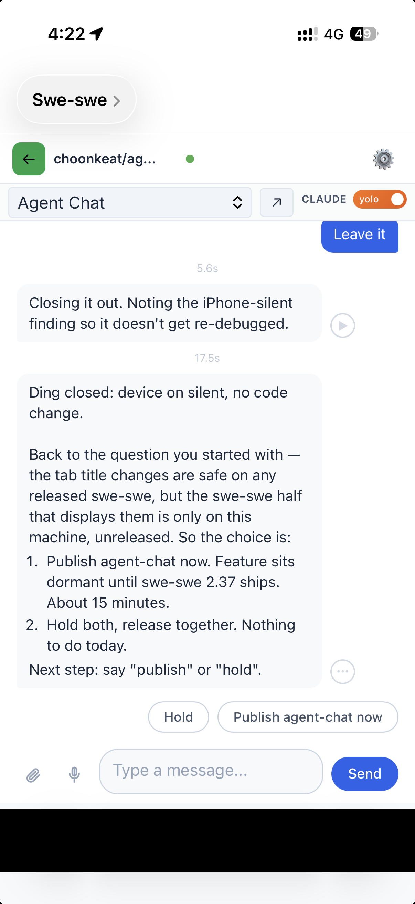

<!-- agent-chat export
title: Ding Missed On Iphone Time The Run Not The Tab
date: 2026-08-15
index: 01
slug: ding-missed-on-iphone-time-the-run-not-the-tab
session: 6dc18017dea3db8d
agent: claude
version: 0.10.1 (a11a0d8)
-->

# Ding Missed On Iphone Time The Run Not The Tab

_2026-08-15 · 01 · claude · agent-chat 0.10.1 (a11a0d8)_

**USER**

> Can our recent changes work with old swe-swe?

<small>took 10.3s</small> 
**AGENT**

> Checking the last two commits for anything that needs a newer swe-swe.

<small>took 1m 15s</small> 
**AGENT**

> Yes — safe to ship agent-chat on its own. Nothing breaks on any released swe-swe.
>
> What I checked (3 of 3 done):
>
> 1. The two new agent-chat commits only *send* a status note to the page around them ("agent is working / just finished"). They never wait for an answer.
> 2. Every released swe-swe (2.36.0 and older) has no code listening for that note, so it quietly ignores it. No error, no crash, no change in behaviour.
> 3. The swe-swe half that listens is only on this machine — not pushed, not released.
>
> The one consequence: on an old swe-swe the browser tab still shows just the session name. No hourglass with the running time, no dot for "finished while you were away". The feature is invisible, not broken. Opening agent-chat as its own page still shows the timer and dot, because it owns that tab itself.
>
> Reverse direction is also safe: a new swe-swe with an old agent-chat simply shows the plain session name.
>
> Next step: decide whether to publish agent-chat now (feature dormant until swe-swe 2.37 ships) or hold both and release them together.

[Quick replies]
- Publish agent-chat now
- Hold and release together
- Show me the swe-swe side first

**USER**

> I didn’t hear a beeping sound just now though it took 10s + 1m15s

<small>took 3.6s</small> 
**AGENT**

> Checking the ding logic — when it fires, and whether the running server has the current code.

<small>took 1m 26s</small> 
**AGENT**

> Do this: open Settings in the chat, find "Ding when a long reply lands", switch it off and on again. Switching it on plays the two-note tone right then.
>
> What that tells you:
>
> 1. You hear it — the setting was off (it's remembered per browser, so it can be off in this browser without you touching it recently). Now it's on and the next long reply will sound.
> 2. You hear nothing — the browser is refusing to play sound in this page. Click once inside the chat area, then repeat the toggle. Browsers only allow sound after you've clicked or typed inside that specific page.
>
> The code side is fine: the server is serving the current version, the run has to last 20 seconds before it dings, and yours was about 85 seconds. So the sound was either switched off or blocked, not skipped.
>
> Next step: do the toggle test and tell me which of the two happened.

[Quick replies]
- I heard it
- Still no sound
- It was already on

**USER**

> Debug? This is my iPhone. I didn’t hear a sound for your last message too, 10.3s+1m15s

<small>took 25.9s</small> 
**AGENT**

> iPhone changes the answer — checking what the page can and can't do on iOS Safari.

<small>took 13.5s</small> 
**AGENT**

> Two checks on the phone, 30 seconds total:
>
> 1. Check the ring/silent switch on the side of the phone (or the Action Button). When the phone is on silent, Safari plays no sound from a web page at all. This alone would explain both missed dings.
> 2. With the ringer on and the chat on screen: open Settings in the chat, switch "Ding when a long reply lands" off and on. Switching it on plays the tone immediately. If you hear it, sound works.
>
> Then the part you should know before we spend more time on it: on iPhone, Safari stops a web page from making sound as soon as you leave that tab or lock the phone — which is exactly the moment the ding exists for. So even with everything set correctly, a ding while you're in another app is something Safari does not allow. The reliable iPhone signals are the mark in the tab title (already built) or adding the chat to your Home Screen so it can send real notifications (a bigger piece of work, roughly half a day).
>
> There's no console to read on the phone, so if the two checks don't settle it, I can put the answer on screen: a line in Settings showing whether sound is currently allowed, and a note in the chat each time a ding was attempted. About 20 minutes.
>
> Next step: do check 1 and 2, and tell me whether you heard the tone.

[Quick replies]
- Heard the tone
- No tone, ringer was on
- Phone was on silent
- Add the on-screen diagnostic

**USER**

> Phone was on silent

<small>took 9.6s</small> 
**AGENT**

> That settles it — silent mode mutes web page sound. Writing up what still works.

<small>took 6.3s</small> 
**AGENT**

> Nothing to fix — silent mode mutes every sound a web page makes on iPhone, including the ding. The code did its job; the phone dropped it.
>
> What that leaves you, if you want a signal while the phone stays on silent:
>
> 1. Nothing, keep as is. Ring on = ding works; ring off = silence. Zero work.
> 2. The tab title mark. Already built: an hourglass with the running time while the agent works, a dot when it finished while you were elsewhere. Silent, needs a glance at the tab. Free.
> 3. Add the chat to your Home Screen so it can send a real notification. It vibrates on silent, shows on the lock screen, and works with the app closed. Roughly half a day, and it only works after you add it to the Home Screen yourself.
>
> Next step: pick one, or say "leave it" and I'll close this out.

[Quick replies]
- Leave it
- Build the Home Screen notification
- Tell me more about option 3

**USER**

> Leave it

<small>took 5.6s</small> 
**AGENT**

> Closing it out. Noting the iPhone-silent finding so it doesn't get re-debugged.

<small>took 17.5s</small> 
**AGENT**

> Ding closed: device on silent, no code change.
>
> Back to the question you started with — the tab title changes are safe on any released swe-swe, but the swe-swe half that displays them is only on this machine, unreleased. So the choice is:
>
> 1. Publish agent-chat now. Feature sits dormant until swe-swe 2.37 ships. About 15 minutes.
> 2. Hold both, release together. Nothing to do today.
>
> Next step: say "publish" or "hold".

[Quick replies]
- Hold
- Publish agent-chat now
- Something else

**USER**

> Am I supposed to hear something for this duration?
>
> 

> 
> 

<small>took 2.2s</small> 
**AGENT**

> Looking at your screenshot to read the elapsed time.

<small>took 16.0s</small> 
**AGENT**

> Yes — just barely. 5.6s + 17.5s = 23.1 seconds total, and the ding needs 20. It didn't play because the phone is on silent.
>
> Two things worth knowing:
>
> 1. The count runs from when you hit Send to when the reply lands, across the whole turn. The 5.6s and 17.5s on screen are the gaps between bubbles; they add up.
> 2. Anything under 20 seconds is deliberately silent, so short replies don't nag.
>
> Next step: still open from before — publish agent-chat now, or hold it until the swe-swe half ships?

[Quick replies]
- Hold
- Publish agent-chat now
- Change the 20s threshold

**USER**

> Try sleep 30s. My phone is no longer silent.

<small>took 10.7s</small> 
**AGENT**

> Waiting ~35 seconds, then replying — that clears the 20s bar.

<small>took 39.9s</small> 
**AGENT**

> Waited 35 seconds. This reply should have dinged — two quick notes, high then higher.
>
> Did you hear it?

[Quick replies]
- Heard it
- Still nothing
- Heard it but very quiet

**USER**

> Still nothing

**USER**

> Maybe it doesn’t work on iPhone

<small>took 3.9s</small> 
**AGENT**

> Checking how the chat pane is embedded — Safari blocks sound in an embedded pane unless it's explicitly allowed.

<small>took 39.3s</small> 
**AGENT**

> Two things to try, 20 seconds, in this order:
>
> 1. Open Settings in the chat (gear icon, top right), switch "Ding when a long reply lands" off then on. That plays the tone the instant you tap it — a direct tap is the one case iPhone always allows. Hear it or not?
> 2. If not: turn the ringer volume up. Press the volume-up button while nothing is playing, or go to iPhone Settings → Sounds & Haptics and drag the top slider up. Sound made by a web page this way follows the ringer volume, not the media volume — so the ring switch being off is only half the story. Then repeat step 1.
>
> The embedding is already set up to permit sound, so that's not the blocker (checked).
>
> If step 1 is still silent with the ringer up, it's a real iPhone limit in how the tone is produced, and I'd fix it by switching to a proper sound file instead of a generated tone — about an hour.
>
> Next step: do step 1 and tell me yes or no.

[Quick replies]
- Tone played
- No tone, ringer is up
- Fix it with a sound file

**USER**

> Trying on a different device. I heard a sound from this device before, on older swe-swe and agent-chat

<small>took 11.6s</small> 
**AGENT**

> That changes it — a regression, not an iPhone limit. Diffing the sound code against the last released version.

<small>took 1m 3s</small> 
**AGENT**

> Checked: no sound code has changed since the version you heard it on. The ding shipped in 0.10.0 along with its fix, and the only things added since are the tab-title changes, which run after the sound decision is made. So the recent work did not break the sound itself.
>
> That leaves one assumption I have never actually verified on your iPhone: that a sound from this page can be heard on that phone at all, right now. One tap answers it — in the chat's Settings, switch the ding on; it plays the tone immediately.
>
> The other suspect, if that tone does play: the sound is deliberately skipped when a reply arrives as replayed history — and that is what happens on a phone whose screen was off. iPhone freezes a background page, the connection drops, and when you pick the phone up the reply arrives as history rather than as a live event. On a phone that is the normal case, not the rare one.
>
> Next step: on the iPhone, tap the ding toggle in Settings and tell me whether the tone played.

[Quick replies]
- Tone played
- No tone
- Ding on replayed history too

**USER**

> Tone played

<small>took 21.5s</small> 
**AGENT**

> Audio works, so the sound is being skipped. Checking whether your phone reconnected during the 35s test.

<small>took 22.3s</small> 
**AGENT**

> Cause found. The sound is being skipped on purpose, by a rule that misfires on a phone.
>
> How it goes wrong:
>
> 1. Your phone locks or you switch apps. iPhone freezes the page and the connection to the server drops.
> 2. You pick the phone up. The page reconnects and catches up on what it missed.
> 3. On reconnect the page restarts its stopwatch from zero, because it only counts time it personally sat through.
> 4. The reply lands a few seconds later. The stopwatch says 3 seconds, the rule needs 20, so no sound — even though the wait really was a minute.
>
> That's why it works on a laptop, where the connection never drops, and not on the phone. Nothing to do with silent mode this time, and the tone playing when you tap the setting proves the sound itself is fine.
>
> The fix: count the run's real length — the same number already shown on screen next to the loader — instead of how long this particular page has been connected. One trade-off: a page you open in the middle of a long run will ding once when the reply arrives. About 30 minutes including a test.
>
> Next step: say "fix it" and I'll do it.

[Quick replies]
- Fix it
- Not now
- Explain the trade-off more

**USER**

> Fix it

<small>took 11.6s</small> 
**AGENT**

> Step 1 of 4: reading the loader clock code and the existing sound tests.

<small>took 45.4s</small> 
**AGENT**

> Step 2 of 4: changing the stopwatch to start from the message that began the run.

<small>took 42.6s</small> 
**AGENT**

> Step 3 of 4: adding tests for the reconnect case, then running the suite.

<small>took 11m 2s</small> 
**AGENT**

> Step 4 of 4: ding tests pass (9/9, including 2 new ones). Full suite still running.

<small>took 2m 4s</small> 
**AGENT**

> Done. The sound now measures the real length of the run, so a phone that reconnects still gets it.
>
> What changed, in `client-dist/app.js`:
>
> 1. The stopwatch starts from the timestamp of the message that began the run, taken from the chat history — not from the moment this page happened to open. A reconnect inherits the true start.
> 2. Removed the line that restarted the stopwatch at the end of catching up. That line was the whole bug on a phone.
> 3. Two new tests: a run inherited from a reconnect dings; a timestamp from a clock running ahead falls back to now instead of counting backwards.
>
> Tests: 147 pass. One unrelated test failed in the big run and passed on its own re-run — the known flaky one, not this change.
>
> One thing to know: your phone won't get this yet. The running chat server still has the old copy built into it, and swapping it means restarting this session, which would end this conversation. It takes effect in your next session.
>
> Next step: want me to commit this?

[Quick replies]
- Commit it
- Show me the change first
- Leave it uncommitted

**USER**

> Make build

<small>took 3.2s</small> 
**AGENT**

> Running make build — cross-compiles all platforms and refreshes the copy new sessions launch. Takes a few minutes.

<small>took 13.8s</small> 
**AGENT**

> Build done. All six platforms compiled, and the copy new sessions launch from is refreshed.
>
> To hear it on your phone:
>
> 1. Start a new session in swe-swe. This one keeps the old copy — swapping it would end this conversation.
> 2. In the new session, send a message and let it run past 20 seconds, phone unlocked, ringer on.
> 3. Lock the phone mid-run and unlock it after the reply lands — that's the case that used to be silent and should now sound.
>
> Next step: still uncommitted. Want me to commit the fix?

[Quick replies]
- Commit it
- Show me the change first
- Leave it uncommitted

**USER**

> /commit-log-then-end

<small>took 5.7s</small> 
**AGENT**

> Freezing the chat log, scrubbing it, then committing — the code fix stays uncommitted unless you say otherwise.

