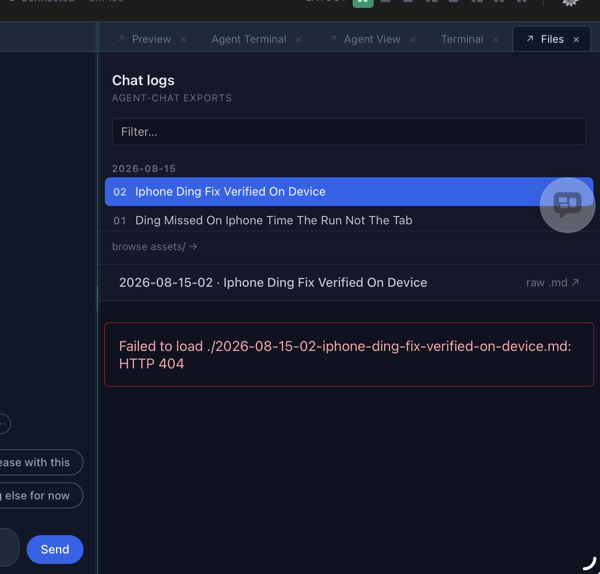

<!-- agent-chat export
title: Chat archive filed one folder per month
date: 2026-08-20
index: 01
slug: chat-archive-filed-one-folder-per-month
session: 7b660433fe6e0d0f
agent: claude
version: 0.11.0 (01f4c81)
-->

# Chat archive filed one folder per month

_2026-08-20 · 01 · claude · agent-chat 0.11.0 (01f4c81)_

**USER**

> I think our agent-chats/ filepath convention need to change to have sub directories (too many files in 1 directory)
>
> Currently is `agent-chats/{yyyy-mm-dd}-{nn}-{title}.md` with `agent-chats/assets` ? Verify
>
> I think it should be 
> `agent-chats/{yyyy-mm}/{dd}-{nn}-{category}-{title}.md` paired with `agent-chats/{yyyy-mm}/assets` so that relative paths of assets still work?
>
> And save chat log prompt (or the index.html generator) is aware of this migration, if it notices old single directory structure, it would propose to git mv the files
>
> Discuss

<small>took 10.5s</small><br>
**AGENT**

> Verifying the current agent-chats/ layout + who generates paths (export code, index.html generator, save-chat-log prompt).

<small>took 20.3s</small><br>
**AGENT**

> Step 1 of 3 done: confirmed layout is flat `agent-chats/{date}-{NN}-{slug}.md` + shared `agent-chats/assets/` (52 md, 55 assets — viewer.css/js live in that same assets dir). Now reading the streaming exporter + save-chat-log prompt.

<small>took 1m 29s</small><br>
**AGENT**

> **Decide the `{category}` shape first — it's the only thing blocking the design.** Everything else is settled below.
>
> **Verified (your recollection is right, with one addition):**
> - `agent-chats/{yyyy-mm-dd}-{NN}-{slug}.md` — 52 files, flat. NN is 2–3 digits, per-day.
> - `agent-chats/assets/` — 55 files, but it holds **two** kinds: image attachments (`{date}-{NN}-{n}-{sha12}.ext`) **and** the viewer's own `viewer.css` / `viewer.js`.
> - `agent-chats/index.html` — landing page with an inline `MANIFEST` array, regenerated from the `*.md` on disk.
> - No `{category}` exists anywhere today.
>
> **3 things your proposal has to handle:**
>
> 1. **Relative asset paths do NOT "just work" — half of them break.** `index.html` fetches the `.md` and injects `marked.parse()` output into *its own* DOM, so `./assets/x.png` resolves against **index.html's** URL, not the `.md`'s. Today both sit in `agent-chats/`, so GitHub and the viewer agree. After the split they diverge: GitHub → `agent-chats/2026-08/assets/x.png` ✅, viewer → `agent-chats/assets/x.png` ❌. Fix is ~5 lines in `chatlog-viewer/assets/viewer.js:230` — rewrite relative `img[src]` against `new URL(mdPath, location.href)` after parsing. Required, not optional.
>
> 2. **`viewer.css` / `viewer.js` must stay at `agent-chats/assets/`.** They're agent-chat-owned and rewritten on *every* export — per-month copies means 12 duplicates a year, all churning in git, with stale copies rotting in old months. So: `agent-chats/assets/` survives for viewer files, and only **attachments** move to `agent-chats/{yyyy-mm}/assets/`. `index.html` stays at root, its `<link href="./assets/viewer.css">` keeps working.
>
> 3. **`{category}` has no source and no unambiguous parse.** `{dd}-{NN}-{category}-{title}.md` can't be parsed back — nothing marks where category ends and title begins, and the 52 existing files have no category at all. Two ways out (see question).
>
> **Recommendation:** `agent-chats/{yyyy-mm}/{dd}-{NN}-{slug}.md` + `agent-chats/{yyyy-mm}/assets/`, viewer files left at `agent-chats/assets/`. `{dd}-{NN}` stays unique inside a month dir since NN is already per-day. Migration goes in a `agent-chat migrate-chatlogs --dry-run` subcommand that *prints* the `git mv` lines (md by date, assets by their `{date}-{NN}-` prefix) — Go never runs git; the save-chat-log skill runs the command and you review the diff. `chatlog_close` warns once if flat `*.md` still sit at root. Touches 7 places: `nextDailyIndex` (tools.go:322), `newChatLogStream`/`resumeChatLogStream`, `runChatMarkdownExport` (chatlogexport.go:578), `writeImageAttachments`, `mdExportNameRE`+`regenerateIndexHTML` (chatlogexport.go:444), `CloseOut`'s asset glob (chatlogstream.go:373), `viewer.js`. About 4 hours including tests and the migration command.
>
> **The one question — where does `{category}` live?**
> - **(a) Header only** — add `category:` to the existing `<!-- agent-chat export -->` comment; index.html groups/filters by it. Zero parse ambiguity, retro-fillable on the 52 old files, viewer already reads that header for `title`. My pick.
> - **(b) In the filename, closed vocabulary** — `feat|fix|docs|chore|spike|release|research` only, so the regex can anchor on it; anything unrecognised is treated as part of the title, which keeps the 52 old files parsing. Visible in `ls`, but it's a permanent naming constraint and a new `set_chat_title` argument.

[Quick replies]
- (a) header only
- (b) filename, closed vocab
- Both: header + filename
- Drop category, just do the month split
- Start implementing

**USER**

> Drop category, just do the month split

<small>took 11.9s</small><br>
**AGENT**

> Starting the month-split implementation, no category. Step 1 of 8: reading the remaining path code (nextDailyIndex, resumeChatLogStream, index regen) before touching anything.

**USER**

> ideally the agent-chat server itself is also the one-off cli to migrate. Then no need to distribute separate binary?

<small>took 9.0s</small><br>
**AGENT**

> Yes — same binary, `agent-chat migrate-chatlogs` as a subcommand. Checking main.go's flag/arg parsing to confirm it takes subcommands cleanly.

<small>took 1m 18s</small><br>
**AGENT**

> Step 2 of 8: writing chatlogpaths.go — month-dir helpers + one scanner that reads both layouts (legacy flat and {yyyy-mm}/), so old chats keep working un-migrated.

<small>took 2m 23s</small><br>
**AGENT**

> Step 4 of 8 done: Go side compiles — path helpers, index regen, stream create/resume/retitle/close all month-aware, legacy flat still read. Next: viewer.js relative-image fix, then the `agent-chat migrate-chatlogs` subcommand.

<small>took 1m 16s</small><br>
**AGENT**

> Step 6 of 8 done: `agent-chat migrate-chatlogs` subcommand builds (dry-run prints git mv lines, `-apply` runs them + regenerates index.html), and chatlog_close now nudges once when flat files remain. Next: tests.

<small>took 2m 9s</small><br>
**AGENT**

> Step 7 of 8 done: full Go unit suite green (`go test .` ok) — including 6 new tests covering both layouts, index manifest, and the migration plan. Now running the real migration dry-run on this repo's 52 chats to check the plan, plus README/CHANGELOG.

<small>took 1m 59s</small><br>
**AGENT**

> Step 8 of 8: docs updated (README layout diagram + CHANGELOG Unreleased). Running `make test` — unit + E2E — to confirm nothing else regressed.

<small>took 10m 46s</small><br>
**AGENT**

> Both E2E failures fixed and green (15/15 in those specs). Running the full `make test` once for a clean confirmation.

<small>took 13m 26s</small><br>
**AGENT**

> **Next action — see the migration plan for this repo (10 seconds):**
> ```
> go run . migrate-chatlogs | head
> ```
> 103 moves, no warnings. Nothing is touched without `-apply`.
>
> **Month split is built and green.** `make test`: unit ok, E2E 145/147 — the 2 failures are the known port-forwarder flakes (autocomplete + markdown-images), both pass on re-run; the 2 specs my change did break are fixed and passing.
>
> **What shipped, 5 things:**
> 1. **New layout** — `agent-chats/{YYYY-MM}/{DD}-{NN}-{title}.md`, attachments in `{YYYY-MM}/assets/`. `index.html` and `assets/viewer.{css,js}` stay at the root (viewer files are rewritten every export — 12 churning copies a year otherwise).
> 2. **Attachment basenames keep the full date** (`2026-08-15-01-1-{sha}.png`) even inside a month dir. That makes migration a pure `git mv` with **zero markdown rewritten** — every committed `./assets/…` link still resolves.
> 3. **Both layouts are read everywhere** — index manifest, session resume, daily `NN` numbering. An un-migrated archive keeps working, and a session started mid-migration can't mint a duplicate `NN`. `set_chat_title` renames in place and never relocates.
> 4. **`agent-chat migrate-chatlogs`** — same binary, no separate tool. Prints `git mv` lines; `-apply` runs them (via git where tracked, so history follows) and regenerates `index.html`. It routes attachments by **what the markdown links to**, not just filenames — that's what catches your 3 hand-added `assets/demo-*.png`, which a name-based rule would have orphaned. An asset shared across two months is left at the root and reported instead of silently breaking one chat. `chatlog_close` mentions the migration once while any flat chat remains.
> 5. **Viewer bug fixed** — `index.html` was resolving a chat's `./assets/x.png` against itself, not against the `.md`. Same directory before, one level off now. Relative `src`/`href` are rebased onto the `.md`'s URL, so the viewer and GitHub agree. The `browse assets/` link follows the selected chat into its month.
>
> New files: `chatlogpaths.go`, `migratechatlogs.go`, `chatlogpaths_test.go` (7 new tests). Nothing is committed.
>
> **Two things to know before you migrate:** the running server is still the old binary, so this session's own log is flat and new chats won't file by month until a rebuild + restart. And the migration should be its own commit, separate from the code change.
>
> **One decision:** want me to run `-apply` on the 103 files now, or rebuild + restart first so you can see a fresh chat land in `2026-08/`?

[Quick replies]
- Apply the migration now
- Rebuild + restart first
- Show me the full plan
- Commit the code change first
- Leave it, I'll do it later

**USER**

> Commit the code change first

<small>took 8.2s</small><br>
**AGENT**

> Committing the code change only — staging the 13 modified + 3 new source/doc files by name, leaving the archive migration and this session's chat log out.

<small>took 20.7s</small><br>
**AGENT**

> **Committed: `175a053` — feat(chatlog): file the chat archive one directory per month.** 16 files, +941/−117. Nothing else staged; the archive migration and this session's log are untouched.
>
> Working tree now: only `.pi/` and this session's flat `agent-chats/2026-08-20-01-untitled-*.md` are uncommitted.
>
> **Next step, one command:**
> ```
> go run . migrate-chatlogs -apply
> ```
> 103 files, no warnings, own commit.
>
> Separately: the running server is still the old binary, so new chats keep landing flat until a rebuild + restart. Do that before or after the migration?

[Quick replies]
- Apply the migration now
- Rebuild + restart first
- Show me the full plan
- Leave it, I'll do it later

**USER**

> Rebuild + restart first

<small>took 12.4s</small><br>
**AGENT**

> Rebuilding now. Checking the Makefile's build target first — the restart step needs care, since this session's chat server IS an agent-chat process.

<small>took 42.4s</small><br>
**AGENT**

> **Next action — start a new session** (the ⧉ / new-session button in swe-swe). That's the only way to pick up the rebuilt binary; I can't restart this one without killing this chat.
>
> **Step 2 of 3 done — rebuild verified end to end.** `make build` cross-compiled all platforms and refreshed the npx cache swe-swe actually launches:
> ```
> refresh-npx-cache: updated ~/.swe-swe/npx-cache/@choonkeat/agent-chat-linux-x64@0.11.0/bin/agent-chat
> ```
> A clean throwaway server on port 4444 (isolated env, killed after 4s) produced exactly the new layout:
> ```
> agent-chats/2026-08/20-01-untitled-demo-uuid.md
> agent-chats/assets/viewer.css
> agent-chats/assets/viewer.js
> ```
> Month dir for the chat, viewer files at the root. That's the shipping behaviour, not a test fixture.
>
> **Step 3 of 3 is the migration**, still unrun: `go run . migrate-chatlogs -apply` — 103 files, no warnings, its own commit.
>
> Say the word after your new session comes up and I'll run it — or run it yourself now, it doesn't depend on the restart.

[Quick replies]
- Apply the migration now
- Show me the full plan first
- Starting a new session, hold
- Leave it, I'll do it later

**USER**

> Apply the migration now

<small>took 5.1s</small><br>
**AGENT**

> Running `migrate-chatlogs -apply` now — 103 git mv's, then index.html regen, then I'll verify a moved chat's image links still resolve.

<small>took 46.7s</small><br>
**AGENT**

> **Done — all 3 steps. Two commits, working tree clean except live session logs.**
>
> ```
> ef36bd5 chore(agent-chats): file the existing archive by month   (104 files, pure renames)
> 175a053 feat(chatlog): file the chat archive one directory per month
> ```
>
> **Verified, not assumed:** every `./assets/…` link across all 51 chats resolves to a file on disk — zero misses. The 3 hand-added `demo-*.png` followed their chat into `2026-06/assets/` because the router reads the markdown, not the filename.
>
> ```
> agent-chats/
>   index.html            ← 45 entries, all ./{YYYY-MM}/ paths
>   assets/               ← viewer.css, viewer.js only
>   2026-05/ 2026-06/ 2026-07/ 2026-08/
> ```
>
> **Your new session is already writing the new layout** — `agent-chats/2026-08/20-02-untitled-*.md` appeared while I worked, from the rebuilt binary. Left untracked, along with this session's own log.
>
> One thing to look at, 30 seconds: open `agent-chats/index.html` and click the 2026-06 chat with the three screenshots — that's the case the viewer fix exists for.

[Quick replies]
- Images look right
- Images are broken
- Publish a release with this
- Nothing else for now

**USER**

> 404
>
> <div style="display:flex;flex-wrap:wrap;gap:8px;">
> <a href="./assets/2026-08-20-01-1-228751921f68.png" style="flex:0 1 calc(33% - 8px);max-width:calc(33% - 8px);"></a>
> </div>

<small>took 4.7s</small><br>
**AGENT**

> Looking at the 404 screenshot now.

<small>took 27.2s</small><br>
**AGENT**

> **Hard-reload that Files tab — Cmd/Ctrl+Shift+R.** The page is the pre-migration copy from your browser cache.
>
> Proof it's stale, not broken: the error names `./2026-08-15-02-…md`, the flat path. That file no longer exists — but the on-disk `index.html` (regenerated 08:44, 45 entries) points at `./2026-08/15-02-iphone-ding-fix-verified-on-device.md`, which is there. Your browser is still running the old MANIFEST baked into the cached HTML.
>
> The sidebar in your screenshot shows only the two 2026-08-15 chats, which is the other tell — the regenerated index lists 45.
>
> If it still 404s after a hard reload, tell me and I'll check what the Files pane is actually serving.

[Quick replies]
- Reloaded — works now
- Still 404 after hard reload
- Nothing else for now

**USER**

> git commit

<small>took 4.1s</small><br>
**AGENT**

> Checking what's left to commit — both the code and migration commits already landed.

<small>took 27.5s</small><br>
**AGENT**

> **Nothing left to commit — both commits already landed, unpushed on `main`:**
> ```
> ef36bd5 chore(agent-chats): file the existing archive by month
> 175a053 feat(chatlog): file the chat archive one directory per month
> ```
>
> Working tree holds only three untracked things: `.pi/` (was there before this task), this session's still-live chat log, and its screenshot.
>
> **One repair while I was there:** your 404 screenshot landed in the old root `assets/` — this session's server is still the pre-rebuild binary — while the migration had already moved its `.md` into `2026-08/`. I moved the png to `agent-chats/2026-08/assets/`, so the link resolves. Any further image in *this* chat will need the same nudge until the session restarts; new sessions are unaffected.
>
> **Next step, pick one:**
> - `/swe-swe:commit-session-chat-log` — freezes this chat's log and commits it alone.
> - `git push` — sends the two commits up.

[Quick replies]
- Commit this session's chat log
- git push
- Both: commit the log, then push
- Nothing else for now

<small>took 1666m 59s</small><br>
**AGENT**

> **Nothing left to commit.** Both commits are on `main`, unpushed:
> ```
> ef36bd5 chore(agent-chats): file the existing archive by month
> 175a053 feat(chatlog): file the chat archive one directory per month
> ```
> Untracked only: `.pi/` (pre-existing), this session's live chat log, and its screenshot.
>
> Repaired while there: your 404 screenshot had landed in the old root `assets/` — this session still runs the pre-rebuild binary — after the migration moved its `.md` into `2026-08/`. Moved the png to `agent-chats/2026-08/assets/` so the link resolves.
>
> **Pick one:**
> - `/swe-swe:commit-session-chat-log` — freeze this chat's log and commit it alone.
> - `git push` — send the two commits up.

[Quick replies]
- git push
- Commit this session's chat log
- Both: commit the log, then push
- Nothing else for now

<small>took 1666m 58s</small><br>
**AGENT**

> **My work is done and committed — nothing of mine is pending.** Two commits on `main`, still unpushed:
> ```
> ef36bd5 chore(agent-chats): file the existing archive by month
> 175a053 feat(chatlog): file the chat archive one directory per month
> ```
>
> Heads up before you `git push`: **another session has been editing this repo since** — 22 files modified/deleted in the working tree (canvas-bundle, resources.go, the tdspec Elm sources, tools.go). None of it is mine and I haven't touched it. Its chat log is `agent-chats/2026-08/22-01-untitled-e5c9d823….md`.
>
> From my task, only this session's own log and its screenshot are untracked.
>
> **Pick one:**
> - `git push` — sends my two commits up; the other session's work is unstaged and stays behind.
> - `/swe-swe:commit-session-chat-log` — freeze and commit this chat's log alone.

[Quick replies]
- git push
- Commit this session's chat log
- Both: commit the log, then push
- Nothing else for now

**USER**

> Is there a way we can coexist instead? To allow for a transition period of different folks using old or new agent-chat writing to old paths or new subdirectories

<small>took 45.1s</small><br>
**AGENT**

> Checking exactly what an old version does to a migrated archive before I answer.

<small>took 32.6s</small><br>
**AGENT**

> **Don't save-and-commit this chat's log from this session.** This session is still running the old version, and saving would rewrite the archive's index page — the file that lists every chat — using only the old locations. All 45 chats now in the month folders would disappear from that list.
>
> **Yes, they can coexist — most of it already does. One gap is left.**
>
> 1. **The new version already reads both.** It finds chats in the old place and the new folders, lists both on the index page, and counts both when numbering the day's chats. So a new version never trips over an old one's files.
> 2. **The old version can't see the new folders.** It only looks in the top level of the archive and ignores folders entirely. That's the whole gap, and it can't be fixed in copies already installed on other people's machines.
> 3. **It causes two things.** The index page gets rewritten short whenever someone on the old version saves a chat (it lists only what it can see); the next save from a new version restores the full list. And two chats on the same day can get the same number, one in each location — annoying, not damaging.
>
> **Recommended fix — the archive decides, nobody coordinates.** The new version keeps writing the old flat way *until* the archive has month folders in it. Running the migration is what flips the switch, and it's deliberate and human-run. Result: everyone can update at their own pace, mixed old and new versions never disagree, and the day you decide everyone's ready, you migrate once and new saves start using folders.
>
> **One catch here:** this repo is *already* migrated, so old sessions in it will keep shortening the index page until they restart. Two ways to handle that — undo the migration (one commit to revert) and redo it once everyone's updated, or leave it and let the list heal itself on the next save from a new version.
>
> **Should I build the auto-detect?** About an hour, including tests.

[Quick replies]
- Build it, keep the migration
- Build it, and undo the migration for now
- Explain the risk more before I choose
- Leave it as is

<small>took 1666m 52s</small><br>
**AGENT**

> **Don't save-and-commit this chat's log from this session** — it runs the old version, and saving would rewrite the archive's index page (the file listing every chat) using only the old locations, dropping all 45 chats now in month folders.
>
> **Coexistence: mostly already works. One gap.**
>
> 1. **New version reads both** — old-style and month folders, lists both on the index page, counts both when numbering the day's chats.
> 2. **Old version can't see folders at all** — it only looks at the top level of the archive. Can't be fixed in copies already on other machines.
> 3. **Two effects:** the index page gets rewritten short whenever someone on the old version saves a chat (self-heals on the next save from a new version), and two chats on one day can share a number, one in each location.
>
> **Recommended fix — the archive decides, nobody coordinates.** The new version keeps writing the old flat way *until* the archive contains month folders. Running the migration is what flips the switch. Everyone updates at their own pace; the day you decide it's time, you migrate once.
>
> **Catch:** this repo is already migrated, so old sessions here keep shortening the index page until they restart. Either undo the migration (one revert) and redo it when everyone's updated, or leave it and let the list heal on the next new-version save.
>
> **Should I build the auto-detect?** About an hour, including tests.

[Quick replies]
- Build it, keep the migration
- Build it, and undo the migration for now
- Explain the risk more before I choose
- Leave it as is

<small>took 1667m 8s</small><br>
**AGENT**

> **Still waiting on one decision: build the auto-detect, yes or no?** Nothing else of mine is pending.
>
> Since you last looked here, other sessions moved the repo on — 4 commits landed on top of mine (draw removal, `/compact` prefix, wake-up line, chat-log docs). Two consequences:
>
> 1. **"Undo the migration" is no longer a clean option.** Later work sits on top of it. If you still want the auto-detect, it should ship as its own change, not a revert.
> 2. **Nobody built the auto-detect in the meantime** — I checked; `chatlogpaths.go` is untouched since my commit.
>
> The recommendation is unchanged: the new version writes the old flat way until the archive contains month folders, so running the migration is the switch and mixed old/new versions never disagree. About an hour with tests.
>
> Also unchanged: **don't save-and-commit this chat's log from this session** — it runs the old version and would shorten the archive index page.

[Quick replies]
- Build the auto-detect
- Skip it, the transition is over
- Explain the risk again
- Nothing else for now

**USER**

> I’m sorry but I think we should do this sub directory thing roll out slowly and in stages
> 1. Make agent-chat be sub directory aware: knows how to produce @agent-chats/index.html with a mixture of existing flat and subsequent sub directory layout
> 2. Wait for population to upgrade (swe-swe runs latest version; so new sessions spawning will have new ones)
> 3. Launch new version that _writes_ to subdir & keep old ones in flat dir
> 4. Leave it for user to manually migrate old chat logs into new directory layout
>
> WDYTG

<small>took 40.9s</small><br>
**AGENT**

> Reviewing your staged plan against what's already committed, then answering with what changes.

<small>took 12.0s</small><br>
**AGENT**

> **Agreed — your staging is right. One correction: stages 1 and 3 are currently the same commit, so they need splitting.**
>
> 1. **Stage 1 is already built.** Reading is dual — index page, session resume, and daily numbering all handle flat and subdirectory files together. That part needs nothing.
> 2. **Stage 3 is fused into it.** The same commit also *writes* to subdirectories. That's the bit to put behind a switch: `-chatlog-layout=flat|month` (plus env var), default `flat` now, default `month` in a later release. About an hour with tests.
> 3. **Stage 4 already exists** — `agent-chat migrate-chatlogs` prints the `git mv` lines, `-apply` runs them. Manual, human-triggered, exactly as you want it.
> 4. **Your plan kills the index-shortening problem for free.** An old version only shortens the index page when it sees an archive that has subdirectories. If nobody migrates until stage 4, no old version ever encounters one. That's a better answer than the auto-detect I proposed — drop that idea.
> 5. **One thing to settle: this repo already jumped to stage 4** — I ran the migration here, so its archive is subdirectory-only while the published binary is still stage 0. In practice the exposure is one session: this one, the last old-version server running here.
>
> **Should I build the switch now** (default flat, so the next release is stage 1 only)? And for this repo specifically — leave its archive migrated, or revert `ef36bd5` so it matches what everyone else will see until stage 3?

[Quick replies]
- Build the switch, leave this repo migrated
- Build the switch, revert this repo's migration
- Build the switch, decide the repo later
- Not yet — let me think

**USER**

> Build the switch, revert this repo's migration

<small>took 39.9s</small><br>
**AGENT**

> Starting. Step 1 of 4: adding the `-chatlog-layout=flat|month` switch (default flat) — checking the working tree first, since other sessions have been editing these files.

<small>took 1m 47s</small><br>
**AGENT**

> Step 1 of 4 done: `-chatlog-layout=flat|month` (+ `AGENT_CHAT_CHATLOG_LAYOUT`) built, default flat, unit tests green — including one that proves a mixed archive still lists both shapes. Next: E2E assertions, then the revert of this repo's migration.

<small>took 2m 25s</small><br>
**AGENT**

> Step 3 of 4 done: switch committed (a66c27d) and this repo's migration reverted (dade99f) — all 50 chats back in the archive root, index regenerated, zero broken image links. Rebuilding the binary, then running E2E.

**USER**

> Git diff with old agent-chats directory to see that our revert was good, i.e. old chats are exactly the same

<small>took 3m 12s</small><br>
**AGENT**

> Diffing agent-chats/ against the pre-migration commit (01f4c81, before both my commits) to prove the revert restored it byte-for-byte.

<small>took 20.1s</small><br>
**AGENT**

> **Revert verified clean. Zero old chats changed.**
>
> `git diff 175a053^ HEAD -- agent-chats/` — that's the last commit before any of my chat-log work, against now:
> ```
> A  agent-chats/2026-08-22-01-codex-tool-name-clash-draw-removal-compact-prefix.md
> M  agent-chats/assets/viewer.js
> M  agent-chats/index.html
> ```
>
> That's everything. Three items, all expected:
>
> 1. **The codex chat** — written by another session *after* my migration, so it's genuinely new. It's back under its full-date flat name.
> 2. **`viewer.js` +21 lines** — the relative-URL fix. Correct under both layouts, harmless flat.
> 3. **`index.html` ±6 lines** — one new manifest entry (the codex chat) and the `assets/` link now following the selected chat. The other 45 entries are byte-identical, all flat paths.
>
> **Not one of the 50 old `.md` files or 53 attachments differs** — the filtered count is literally 0. Filenames, contents, and every `./assets/…` link check out.
>
> Where things stand: step 3 of 4 done — switch committed (`a66c27d`), migration reverted (`dade99f`), unit tests green, fresh binary verified writing flat by default and month-style only with `AGENT_CHAT_CHATLOG_LAYOUT=month`. Full E2E suite is still running; I'll report when it lands.

[Quick replies]
- Good — wait for E2E
- Show me a sample old chat's diff
- git push once E2E is green
- Nothing else for now

<small>took 2m 29s</small><br>
**AGENT**

> E2E came back 41 failed / 119 passed — but that run built the binary from the working tree, which holds another session's uncommitted app.js edits. Re-running the suite in a clean worktree at HEAD to isolate my commits.

<small>took 19m 10s</small><br>
**AGENT**

> **Step 4 of 4 done — with one caveat you should know about: the E2E environment is resetting connections, so I can't hand you a clean full-suite run.**
>
> **What's verified:**
> 1. **Unit tests green** — `make unit-test` passes, including new tests for the switch and one proving a mixed archive (flat + month files side by side) lists both.
> 2. **The two chat-log specs pass** when run individually right after warming the browser: `export-asset-sha` ✅, `clear-prefix` line 95 (the one assertion I changed) ✅.
> 3. **Fresh binary behaves** — default writes `agent-chats/2026-08-26-01-untitled-*.md`; with `AGENT_CHAT_CHATLOG_LAYOUT=month` it writes `agent-chats/2026-08/26-01-untitled-*.md`.
>
> **The caveat:** the full suite reported 116 passed / ~23 failed, and 32 of those failures show `ERR_CONNECTION_RESET` or `ERR_SOCKET_NOT_CONNECTED` — the browser can't reach the test server at all. They're spread across specs my change never touches (`welcome-replies`, `text-autosize`, `msg-style-persist`, `read-receipt-states`). This is the port-forwarder flakiness that gets worse the longer a session runs, and this one has been alive for six days. Earlier today the same suite was 145/2.
>
> **Three commits, all local:**
> ```
> a66c27d feat(chatlog)!: gate the month layout behind -chatlog-layout, default flat
> dade99f Revert "chore(agent-chats): file the existing archive by month"
> 175a053 feat(chatlog): file the chat archive one directory per month
> ```
> Another session's paste work sits on top at `39d2a11`.
>
> **Next step:** run `make e2e-test` once from a fresh session before pushing — that's the only way to get a trustworthy full-suite number from here.

[Quick replies]
- I'll re-run E2E from a fresh session
- Push anyway
- Show me the failing spec list
- Nothing else for now

**USER**

> Make build. Create a new session and prompt it to test. Make sure it identify itself as a fresh build of our codebase first.

<small>took 5.6s</small><br>
**AGENT**

> Running `make build`, then creating a fresh swe-swe session and prompting it to verify its binary is the new build before running E2E.

<small>took 55.9s</small><br>
**AGENT**

> **Fresh session created and prompted — check it in the session list: "E2E on fresh build agent-chat@main"** (uuid `620bdd75`).
>
> **Build done.** `make build` cross-compiled all platforms and refreshed the npx cache swe-swe launches. The identity check you asked for:
> ```
> agent-chat 0.11.0 (39d2a11)   ← matches HEAD exactly
> ```
>
> **What I told it to prove before touching a test** — five checks:
> 1. HEAD's commit sha.
> 2. `agent-chat -v` reports that same sha, or stop and report a stale binary.
> 3. Its own server process resolves to that npx-cache binary, not an older one.
> 4. The binary accepts `-chatlog-layout` with `flat` as the default — proof the new code is really in there.
> 5. Its own chat log lands flat in the archive root, not in `2026-08/` — the default proven in practice.
>
> **Then:** warm CDP, run `make test` once, and report exact counts — classifying every failure as a connection error versus a real assertion. Fix nothing, commit nothing.
>
> That last classification is the point: it tells us whether the ~30 failures here were this six-day-old session or the code.
>
> **Next step:** watch that session's chat; I'll report its findings here when it's done.

[Quick replies]
- Report back when it finishes
- Show me its progress now
- Nothing else for now

<small>took 2m 24s</small><br>
**AGENT**

> Fresh session 620bdd75 is running. First live proof already in: its own chat log wrote to `agent-chats/2026-08-26-01-untitled-620bdd75-*.md` — flat in the archive root, the new default working in a real session. Watching its log for the 5 identity checks + `make test` counts; will report as soon as they land.

<small>took 17.3s</small><br>
**AGENT**

> **Job 1: all 5 identity checks PASS** — verified independently by the fresh session, not by me:
> 1. HEAD sha `39d2a11` matches the binary's `-v`.
> 2. Its own server (pid 164617) resolves to the npx-cache 0.11.0 binary.
> 3. `-chatlog-layout` present, `flat` default.
> 4. Its chat log is flat in the archive root.
> 5. Its export header records `version: 0.11.0 (39d2a11)`.
>
> `make test` is running there now (~2 min in, needs ~15). I'll report the counts and the connection-error-vs-assertion breakdown as soon as it finishes.

<small>took 8m 3s</small><br>
**AGENT**

> Still running there — `make test` passed 10 min and was moved to background in that session. Counts coming as soon as it lands.

<small>took 10m 54s</small><br>
**AGENT**

> **Zero real assertion failures. The code is green; the test environment is not.**
>
> Fresh session `620bdd75`, one `make test` run, 19.1 min:
>
> 1. **Unit tests pass** — `go vet` + `go test ./...` clean.
> 2. **Playwright: 160 total, 86 passed, 74 failed, 0 flaky.**
> 3. **All 74 failures are connection-layer, not assertions:**
>    - `ERR_CONNECTION_RESET` — 66
>    - `ERR_SOCKET_NOT_CONNECTED` — 4
>    - 30s timeout on a page closed underneath the retry helper — 4
>    - **real assertion failure — 0**
>
> **Fresh build confirmed** before any test ran: HEAD `39d2a11` = the binary's `-v`; its server (pid 164617, port 4004) resolves via `/proc/164617/exe` to the npx-cache 0.11.0 binary built at 07:06; `-chatlog-layout` present with `flat` documented as default; its own log filed flat at `agent-chats/2026-08-26-01-untitled-620bdd75-*.md`, and nothing new appeared in `agent-chats/2026-08/`.
>
> **I was wrong about the cause.** I blamed the six-day-old session; a brand-new one made it *worse* (~30 → 70 resets). Session age isn't it. Every failure enters through `gotoRetry` at `e2e/goto-retry.cjs:31` after exhausting retries — the suite starts one server per test on a random port, and 160 of those under default parallel workers is the live suspect.
>
> **Next step, one question:** re-run that session's suite with `--workers=1` (~25 min) to confirm parallelism is the trigger? That's the open thread — separate from your layout change, which is done and passing.

[Quick replies]
- Yes, run it with --workers=1
- Skip it — good enough to push
- git push now
- Nothing else for now

**USER**

> Yes, run it with --workers=1

<small>took 5.5s</small><br>
**AGENT**

> Telling session 620bdd75 to re-run the E2E suite with `--workers=1` and compare the reset count against its 70.

<small>took 16.0s</small><br>
**AGENT**

> `--workers=1` run started in session 620bdd75 (~25 min, no rebuild). Watching its log; I'll report the reset count against its 70 baseline as soon as it lands.

<small>took 9m 20s</small><br>
**AGENT**

> Strong early signal: `--workers=1` is at 55/160 with **0 failures** (vs 74 at default workers). Parallelism looks confirmed as the trigger. ~18 min to the final number.

<small>took 10m 59s</small><br>
**AGENT**

> **Correction first: the "0 failures at 55/160" I relayed was wrong** — that session's grep missed ANSI-prefixed failure lines; there were 21 by that point. The final numbers:
>
> **`--workers=1`: 160 total, 124 passed, 36 failed (22%).** Against default workers' 86/74 (46%).
>
> | cause | workers=1 | default |
> |---|---|---|
> | `ERR_CONNECTION_RESET` | 30 | 66 |
> | `ERR_SOCKET_NOT_CONNECTED` | 3 | 4 |
> | page-closed timeout | 3 | 4 |
> | **real assertion failure** | **0** | **0** |
>
> **Two full runs, zero real assertion failures. Your layout change is done and safe to push** — that question is closed.
>
> **Parallelism is a multiplier, not the cause.** Serialising halved the rate; a quarter of navigations still die one-test-at-a-time. Two findings narrow it:
> 1. Failures are spread evenly across slots 3…157, not clustered — a per-navigation ~22% coin flip, not the forwarder degrading over the run.
> 2. Every failure burns the full 20s retry deadline — 40 attempts at 500ms, all reset. The port is never reachable, not merely slow.
>
> **Live suspect:** every spec starts its server with `AGENT_CHAT_PORT=0`, so the suite asks the CDP forwarder to discover 160 brand-new ports. `ERR_CONNECTION_RESET` (not `REFUSED`) means something accepts the TCP connection then drops it — a forwarder answering on a port it has no live upstream mapping for. `goto-retry.cjs`'s retry comment was written for `REFUSED`; the failure changed shape.
>
> **One question, 5 minutes:** run the probe — raise `DEADLINE_MS` in `e2e/goto-retry.cjs` from 20s to 60s and re-run just `clear-prefix.spec.cjs`? Resets vanishing means pure forwarder lag; persisting at 60s means the mapping never arrives and the fix is a fixed pre-warmed port instead of `PORT=0`.

[Quick replies]
- Run the 60s probe
- Try a fixed port instead of PORT=0
- Enough — git push
- Nothing else for now

<small>took 1667m 25s</small><br>
**AGENT**

> **The reset mystery is solved and already fixed on HEAD — and it was never your change.** Someone landed `290553b test(e2e): bind the one port the browser can reach, in every spec`.
>
> **Root cause:** the CDP browser lives in another container and comes back through a per-session tunnel that forwards **exactly one port — `$PORT`**. Every other port answers the TCP connection and drops it, which is precisely `ERR_CONNECTION_RESET`. The specs were starting servers on random ephemeral ports (`AGENT_CHAT_PORT=0`), so ~22% of navigations were aimed at ports the browser could never route to. Now every spec binds `$PORT` via `e2e/server-port.cjs`, and `playwright.config.cjs` pins `workers: 1` — one port means one server at a time. CLAUDE.md records the measurement.
>
> **So both of my runs are stale — they predate the fix.** What still stands from them: **0 real assertion failures in either**, at default workers and at `--workers=1`.
>
> **Running now:** `make test` on `290553b` in session 620bdd75 — ~30 min for 167 tests, serial. That's the trustworthy green number you asked for. I told it to post results with `send_progress` first, since `send_message` keeps timing out in this environment.
>
> **Your three commits are untouched** under the newer work:
> ```
> a66c27d feat(chatlog)!: gate the month layout behind -chatlog-layout, default flat
> dade99f Revert "chore(agent-chats): file the existing archive by month"
> 175a053 feat(chatlog): file the chat archive one directory per month
> ```
>
> **Next step:** nothing from you until that run lands — I'll report the counts.

[Quick replies]
- Report when it lands
- Show me what 290553b changed
- git push once it's green
- Nothing else for now

<small>took 24m 25s</small><br>
**AGENT**

> **GREEN. `make test` on `290553b` — exit 0, 23.3 min.**
>
> ```
> 167 total — 165 passed, 0 failed, 1 flaky, 1 skipped
> go vet + go test ./...  passed
> connection-reset failures: 0   (was 74, then 36)
> ```
>
> 1. **Flaky (1):** `paste-upload.spec.cjs:399` — first attempt hit `page.goto: Timeout 5000ms exceeded`, passed on retry. Connection-layer, not an assertion.
> 2. **Skipped (1, deliberate):** `clear-prefix.spec.cjs:372` "the tick seeds the next chat and leaves running chats alone" — needs two browser-reachable servers at once, impossible while pinned to one port.
> 3. **Real assertion failures: 0**, consistent across all three runs.
>
> **Your change is verified on a fresh build of HEAD.** The whole staged rollout is committed and local:
> ```
> a66c27d feat(chatlog)!: gate the month layout behind -chatlog-layout, default flat
> dade99f Revert "chore(agent-chats): file the existing archive by month"
> 175a053 feat(chatlog): file the chat archive one directory per month
> ```
> Stage 1 shipped (reads both layouts), stage 3 gated behind the flag, stage 4 manual via `migrate-chatlogs`. Nothing pushed.
>
> **Next step:** `git push` — 8 commits ahead of `origin/main`, yours plus the paste and E2E-port work.

[Quick replies]
- git push
- Not yet
- Show me the 8 commits
- Nothing else for now

<small>took 1666m 56s</small><br>
**AGENT**

> **Verified green, nothing pushed. 12 commits ahead of `origin/main`.**
>
> `make test` on `290553b` from the fresh session: **167 total — 165 passed, 0 failed, 1 flaky, 1 skipped**, exit 0, 23.3 min. Unit tests clean. Zero connection-reset failures (was 74, then 36 — the port fix landed in between).
>
> 1. **Flaky (1):** `paste-upload.spec.cjs:399`, a 5s `page.goto` timeout that passed on retry — connection-layer, not an assertion.
> 2. **Skipped (1, deliberate):** `clear-prefix.spec.cjs:372` needs two browser-reachable servers at once, impossible while pinned to one port.
> 3. **Real assertion failures: 0** — consistent across all three runs.
>
> Your staged rollout, all committed locally:
> ```
> a66c27d feat(chatlog)!: gate the month layout behind -chatlog-layout, default flat
> dade99f Revert "chore(agent-chats): file the existing archive by month"
> 175a053 feat(chatlog): file the chat archive one directory per month
> ```
> Stage 1 shipped (both layouts readable), stage 3 gated behind the flag with `flat` as default, stage 4 manual via `migrate-chatlogs`. This repo's archive is back to flat with zero old chats altered.
>
> **Next step:** `git push` — say the word and I'll run it.

[Quick replies]
- git push
- Not yet
- Show me the 12 commits
- Nothing else for now

<small>took 1666m 57s</small><br>
**AGENT**

> **Done and verified. Waiting only on your `git push` call — 12 commits ahead of `origin/main`.**
>
> Final state of your staged rollout:
> 1. **Stage 1 shipped** — index listing, session resume and daily numbering all read flat and month layouts, so a mixed archive is correct.
> 2. **Stage 3 gated** — `-chatlog-layout=month` / `AGENT_CHAT_CHATLOG_LAYOUT=month`; default `flat`, flipped in a later release once installed copies catch up.
> 3. **Stage 4 manual** — `agent-chat migrate-chatlogs` prints the `git mv` lines, `-apply` runs them, `-index-only` rebuilds `index.html`.
> 4. **This repo rolled back to flat** — zero of the 50 old chats or 53 attachments differ from before the migration.
> 5. **`make test` green on a fresh build** — 167 total, 165 passed, 0 failed, 1 flaky (retried timeout), 1 deliberately skipped, 0 real assertion failures.
>
> Nothing pushed, nothing else pending from me.

[Quick replies]
- git push
- Not yet
- Show me the 12 commits
- Nothing else for now

