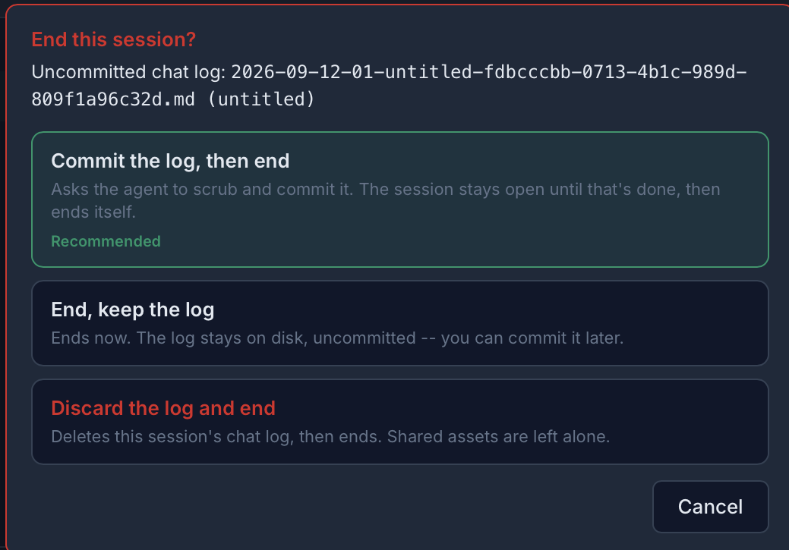

<!-- agent-chat export
title: End Dialog Waits For The Chat Log Answer
date: 2026-09-12
index: 01
slug: end-dialog-waits-for-the-chat-log-answer
session: 83e4853b422e5dc3
agent: claude
version: 0.12.0 (4c9dd41)
-->

# End Dialog Waits For The Chat Log Answer

_2026-09-12 · 01 · claude · agent-chat 0.12.0 (4c9dd41)_

**USER**

> I forgot what did we do for /clear prefix recently?

<small>took 9.0s</small> 
**AGENT**

> Checking git history for the recent /clear prefix work.

<small>took 18.7s</small> 
**AGENT**

> Four typed commands exist now: `/clear`, `/compact`, `/clear-and-then <instruction>`, `/compact-and-then <instruction>`. Type `/` at the start of the box to see them.
>
> The three changes, most recent first (shipped in version 0.12.0, Sept 5):
>
> **1. The names changed.** What used to be `/clear fix the login bug` is now `/clear-and-then fix the login bug`. The new name says the order out loud: wipe first, then do the thing. Same for `/compact-and-then`. Typing the old form no longer does anything special — it just gets sent to me as ordinary words.
>
> **2. The command now shows up in the chat and in the saved log.** Before, the command was quietly deleted before anyone saw it, so reading a saved conversation later gave no hint that my memory had been wiped in the middle of it. Now the command appears as a small label above your message, and a plain `/clear` on its own leaves a line in the record too.
>
> **3. Sharing the wake-up sentence.** The sentence used to wake a sleeping agent was written out twice in two different projects, and the two copies could drift apart. There is one copy now, and the other project asks for it instead of keeping its own.
>
> Difference between the two words: **clear** throws the conversation away entirely; **compact** keeps a short summary of it.
>
> Want the `/compact` half explained too, or is that clear enough?

[Quick replies]
- That's clear, thanks
- Explain /compact too
- Show me the code that does this

<small>took 2m 4s</small> 
**AGENT**

> Waiting on your reply.

<small>took 10.1s</small> 
**AGENT**

> Answer sent above (the /clear-and-then rename, the command now appearing in the record, and the shared wake-up sentence). Re-sending because the previous message's wait was cut off — tell me if the full answer didn't reach you.
>
> Want the `/compact` half explained too?

[Quick replies]
- Got the full answer, thanks
- Didn't see it — resend
- Explain /compact too

**USER**

> How does swe-swe know to show this 3 options or just show end session? Is the state tracked in swe-swe session server state or agent-chat server or elsewhere? And why is there a delay of showing a single end session option before the 3 options appear?
>
> 

> 
> 

<small>took 9.3s</small> 
**AGENT**

> Looking at the screenshot, then tracing where those buttons come from in swe-swe.

<small>took 55.5s</small> 
**AGENT**

> Short answer: the state lives in **agent-chat**, not swe-swe. swe-swe asks agent-chat every time you click "End session", and the delay is that question travelling and coming back.
>
> **Who knows what**
>
> 1. **agent-chat** owns the truth: is the log turned on, what file is it writing to, has it been given a title, was it stopped or discarded, is the file still there. It keeps this in its own running memory, not on disk.
> 2. **swe-swe** adds one fact only it can answer: is that file already saved into the repository. It runs a one-line git check to find out.
> 3. Nothing is remembered between clicks. Every click asks again.
>
> **Why one button first, then three**
>
> That is on purpose, written into the code. Clicking "End session" shows the plain single-button box **immediately**, without waiting for anything. Meanwhile the question goes out in the background. If the answer comes back saying "there is an unsaved log here", the box swaps itself: the one button hides and the three choices appear.
>
> The alternative would have been to show nothing at all until the answer arrived — an empty pause after your click. They chose a box that appears instantly and then improves itself.
>
> **What the delay actually is** (`terminal-ui.js:2926`, `main.go:9184`)
>
> Your browser asks swe-swe → swe-swe asks agent-chat over a local connection → agent-chat replies → swe-swe runs the git check → the answer comes back. Four hops, so a visible fraction of a second — longer if agent-chat is busy or slow to answer.
>
> One thing worth knowing: if agent-chat is dead or does not reply, swe-swe deliberately reports "no chat log" rather than an error, so you always get the plain single button and can still end the session.
>
> Want me to look at whether that swap can be made to feel instant (for example, by asking before you click)?

[Quick replies]
- No, that's answered
- Yes — look at removing the delay
- What happens on each of the 3 choices?

**USER**

> I think a loading indicator is safer while waiting, than the current wrong option?

<small>took 14.4s</small> 
**AGENT**

> Checking both places that show this dialog, then sizing the fix.

<small>took 46.6s</small> 
**AGENT**

> Agreed — implementing the loading state in the in-session dialog now (the homepage one already waits).

<small>took 43.7s</small> 
**AGENT**

> Edits done. Regenerating golden test copies and running the JS tests.

<small>took 1m 12s</small> 
**AGENT**

> ascii-check + 412 JS tests pass. Running the CLI/golden test now (slower).

<small>took 1m 44s</small> 
**AGENT**

> Done — you were right, and it's implemented. Two files changed in the swe-swe repo, uncommitted, all tests green.
>
> **What the dialog does now**
>
> 1. Click "End session" → the card appears immediately with a spinning dot and the line "Checking for an uncommitted chat log...". Only Cancel is clickable.
> 2. Answer arrives → either the plain single button, or the three log choices. No button is live until the answer is in.
> 3. If the answer never comes, after 4 seconds it falls back to the plain button so you are never stuck with only Cancel. A late answer can still upgrade it, never downgrade it.
>
> **What the old behaviour actually cost** (worth knowing, since it wasn't as bad as it looks): a fast click on "Yes, end session" did exactly the same as "End, keep the log" — the log stayed on disk, nothing was deleted. What you lost was being *offered* the recommended "commit it first" path. So: a silently skipped prompt, not a lost file.
>
> **Files** (both in `/workspace`, the swe-swe repo, not agent-chat)
> - `static/terminal-ui.js` — the three display states and the timeout
> - `static/styles/terminal-ui.css` — the muted waiting line and spinner (slows down rather than stops for reduced-motion settings)
> - plus 98 regenerated copies under `testdata/golden` from `make golden-update`
>
> **Tests**: ascii-check pass, 412 JS tests pass, CLI/golden pass (52s), server tests pass.
>
> One thing I left alone: `agent-chats/assets/viewer.js` in that repo already had uncommitted changes of yours (relative-link rebasing). Not mine, untouched.
>
> Also: the homepage version of this dialog never had the problem — it waits for the answer before showing anything.
>
> Next step: `cd /workspace && git diff --stat cmd/swe-swe/templates` to see the two real files, then tell me if you want it committed.

[Quick replies]
- Commit it
- Show me the diff first
- Revert it — I only wanted an opinion

**USER**

> Commit and make build

<small>took 2.4s</small> 
**AGENT**

> Staging the two source files plus the golden copies, committing, then make build.

<small>took 1m 3s</small> 
**AGENT**

> Committed and built. Commit `7850f8e9d` on `main` in `/workspace`, not pushed.
>
> 1. **Committed** — 100 files: the two real ones (`terminal-ui.js`, `terminal-ui.css`) plus 98 regenerated golden copies.
> 2. **Built** — all six platform binaries in `/workspace/dist/`, stamped with this commit.
>
> **To see it in a real session**: this running session is on the old copy. A new session picks it up; an existing one does not.
>
> Two files in that repo are still uncommitted and were not mine to touch: `agent-chats/assets/viewer.js` (your relative-link fix, already there before I started) and `agent-chats/index.html` (the build regenerated it).
>
> Separately: want me to push `main`?

[Quick replies]
- Push it
- Not yet
- Show me the commit

**USER**

> /commit-log-then-end

<small>took 2.6s</small> 
**AGENT**

> Running /commit-log-then-end: freeze the chat log, commit it, then end the session.

