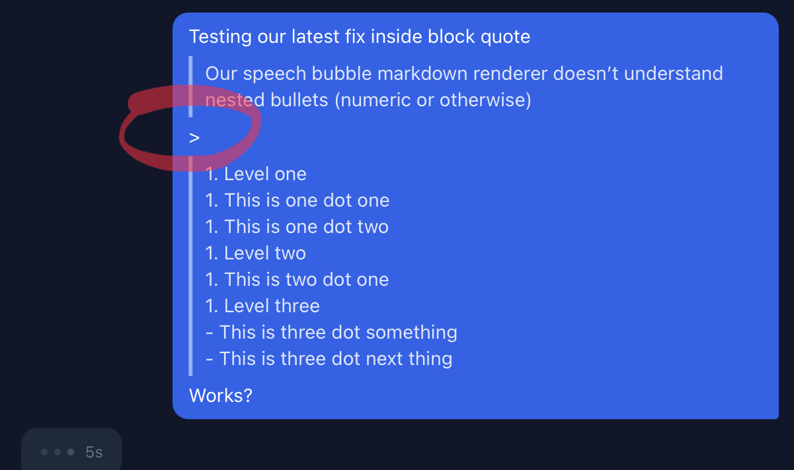

<!-- agent-chat export
title: Blockquote Markdown Nested Lists And Bare Markers
date: 2026-09-13
index: 02
slug: blockquote-markdown-nested-lists-and-bare-markers
session: fba0e8a7cac2b12b
agent: claude
version: 0.12.0 (88d1bf4)
-->

# Blockquote Markdown Nested Lists And Bare Markers

_2026-09-13 · 02 · claude · agent-chat 0.12.0 (88d1bf4)_

**USER**

> Testing our latest fix inside block quote
>
> > Our speech bubble markdown renderer doesn’t understand nested bullets (numeric or otherwise)
> >
> > 1. Level one
> >     1. This is one dot one
> >     1. This is one dot two
> > 1. Level two
> >     1. This is two dot one
> > 1. Level three
> >     - This is three dot something
> >     - This is three dot next thing
>
> Works?

<small>took 10.0s</small> 
**AGENT**

> Checking the markdown renderer's blockquote + nested-list path, and whether the running binary has commit cedb710.

**USER**

> Oops, our nested list fix fails when inside `> ` blockquote. Also i spotted a bug with our blockquote when blank lines are involved (see screenshot)
>
> TDD fixes?
>
> 

> 
> 

<small>took 10.1s</small> 
**AGENT**

> Writing failing specs first for both bugs (lists inside `> `, and blank-line `>` splitting the quote), then fixing renderMarkdown.

<small>took 1m 50s</small> 
**AGENT**

> Step 1 of 4 done: 11 specs written, 6 fail red (bare `>` splits the quote; lists/headings inside `>` stay plain text). Now editing renderMarkdown.

<small>took 1m 20s</small> 
**AGENT**

> Step 2 of 4 done: 19/19 markdown specs green (10 new blockquote specs + the 9 nested-list ones). Running full `make test` now — ~30 min.

<small>took 10m 21s</small> 
**AGENT**

> Step 3 of 4 done: CHANGELOG updated. Full `make test` still running (~20 min left); will commit once it's green.

<small>took 11.2s</small> 
**AGENT**

> Both bugs fixed, 19/19 markdown specs green. Full `make test` is still running in the background — I'll report when it finishes.
>
> **What changed** (`client-dist/app.js`)
>
> 1. Block rules now run *inside* quotes. New `parseBlocks()` (headings → rules → lists → blockquotes) is called both on the whole message and on the inside of every `>` quote. Before, lists were parsed before quotes and never looked past the `&gt;` prefix, so quoted lists came out as plain text with ` `s.
> 2. Quote regex `^&gt;[ &].+` → `^&gt;.*`. A bare `>` is now a blank line *inside* the quote instead of a literal `>` splitting it in two (your red circle), and `>text` with no space quotes correctly.
>
> **Tests written first** — `e2e/markdown-blockquotes.spec.cjs`, 10 specs, 6 of them red before the fix:
>
> - bare `>` keeps one quote · `>tight` quotes · flat list in quote · nested list in quote · heading in quote · the full reported example
> - regressions held: one-line quote, `>>` nesting, inline formatting, text after a quote
>
> Your example now renders as one quote containing one three-item `<ol>` with nested `<ol>`/`<ul>` children — no stray `>`, no ` `.
>
> Next: reply "commit" and I'll commit app.js + the new spec + CHANGELOG once the suite is green (about 15 more minutes).

[Quick replies]
- Commit when green
- Show me the rendered result first
- Wait for the full test result

<small>took 16m 56s</small> 
**AGENT**

> Step 4 of 4 done: `make test` green — 190 passed, 1 skipped, 0 failed (unit `ok agent-chat 0.826s`, e2e 26.8m).
>
> Files ready to stage: `client-dist/app.js`, `e2e/markdown-blockquotes.spec.cjs`, `CHANGELOG.md`. Say "commit" and I'll commit those three by name.

<small>took 7.6s</small> 
**AGENT**

> `make test` green: 190 passed, 1 skipped, 0 failed (unit `ok agent-chat 0.826s`; e2e 26.8m).
>
> Both bugs fixed in `client-dist/app.js`:
>
> 1. New `parseBlocks()` (headings → rules → lists → blockquotes) runs on the whole message **and** on the inside of every `>` quote, so quoted lists/headings render instead of flattening to ` `s.
> 2. Quote regex `^&gt;[ &].+` → `^&gt;.*` — a bare `>` is a blank line *inside* the quote (your red circle), not a literal `>` splitting it in two. `>text` with no space also quotes now.
>
> Tests written first: `e2e/markdown-blockquotes.spec.cjs`, 10 specs, 6 red before the fix (bare `>`, `>tight`, flat list in quote, nested list in quote, heading in quote, full reported example) + 4 regressions (one-line quote, `>>` nesting, inline formatting, text after a quote).
>
> Reply "commit" and I'll commit exactly `client-dist/app.js`, `e2e/markdown-blockquotes.spec.cjs`, `CHANGELOG.md`.

[Quick replies]
- Commit
- Show me the rendered output first
- Not yet

**USER**

> commit and make build

<small>took 2.0s</small> 
**AGENT**

> Committing the three files by name, then running `make build` (cross-compiles all platforms + refreshes the npx cache).

<small>took 25.5s</small> 
**AGENT**

> Start a NEW session to see the fix in this chat UI — the npx cache binary is refreshed but the running server still holds the old one.
>
> Done:
> 1. Committed `9a0819a` — `client-dist/app.js`, `e2e/markdown-blockquotes.spec.cjs`, `CHANGELOG.md` (3 files, +212/−20).
> 2. `make build` green — all 6 platforms compiled, `~/.swe-swe/npx-cache/@choonkeat/agent-chat-linux-x64@0.12.0/bin/agent-chat` refreshed.
>
> Test the same quoted nested list in the new session and it should render as one quote with one nested `<ol>`, no stray `>`.
>
> Separately: this is unreleased on npm (still 0.12.0). Cut 0.12.1 next?

[Quick replies]
- Start a new session to verify
- Cut 0.12.1
- Not yet

**USER**

> /commit-log-then-end

<small>took 2.2s</small> 
**AGENT**

> Running /commit-log-then-end: freeze this session's chat log, scrub it, commit it alone, then end the session.

