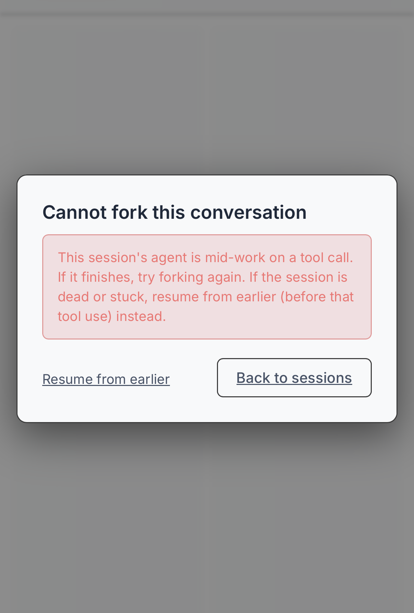
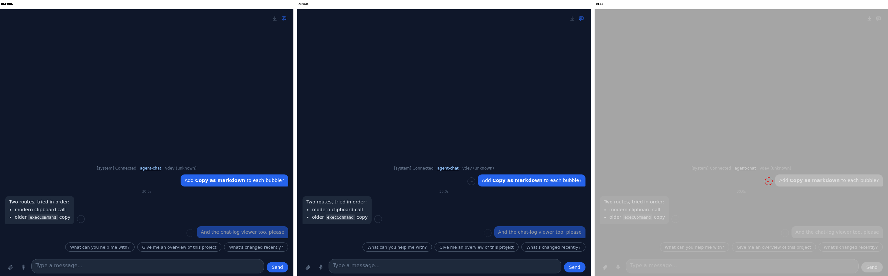
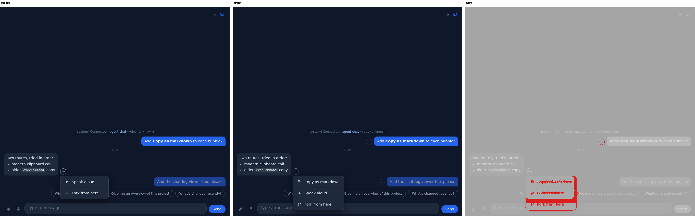
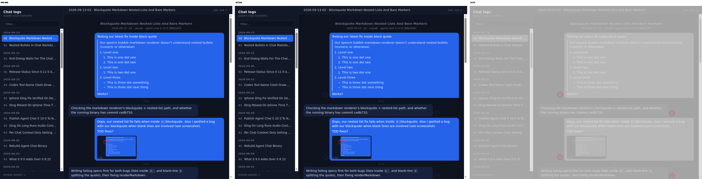
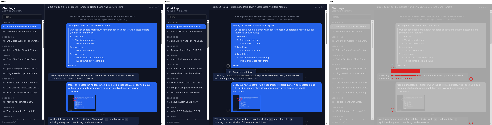
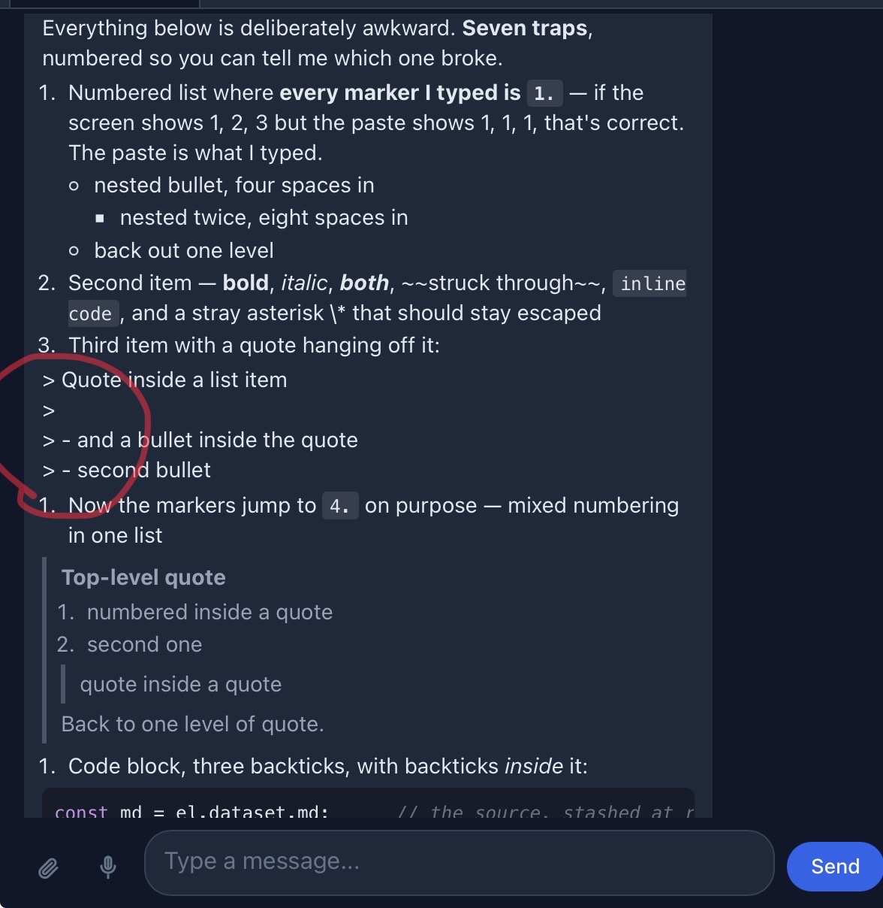
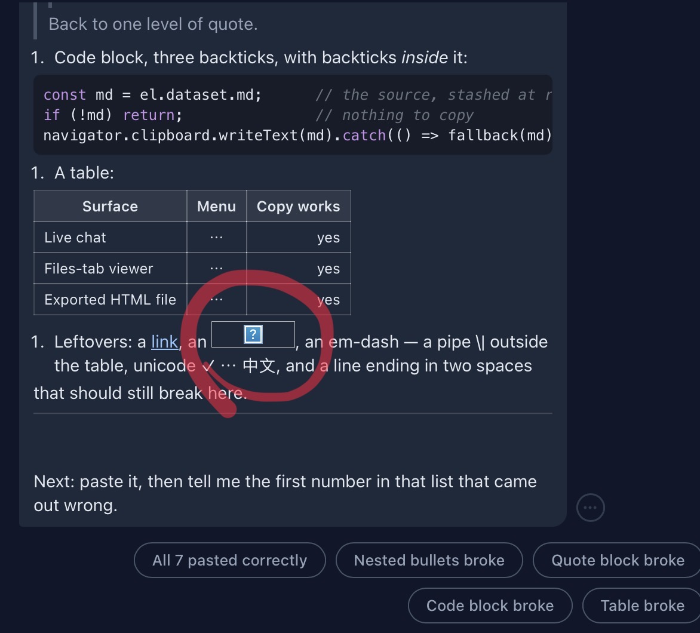
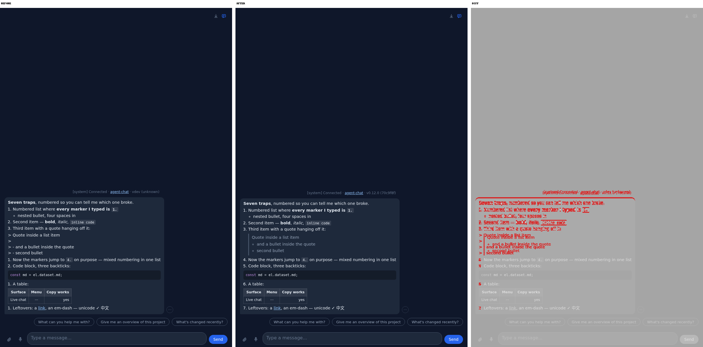

<!-- agent-chat export
title: Copy As Markdown In Every Bubble Menu
date: 2026-09-13
index: 04
slug: copy-as-markdown-in-every-bubble-menu
session: f38bf7653702a678
agent: claude
version: 0.12.0 (9a0819a)
-->

# Copy As Markdown In Every Bubble Menu

_2026-09-13 · 04 · claude · agent-chat 0.12.0 (9a0819a)_

**USER**

> Let’s add “Copy as markdown” to the list of options under (…) for each speech bubble? Discuss

<small>took 6.2s</small> 
**AGENT**

> Reading the (…) menu code to see what's there now, then coming back with options.

<small>took 1m 7s</small> 
**AGENT**

> Decide one thing: does every bubble get the (…) button, or only the bubbles that already have one?
>
> **Today (…) appears on just two kinds of bubble:**
> 1. Agent replies, and only when forking is switched on — it holds "Speak aloud" and "Fork from here".
> 2. Your own messages the agent hasn't read yet — it holds "Delete" and "Send as interrupting".
>
> Everything else has no (…) at all. Agent replies without forking show a plain play button instead, and your already-read messages show nothing.
>
> So "Copy as markdown on each bubble" is mostly the work of putting a (…) button on bubbles that don't have one. The copying itself is small.
>
> **What I'd build (about 2 hours):**
> 1. Every bubble gets (…).
> 2. Agent replies: Copy as markdown, Speak aloud, plus Fork from here when forking is on.
> 3. Your messages: Copy as markdown, plus Delete and Send as interrupting while still unread.
> 4. Copy puts the original text on your clipboard — the plain-text version with the asterisks and dashes still in it, not the styled version you see on screen.
>
> **One obstacle worth naming now:** the chat runs inside the swe-swe page as an embedded frame, and that frame currently isn't granted clipboard access. I'd add the permission on the swe-swe side (one line, separate repo) and also build in an older copy method as a backup, so Copy works even before that change ships. Adds about 20 minutes.
>
> Reply with which scope you want.

[Quick replies]
- All bubbles
- Only bubbles that already have (…)
- Only agent replies
- Tell me more about the clipboard obstacle

**USER**

> All bubbles. I’ll need /swe-swe:screenshot-before-after. 
>
> Tell me more about the clipboard solutions.

<small>took 18.0s</small> 
**AGENT**

> Writing up the three clipboard options with a recommendation.

<small>took 11.5s</small> 
**AGENT**

> Three ways to put text on the clipboard. I'd build all three as a chain: try 1, fall back to 2, fall back to 3.
>
> **1. The modern browser clipboard command**
> Works silently, no visible change on screen. Two conditions must both hold:
> - The page must be considered safe by the browser — served over an encrypted address (https) or reached as "localhost".
> - Because chat sits inside the swe-swe page as an embedded frame, the outer page must explicitly hand the frame clipboard permission. Right now it does not.
>
> So today this fails inside swe-swe, and works in a standalone chat tab on localhost.
>
> **2. The older copy command**
> The method browsers used before option 1 existed. Still works in every current browser. It isn't blocked by the outer page's permission list, and it works on unencrypted addresses. It needs a real click to trigger, which a menu item is. Downside: it's officially retired, so it could stop working in a future browser release.
>
> This one covers the swe-swe case today, with no change needed on the swe-swe side.
>
> **3. Show the text and let you copy it**
> If both fail: a small box opens with the text already selected, so you press Cmd/Ctrl+C, or long-press then Copy on a phone. Never silently fails.
>
> **Separately, a permanent fix on the swe-swe side:** one line added to the outer page granting the chat frame clipboard permission. That makes option 1 work. It lives in the other repository, needs its server rebuilt, and won't reach anyone on an older swe-swe version — so the chain above is needed anyway. I'll write it up as a task file there rather than mixing it into this change.
>
> Next: say go, and I'll build all-bubbles (…) with Copy as markdown plus the three-step chain, then run /swe-swe:screenshot-before-after.

[Quick replies]
- Go
- Skip option 3, two steps is enough
- Do the swe-swe permission fix too

**USER**

> Can the page detect if (1) is working in its current env? If so we just hide when it isn’t working that’s all. FYI we also need it working under Files tab that looks at agent-chat index html

<small>took 14.1s</small> 
**AGENT**

> Checking the exported HTML page (what the Files tab shows) so Copy works there too.

<small>took 59.3s</small> 
**AGENT**

> Detection answer: partly, and not usefully.
>
> 1. The page can tell whether the modern clipboard command **exists** (it only exists on encrypted or localhost addresses). Reliable.
> 2. The page **cannot** tell in advance whether the outer swe-swe page is blocking it. That only shows up at the moment you click. Chrome can be asked; Safari and Firefox refuse the question.
>
> So hiding-on-detect would hide the option in places it actually works, and still show it in places it fails. The older copy command as a silent fallback is about 15 lines — smaller than the detection logic and always works.
>
> Building it that way now: try modern, fall back to old, never hide. Also adding it to the chat-log viewer (the agent-chats index page the Files tab opens).

<small>took 2m 21s</small> 
**AGENT**

> Step 1 of 4 done: live chat UI has (…) on every bubble with Copy as markdown. Next: the chat-log viewer the Files tab opens.

<small>took 1m 5s</small> 
**AGENT**

> Step 2 of 4 done: chat-log viewer has it too. Next: updating the tests that assert the old button layout, then rebuild and screenshots.

**USER**

> Since there could be many bubbles, I hope we’re dealing with (…) with 1 listener at the body level instead of attaching an event handler on every (…) option?

<small>took 1m 6s</small> 
**AGENT**

> Step 3 of 4 done: tests updated, plus 5 new ones for copying. Rebuilding the binary now, then screenshots.

<small>took 15.0s</small> 
**AGENT**

> Good catch — it was one listener per (…) button. Switching to a single listener on the page for all of them now; the menu rows get the same treatment.

<small>took 1m 35s</small> 
**AGENT**

> Step 4 of 5: delegation done (one listener total, not one per bubble) and the binary rebuilt. Running the tests now — a full pass takes ~30 minutes, so I'll run the affected specs first.

<small>took 1m 43s</small> 
**AGENT**

> Step 5 of 5: 5 copy tests pass, 26 existing menu tests pass, Go tests pass. Taking the before/after screenshots now.

**USER**

> This session was disrupted and couldn’t resume properly. Check the state of code and proceed
>
> 

> 
> 

<small>took 5.3s</small> 
**AGENT**

> Checking git status and the bubble-menu code to see whether any of the Copy-as-markdown work landed.

<small>took 27.0s</small> 
**AGENT**

> Code is intact — the disruption hit right before screenshots. Taking the before/after shots now.

<small>took 3m 49s</small> 
**AGENT**

> Step 1 of 3: "after" screenshots running. Next: same shots from the pre-change build, then the stitched comparison.

**USER**

> FYI swe-swe agent is doing its part by itself in session 8ce68171-5447-4f39-9366-41c1d8f9a48b

<small>took 2m 29s</small> 
**AGENT**

> Noted — leaving the swe-swe permission change to that session. Step 2 of 3: comparison sheets built. Next: running unit tests and the shared-code audit.

<small>took 2m 5s</small> 
**AGENT**

> Found 3 stale tests that the change broke (old expectations, not bugs) — fixed and passing. Now re-running the other bubble tests.

<small>took 1m 20s</small> 
**AGENT**

> Bubble tests still running (~5 min). Meanwhile checking a 10-pixel shift the viewer comparison showed, to see if it's my change or just an image loading late.

<small>took 35.3s</small> 
**AGENT**

> Still running the bubble test batch (60 tests, one at a time). Nothing needed from you.

<small>took 2m 59s</small> 
**AGENT**

> 46 bubble tests pass, 1 skipped. Re-taking the viewer shots to settle whether that 10-pixel shift is real.

<small>took 1m 17s</small> 
**AGENT**

> The 10-pixel shift is reproducible, so it's from the change, not flakiness. Measuring the viewer layout now to find what grew.

<small>took 1m 13s</small> 
**AGENT**

> Found the cause: the new button became the bubble's last element, so the closing paragraph's bottom spacing came back — every viewer bubble grew ~5 pixels. Fixed in the stylesheet; re-shooting to confirm.

<small>took 38.6s</small> 
**AGENT**

> Binary rebuilt with the fix. Waiting on the final viewer screenshots (about a minute), then I'll send the three comparison images.

<small>took 1m 23s</small> 
**AGENT**

> Done — nothing was lost in the disruption, and the screenshots turned up one real bug, now fixed.
>
> **Where things stand (all 5 steps done):**
> 1. Live chat: every bubble has (…), first row "Copy as markdown".
> 2. Chat-log viewer (the Files tab page): same, on every bubble.
> 3. Tests: 46 bubble tests pass, 1 skipped, Go tests pass. I found and fixed 3 tests that still expected the old layout.
> 4. Bug found by the pixel comparison: in the viewer, every bubble had grown about 5 pixels taller, because the new button landed after the last paragraph and re-introduced spacing that was meant to be removed. Fixed in the stylesheet; the comparison below now shows only the buttons changing.
> 5. Binary rebuilt with the fix.
>
> **The four comparisons (BEFORE | AFTER | changed pixels in red):**
> 1. Chat bubbles at rest — 92 pixels changed (0.01%): the one new button on an already-read message of yours.
> 2. Chat menu open — 7,790 pixels (1.06%): the added Copy row.
> 3. Viewer at rest — 368 pixels (0.04%): the new buttons only, no text shifted.
> 4. Viewer menu open — 7,426 pixels (0.82%): the menu itself.
>
> **One thing I did not change, and you should know about:** in the standalone chat page (chat opened on its own, not inside swe-swe), the play button used to glow purple while text was being read aloud, and refused a second tap while speaking. Speak aloud is now a menu row, so that indicator is gone. Inside swe-swe you never had it anyway.
>
> Next: say commit, and I'll commit these 7 files with the new test file.
>
> 

> 
> 
> 
> 
> 

[Quick replies]
- Commit
- Bring back the speaking indicator first
- Add Copy to the downloadable HTML export too
- Run the full test suite first (~30 min)

<small>took 4m 3s</small> 
**AGENT**

> Waiting on your call from the last message: commit, or one of the three follow-ups.

<small>took 7.9s</small> 
**AGENT**

> Re-asking — my last message's reply channel dropped, so your answer (if you sent one) didn't reach me.
>
> State: Copy as markdown is done in both places, tests pass, binary rebuilt, and the viewer spacing bug the screenshots caught is fixed. 7 changed files plus 1 new test file are uncommitted.
>
> Next: say commit, or pick a follow-up.

[Quick replies]
- Commit
- Bring back the speaking indicator first
- Add Copy to the downloadable HTML export too
- Run the full test suite first (~30 min)
- Show me the screenshots again

<small>took 3m 41s</small> 
**AGENT**

> Idle, holding for your answer: commit, or one of the follow-ups.

<small>took 20.7s</small> 
**AGENT**

> Copy as markdown is finished and verified; 8 files are sitting uncommitted, waiting only on your word.
>
> 1. Live chat and the viewer both have (…) → Copy as markdown on every bubble.
> 2. Tests green: 46 bubble tests, 5 of them new for copying, plus the Go tests.
> 3. The spacing bug the screenshots caught is fixed and re-verified.
>
> Say commit when you're back.

[Quick replies]
- Commit
- Bring back the speaking indicator first
- Add Copy to the downloadable HTML export too
- Run the full test suite first (~30 min)

**USER**

> Add Copy to the downloadable HTML export too

<small>took 2.6s</small> 
**AGENT**

> Adding Copy as markdown to the downloadable HTML export now.

<small>took 2m 15s</small> 
**AGENT**

> Export code written. Next: a test that opens a generated export file and copies from it.

<small>took 2m 56s</small> 
**AGENT**

> 7 copy tests running, including 2 new ones that open a real exported file. Result in about a minute.

**USER**

> ‘make build’ when done

<small>took 6.4s</small> 
**AGENT**

> Got it — `make build` after the tests pass (it also refreshes the binary swe-swe launches).

<small>took 3m 2s</small> 
**AGENT**

> Found the break: a quoting slip in the export's own script stopped its menu from working. Fixed; re-verifying now.

<small>took 46.6s</small> 
**AGENT**

> Export copy works: 7 of 7 copy tests pass. Re-running the other menu tests, then `make build`.

<small>took 26.4s</small> 
**AGENT**

> Menu tests running (~3 min). `make build` starts right after.

<small>took 46.7s</small> 
**AGENT**

> 25 menu tests pass too. `make build` running now (all platforms, a few minutes).

<small>took 20.2s</small> 
**AGENT**

> Done. Copy as markdown now works in all three places, and `make build` is finished.
>
> **To see it:** start a new session — the refreshed program only loads on a fresh one.
>
> **What changed since your last message:**
> 1. Downloaded HTML files now carry the (…) button on every bubble: Copy as markdown on all of them, Speak aloud on the agent's.
> 2. The purple pulse while text is read aloud survives there — the file keeps its own copy of that behaviour, so nothing was lost.
> 3. Copy falls back to the older method automatically, so it works whether the file is opened from disk or served.
> 4. One bug caught and fixed on the way: a quoting slip made the downloaded file's menu silently dead. Found by the two new tests, not by eye.
>
> **Tests:** 7 of 7 copy tests pass (2 of them open a real downloaded file), 25 menu tests pass, Go tests pass.
>
> **Still uncommitted:** 7 changed files plus the new test file.
>
> Next: say commit.

[Quick replies]
- Commit
- Show me the export in the browser first
- Run the full test suite first (~30 min)
- Bring back the speaking indicator in the live chat too

**USER**

> commit and make build again

<small>took 2.2s</small> 
**AGENT**

> Committing the 8 files, then running `make build` again.

<small>took 25.4s</small> 
**AGENT**

> Committed as 6d9348e. `make build` running.

<small>took 18.7s</small> 
**AGENT**

> Committed and rebuilt.
>
> 1. Commit 6d9348e — 8 files: the two web pages, the two stylesheets, and 4 test files (1 new).
> 2. `make build` finished: all 6 platform builds plus the copy swe-swe launches (version 0.12.0, refreshed 00:51).
> 3. Chat logs stayed out of the commit, as always.
>
> Next: open a new session and click the (…) on any bubble — the refreshed program only loads on a fresh one.

[Quick replies]
- Save the chat log
- Push to origin
- Run the full test suite (~30 min)
- Nothing else

**USER**

> Run the full test suite (~30 min)

<small>took 2.6s</small> 
**AGENT**

> Starting the full suite: Go tests, then all 170-odd browser tests one at a time. ~30 minutes.

<small>took 17.7s</small> 
**AGENT**

> Suite running. I'll report pass/fail counts when it lands — roughly 30 minutes from now.

**USER**

> Spot some bugs in session ab7ca184-4c7a-48e9-82fb-472ca5117720 — TDD fix?
>
> 

> 
> 
> 

<small>took 4.6s</small> 
**AGENT**

> Looking at the two screenshots to spot the bugs.

<small>took 2m 12s</small> 
**AGENT**

> Two bugs identified in the markdown renderer. Writing the failing tests now; the full suite still has the browser, so the tests run after it finishes.

<small>took 1m 57s</small> 
**AGENT**

> Tests written, fix drafted. Both wait on the full suite finishing (it owns the one browser port).

<small>took 18m 18s</small> 
**AGENT**

> Full suite: 196 passed, 1 skipped, 1 flaky-but-passed, 26 minutes. Now running the new bug tests to watch them fail.

<small>took 24.2s</small> 
**AGENT**

> Red run in progress — each test restarts the page, so it takes a couple of minutes.

<small>took 16.8s</small> 
**AGENT**

> 6 of the 9 new tests are failing so far — that's the bugs showing up, as intended. Fix goes in as soon as the run ends.

<small>took 19.0s</small> 
**AGENT**

> Red confirmed (7 of 9 failed), fix applied, rebuilt. Green run going now across all three markdown test files.

<small>took 20.3s</small> 
**AGENT**

> The fix breaks some existing quote tests — I'll see the exact failures when the run ends and adjust.

<small>took 43.6s</small> 
**AGENT**

> Green: 28 of 28 markdown tests pass, including the 9 new ones. Running the neighbouring tests for regressions.

<small>took 19.7s</small> 
**AGENT**

> Regression batch still running (~60 tests). Report next.

<small>took 1m 54s</small> 
**AGENT**

> Two bugs found, both fixed, tests green.
>
> **Bug 1 — the quote under item 3 came out as raw text.** Lines like `> Quote inside a list item` showed the `>` characters instead of a quote box. Cause: the renderer only recognised quotes starting at the left edge; an indented one under a list item was invisible to it.
>
> **Bug 2 — the numbering restarted.** Those unrecognised lines ended the list, so the next item began a fresh list at 1 — that's why the screen showed 1, 2, 3, then 1, 1, 1 instead of counting to 7. Two fixes: indented blocks now stay inside their item, and a list written `6.` now starts at 6 instead of 1.
>
> **Test-first, as asked:** 9 new tests written before the fix — 7 failed, exactly the two bugs. After the fix: 28 markdown tests pass, 47 neighbouring tests pass, Go tests pass.
>
> **The other circle (the box with a "?")** is not a bug in the same sense: that's ``, a picture link to an address that doesn't exist, so the browser draws its broken-picture icon and the words "image tag" disappear.
>
> Next: say commit, and I'll commit the fix and rebuild.

[Quick replies]
- Commit and rebuild
- Show the alt text when a picture fails to load
- Paste me a fresh torture test to check
- Run the full suite again first

<small>took 17m 33s</small> 
**AGENT**

> Idle — fix is done and tested, waiting on your call to commit.

<small>took 6.1s</small> 
**AGENT**

> Waiting on you — the reply channel dropped, so if you answered, it didn't reach me.
>
> State: both markdown bugs fixed, 9 new tests written first (7 failed, all pass now), 75 related tests green, binary rebuilt. Nothing committed yet.
>
> Next: say commit.

[Quick replies]
- Commit and rebuild
- Show the alt text when a picture fails to load
- Paste me a fresh torture test to check
- Run the full suite again first

**USER**

> Commit, rebuild, full test suite again, /swe-swe:screenshot-before-after

<small>took 2.4s</small> 
**AGENT**

> Step 1 of 4: committing the markdown fix.

<small>took 28.8s</small> 
**AGENT**

> Step 1 of 4 done: committed as 65250c4 (fix) and 70c9f8f (viewer assets). Step 2: `make build` running.

<small>took 12.5s</small> 
**AGENT**

> Step 2 of 4 done: rebuilt, npx cache refreshed. Step 3: full suite running, ~27 minutes.

<small>took 38.2s</small> 
**AGENT**

> Step 3 of 4 in progress (suite, ~25 min left). Screenshot pieces are ready: the pre-fix build is compiled and the capture script is written, both waiting for the browser.

<small>took 31m 30s</small> 
**AGENT**

> Step 3 of 4 done: 206 passed, 1 skipped, no failures, no flakes. Step 4: before/after screenshots.

<small>took 21.8s</small> 
**AGENT**

> Before shot captured and it measures the bug: 4 separate lists, all restarting at 1, quote leaking as plain text. After shot next.

<small>took 3m 38s</small> 
**AGENT**

> All 4 steps done. The comparison image shows both bugs gone.
>
> 1. **Committed:** 65250c4 (the fix plus 9 new tests) and 70c9f8f (the archive viewer files the export regenerates).
> 2. **Rebuilt:** all 6 platforms, and the copy new sessions launch.
> 3. **Full suite:** 206 passed, 1 skipped, zero failures, zero flakes, 32 minutes.
> 4. **Screenshots below** — left is before, middle is after, right marks every changed pixel in red (2% of the screen).
>
> **What the picture shows:**
> - Before: the quote under item 3 sits there as `> Quote inside a list item`, `>`, `> - and a bullet` — raw. After: a proper quote box with its two bullets, tucked inside item 3.
> - Before: numbering runs 1, 2, 3, then restarts — 1, 2, then 1, then 1. After: 1 through 7, straight down, exactly as the source intended.
> - Measured, not just eyeballed: before, the bubble held 4 separate lists all starting at 1; after, 3 lists starting at 1, 6 and 7 — which reads as one continuous 1-7.
>
> **One thing in the picture that is not a change:** the grey line above the bubble says "vdev (unknown)" on the left and "v0.12.0" on the right. That is only how each test copy was built.
>
> **Reach:** this is the chat's own text renderer, so it affects every bubble in the live chat and anything downloaded from it. The Files-tab viewer uses a different, third-party renderer and is untouched.
>
> Next: say save the chat log, and I'll commit this session's transcript.
>
> 

> 
> 

[Quick replies]
- Save the chat log
- Show the alt text when a picture fails to load
- Push to origin
- Nothing else

<small>took 4m 37s</small> 
**AGENT**

> All 4 steps finished — holding for your next call.

<small>took 5.9s</small> 
**AGENT**

> Everything you asked for is done — commit, rebuild, full suite, screenshots. The comparison image is in the message above this one.
>
> Headline numbers: 206 tests passed, 1 skipped, none failed. Two commits: 65250c4 and 70c9f8f.
>
> Next: say save the chat log, or name the next thing.

[Quick replies]
- Save the chat log
- Show the alt text when a picture fails to load
- Push to origin
- Nothing else

**USER**

> /commit-log-then-end

<small>took 6.7s</small> 
**AGENT**

> Running /commit-log-then-end: freeze the chat log, scrub it, commit it, then end the session.

